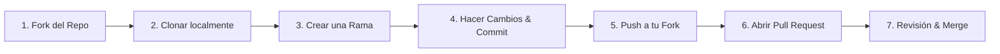

# Aprendizaje Automático 🤖📚

Repositorio dedicado al estudio, resolución de trabajos prácticos e implementación didáctica de algoritmos de Machine Learning.

> [!NOTE]
> **Créditos y Origen Institucional:**  
> Todo el contenido teórico, letras de trabajos prácticos y material de referencia provienen del curso de **Aprendizaje Automático** de la **Facultad de Ingeniería (FING) - Universidad de la República (UdelaR)**, Uruguay.  
> Este repositorio constituye un recurso de estudio abierto y colaborativo para estudiantes de la materia.

---

## 📁 Estructura del Repositorio

```text
aprendizaje-automatico/
├── teoricos/               # Diapositivas, notas conceptuales y glosario
│   ├── GLOSARIO.md         # Glosario formal de términos y notación matemática
│   ├── clase 1 - intro/
│   ├── clase 2 - concept_learning/
│   └── clase 3 - arboles_de_decision/
├── practicos/              # Trabajos prácticos de la materia
│   └── practico 1/
│       ├── letra/          # Enunciados de los ejercicios
│       └── resultados/     # Resoluciones detalladas y scripts ejecutables en Python
├── algoritmos/             # Módulos reutilizables y visualizadores interactivos
│   ├── concept_learning.py
│   ├── concept_learning_visualizer.py
│   └── __init__.py
├── requirements.txt        # Dependencias recomendadas para el entorno de Python
└── README.md               # Descripción general del repositorio
```


---

## 🚀 Entorno de Desarrollo (Python)

Para crear un entorno virtual e instalar las librerías necesarias:

```bash
# Crear entorno virtual
python -m venv venv

# Activar entorno (Windows PowerShell)
.\venv\Scripts\Activate.ps1

# Instalar dependencias
pip install -r requirements.txt
```

---

## 🤝 Cómo Colaborar (Guía de Contribución)

¡Las contribuciones son bienvenidas! Para colaborar con correcciones, mejoras teóricas, nuevos algoritmos o resoluciones de prácticos, sigue estos pasos:



### 1. Hacer un Fork del Repositorio
* Ve a la página principal del proyecto en GitHub: [santrodriguez21/aprendizaje-automatico](https://github.com/santrodriguez21/aprendizaje-automatico).
* Haz clic en el botón **Fork** (arriba a la derecha) para crear una copia completa en tu cuenta de GitHub.

### 2. Clonar tu Fork Localmente
Clona tu copia remota a tu máquina de desarrollo:
```bash
git clone https://github.com/TU_USUARIO/aprendizaje-automatico.git
cd aprendizaje-automatico
```

*(Opcional recomendado)* Configura el repositorio original como remoto `upstream` para mantenerte actualizado:
```bash
git remote add upstream https://github.com/santrodriguez21/aprendizaje-automatico.git
```

### 3. Crear una Rama (*Feature Branch*)
Crea y cámbiate a una nueva rama con un nombre descriptivo para tus cambios:
```bash
git checkout -b feature/nombre-de-la-mejora
# Ejemplos: fix/ejercicio-04, feature/practico-02, docs/resumen-clase-03
```

### 4. Realizar tus Modificaciones y Commits
Haz tus cambios siguiendo las convenciones de estilo del proyecto (markdown claro, notación LaTeX y código documentado en Python) y guarda tus avances con mensajes claros:
```bash
git add .
git commit -m "feat(practico-1): agregar resolución de ejercicio 4 con script en python"
```

### 5. Subir los Cambios a tu Fork
Envía tu rama a tu repositorio en GitHub:
```bash
git push origin feature/nombre-de-la-mejora
```

### 6. Crear un Pull Request (PR)
* Ve a tu repositorio en GitHub; verás un banner amarillo que dice **"Compare & pull request"**. Haz clic en él.
* Asegúrate de que la rama base (*base repository*) sea `santrodriguez21/aprendizaje-automatico` en la rama `main`.
* Escribe un título y una descripción clara de lo que agregas o corriges.
* Haz clic en **Create Pull Request**.

### 7. Esperar Revisión y Aprobación
* El mantenedor del repositorio revisará tus cambios, dejará comentarios si son necesarios ajustes y finalmente aprobará e integrará (*Merge*) tu aporte a la rama principal `main`.