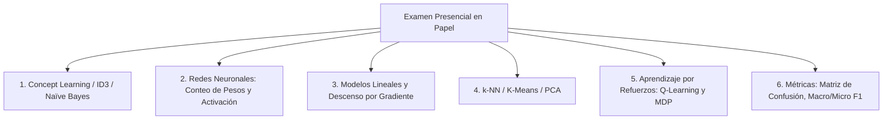

# 🎓 Guía Maestra Integral de Estudio para el Examen Presencial
## Aprendizaje Automático (FING - UdelaR)

Documento centralizado con **todos los temas evaluados en los exámenes de 2018 a 2025**. Diseñado para asimilar rápidamente mediante lectura conceptual, recetas mecánicas y bancos de preguntas teóricas resueltas.

---

## 📑 Índice General por Bloques Temáticos

1. [El Mapa Completo del Examen](#1-el-mapa-completo-del-examen)
2. [Bloque 1: Concept Learning y Candidate-Elimination](#2-bloque-1-concept-learning-y-candidate-elimination)
3. [Bloque 2: Árboles de Decisión y Algoritmo ID3](#3-bloque-2-árboles-de-decisión-y-algoritmo-id3)
4. [Bloque 3: Aprendizaje Bayesiano y Naïve Bayes (CBS)](#4-bloque-3-aprendizaje-bayesiano-y-naïve-bayes-cbs)
5. [Bloque 4: Métricas de Evaluación, Matrices de Confusión y Validación](#5-bloque-4-métricas-de-evaluación-matrices-de-confusión-y-validación)
6. [Bloque 5: Modelos Lineales, Regresión y Descenso por Gradiente](#6-bloque-5-modelos-lineales-regresión-y-descenso-por-gradiente)
7. [Bloque 6: Redes Neuronales Artificiales (ANN) y Deep Learning](#7-bloque-6-redes-neuronales-artificiales-ann-y-deep-learning)
8. [Bloque 7: Algoritmos Basados en Instancias (k-NN) y No Supervisado (K-Means, PCA)](#8-bloque-7-algoritmos-basados-en-instancias-k-nn-y-no-supervisado-k-means-pca)
9. [Bloque 8: Aprendizaje por Refuerzos (RL, MDP y Q-Learning)](#9-bloque-8-aprendizaje-por-refuerzos-rl-mdp-y-q-learning)
10. [Banco Integral de Preguntas Teóricas "Comodín"](#10-banco-integral-de-preguntas-teóricas-comodín)
11. [Chuletario Maestro de Fórmulas de Examen](#11-chuletario-maestro-de-fórmulas-de-examen)

---

## 1. El Mapa Completo del Examen

Los exámenes y parciales presenciales en la FING combinan de 4 a 6 problemas que cubren los siguientes pilares:

---

## 2. Bloque 1: Concept Learning y Candidate-Elimination

- **Espacio de Versiones:** $VS_{H,D} = \{ h \in H \mid s \le_g h \le_g g \text{ con } s \in S, g \in G \}$.
- **Regla ante Positivos:** $G$ se mantiene (se eliminan las inconsistentes), $S$ se generaliza mínimamente reemplazando literales no coincidentes por `?`.
- **Regla ante Negativos:** $S$ se mantiene, $G$ se especifica mínimamente generando hipótesis con atributos consistentes con $S$ y `?` en el resto.
- **Clasificación de Instancias Nuevas:**
  - Si todas las hipótesis de $G$ cubren la instancia $\implies$ **Sí**.
  - Si ninguna hipótesis de $G$ cubre la instancia $\implies$ **No**.
  - Si algunas la cubren y otras no $\implies$ **Incertidumbre ($?$)** (se resuelve por votación de mayoría si se conocen las probabilidades).

---

## 3. Bloque 2: Árboles de Decisión y Algoritmo ID3

- **Entropía de Shannon:** $H(S) = - \sum p_i \log_2(p_i)$ ($H=0$ si puro, $H=1$ si 50/50 binario).
- **Ganancia de Información:** $\text{Gain}(S, A) = H(S) - \sum \frac{|S_v|}{|S|} H(S_v)$. El nodo elige el de máxima ganancia.
- **Tasa de Ganancia (*Gain Ratio*):** $\frac{\text{Gain}(S,A)}{\text{SplitInfo}(S,A)}$ con $\text{SplitInfo} = -\sum \frac{|S_v|}{|S|}\log_2\left(\frac{|S_v|}{|S|}\right)$ (penaliza atributos con muchos valores únicos).
- **Atributos Numéricos Continuos:** Ordenar instancias $\to$ identificar cambios de clase adyacentes $\to$ evaluar puntos medios $c = \frac{v_i + v_{i+1}}{2}$.
- **Poda (*Reduced Error Pruning*):** Evaluar subárboles con conjunto de validación; si la hoja mayoritaria tiene igual o menor error, se poda.

---

## 4. Bloque 3: Aprendizaje Bayesiano y Naïve Bayes (CBS)

- **Teorema de Bayes:** $P(h \mid D) = \frac{P(D \mid h) P(h)}{P(D)}$.
- **Clasificador Naïve Bayes (Regla MAP):**
  $$c_{\text{MAP}} = \arg\max_{c_j \in C} P(c_j) \prod_{i=1}^n P(a_i \mid c_j)$$
- **$m$-estimador (suavizado):** $\hat{P}(a_i \mid c) = \frac{n_c + m \cdot p}{n + m}$ (donde $p = 1/k$, $m$ es el peso virtual).
- **Suavizado de Laplace:** Caso con $m = k = |\text{Val}(A)|$ y $p = 1/k \implies \hat{P} = \frac{n_c + 1}{n + k}$.
- **Inferencia en Escala Logarítmica:** $\arg\max \left[ \log P(c) + \sum \log P(a_i \mid c) \right]$ (evita *underflow*).
- **Clasificador Bayesiano Óptimo (BOC):** $\arg\max_{v} \sum_{h \in H} P(v \mid h) P(h \mid D)$ (combina todas las hipótesis ponderadas).

---

## 5. Bloque 4: Métricas de Evaluación, Matrices de Confusión y Validación

- **Matriz de Confusión:** Filas = Clases Reales, Columnas = Predicciones.
- **Fórmulas Clave:**
  - $\text{Accuracy} = \frac{\text{VP} + \text{VN}}{\text{Total}}$
  - $\text{Precisión} (P) = \frac{\text{VP}}{\text{VP} + \text{FP}}$
  - $\text{Recall} (R) = \frac{\text{VP}}{\text{VP} + \text{FN}}$
  - $F_1 = 2 \cdot \frac{P \cdot R}{P + R} = \frac{2\text{VP}}{2\text{VP} + \text{FP} + \text{FN}}$
- **Macro vs. Micro:**
  - $\text{Macro-}F_1 = \frac{1}{K} \sum F_1^{(k)}$ (promedio simple; da igual peso a clases chicas y grandes).
  - $\text{Micro-}F_1$: Suma global de VP, FP, FN antes de calcular la métrica (dominada por clases grandes).
- **Validación Cruzada ($k$-fold) Estratificada:** Divide en $k$ particiones manteniendo la proporción porcentual de clases.

---

## 6. Bloque 5: Modelos Lineales, Regresión y Descenso por Gradiente

### A. Descenso por Gradiente (*Gradient Descent*)
- **Regla de Actualización:**
  $$w \leftarrow w - \eta \nabla E(w)$$
- **Cálculo a Mano en Examen:**
  - Dada una función de error unidimensional $f(x) = x^2 - 10x$, su derivada es $f'(x) = 2x - 10$.
  - Con punto inicial $x_0 = 0$ y tasa de aprendizaje $\eta = 0{,}1$:
    $$x_1 = x_0 - \eta f'(x_0) = 0 - 0{,}1(2(0) - 10) = 0 - 0{,}1(-10) = \mathbf{1{,}0}$$
    $$x_2 = x_1 - \eta f'(x_1) = 1{,}0 - 0{,}1(2(1) - 10) = 1{,}0 - 0{,}1(-8) = \mathbf{1{,}8}$$

### B. Regresión Logística y Clasificación Binaria
- **Función Sigmoide / Logística:**
  $$\sigma(z) = \frac{1}{1 + e^{-z}}, \quad \text{con } z = w_0 + \sum_{i=1}^d w_i x_i$$
- Mapea cualquier valor real $\mathbb{R}$ al rango probabilístico $(0, 1)$.
- Regla de decisión: $\hat{y} = 1 \iff \sigma(z) \ge 0{,}5 \iff z \ge 0$.
- **Función de Pérdida (Entropía Cruzada Binaria):**
  $$E(w) = - \sum_{i=1}^N \left[ y_i \log(\hat{y}_i) + (1 - y_i) \log(1 - \hat{y}_i) \right]$$

### C. Regularización: L1 (Lasso) vs. L2 (Ridge)
- **L1 (Lasso):** $E_{\text{reg}} = E(w) + \lambda \sum |w_i|$ $\implies$ Fuerza pesos exactamente a $0$ (**selección automática de atributos / *sparsity***).
- **L2 (Ridge):** $E_{\text{reg}} = E(w) + \lambda \sum w_i^2$ $\implies$ Reduce la magnitud de todos los pesos sin anularlos (previene sobreajuste por alta varianza).

---

## 7. Bloque 6: Redes Neuronales Artificiales (ANN) y Deep Learning

### A. Conteo de Parámetros (Pesos y Sesgos) en Examen
> [!IMPORTANT]
> **Fórmula Maestra:** Para una conexión entre una capa de $N$ neuronas y una capa de $M$ neuronas:
> $$\text{Cantidad de Pesos} = N \times M$$
> $$\text{Cantidad de Sesgos (Bias)} = M$$
> $$\mathbf{\text{Total de Parámetros}} = M(N + 1)$$

- **Ejemplo Típico de Examen (Examen 2025):**
  - Entrada: Imagen RGB de $200 \times 200$ píxeles $\implies N = 200 \times 200 \times 3 = \mathbf{120.000}$ entradas.
  - Capa oculta: $m$ neuronas.
  - Capa de salida: $100$ neuronas.
  - *Cálculo:*
    - Entrada a Oculta: $m(120.000 + 1) = 120.001 m$ parámetros.
    - Oculta a Salida: $100(m + 1) = 100m + 100$ parámetros.
    - **Total:** $120.101m + 100$ parámetros.

### B. El Problema de XOR y Separabilidad Lineal
- Un **perceptrón simple (1 neurona)** solo puede aprender funciones **linealmente separables** (ej. AND, OR, NAND).
- La función **XOR** requiere al menos **una capa oculta** (Perceptrón Multicapa / MLP) para transformar el espacio de entrada en una representación linealmente separable.

### C. Funciones de Activación
- **Sigmoide:** $\sigma(z) = \frac{1}{1+e^{-z}} \in (0, 1)$ (satura en los extremos, problema de desvanecimiento del gradiente).
- **ReLU (Rectified Linear Unit):** $f(z) = \max(0, z)$ (rápida computacionalmente, evita saturación positiva).
- **Softmax:** Para clasificación multiclase ($K$ clases), normaliza salidas a una distribución de probabilidad:
  $$\text{Softmax}(z_i) = \frac{e^{z_i}}{\sum_{j=1}^K e^{z_j}}$$

---

## 8. Bloque 7: Algoritmos Basados en Instancias (k-NN) y No Supervisado (K-Means, PCA)

### A. $k$-Nearest Neighbors ($k$-NN / Lazy Learning)
- Algoritmo perezoso (*lazy*): no entrena un modelo explícito a priori; almacena los datos y difiere el cómputo al momento de consultar una nueva instancia.
- **Distancia Euclídea:** $d(x, y) = \sqrt{\sum (x_i - y_i)^2}$.
- **Normalización Obligatoria:** Si un atributo tiene escala $1000$ (ej. Salario) y otro escala $1$ (ej. Años de educación), el primero dominará la distancia. Es fundamental normalizar mediante Min-Max ($x' = \frac{x - x_{\min}}{x_{\max} - x_{\min}}$) o Estandarización Z-score.

### B. Clustering con $K$-Means
- **Algoritmo:**
  1. Inicializar $K$ centroides (aleatorios o con $K$-Means++).
  2. **Asignación:** Cada punto se asigna al centroide más cercano.
  3. **Actualización:** Cada centroide se recalcula como el promedio aritmético (media) de sus puntos asignados.
  4. Repetir hasta que los centroides no cambien.
- **Sensibilidad:** Sensible a la inicialización (puede converger a óptimos locales) y a los *outliers*.

### C. PCA (Análisis de Componentes Principales)
- Técnica **no supervisada** de reducción de dimensionalidad lineal.
- Encuentra proyecciones ortogonales que **maximizan la varianza de los datos** (correspondientes a los autovectores con mayores autovalores de la matriz de covarianza).

---

## 9. Bloque 8: Aprendizaje por Refuerzos (RL, MDP y Q-Learning)

### A. Componentes de un MDP (Proceso de Decisión de Markov)
- **Estados ($S$):** Descripción completa de la situación del agente/entorno.
- **Acciones ($A$):** Decisiones posibles que el agente puede ejecutar.
- **Recompensas ($R(s, a)$):** Señal escalar numérica inmediata tras ejecutar $a$ en $s$.
- **Factor de Descuento ($\gamma \in [0, 1)$):** Determina la importancia de las recompensas futuras frente a las inmediatas.

### B. Algoritmo $Q$-Learning (Temporal Difference)
- **Ecuación de Actualización:**
  $$Q(s, a) \leftarrow Q(s, a) + \alpha \left[ r + \gamma \max_{a'} Q(s', a') - Q(s, a) \right]$$
  - $\alpha$: Tasa de aprendizaje ($0 < \alpha \le 1$).
  - $r$: Recompensa inmediata recibida.
  - $\gamma \max_{a'} Q(s', a')$: Mejor valor esperado desde el siguiente estado $s'$.
  - Error de TD: $\delta = r + \gamma \max_{a'} Q(s', a') - Q(s, a)$.

- **Valor Óptimo de un Estado:**
  $$V^*(s) = \max_a Q^*(s, a)$$

- **Política Óptima:** $\pi^*(s) = \arg\max_a Q^*(s, a)$.
- **Exploración vs. Explotación:** Se usa la política **$\epsilon$-greedy** (con probabilidad $1 - \epsilon$ elige la mejor acción conocida; con probabilidad $\epsilon$ elige una acción al azar para explorar).

---

## 10. Banco Integral de Preguntas Teóricas "Comodín"

### ❓ 1. Sesgo Inductivo: Restrictivo vs. Preferencial
- **Restrictivo:** Limita la forma sintáctica de $H$ (ej. Candidate-Elimination solo admite conjunciones).
- **Preferencial:** $H$ es completo, pero el algoritmo prefiere ciertas hipótesis (ej. ID3 busca árboles cortos por la Navaja de Ockham).

### ❓ 2. ¿Por qué Candidate-Elimination falla en árboles de decisión?
- Porque $H_{\text{DT}}$ es completo ($2^{|X|}$). Sin sesgo restrictivo, la generalización inductiva es fútil ($S$ y $G$ divergen para datos no vistos) y ocurre una explosión combinatoria inmanejable.

### ❓ 3. ¿Por qué $k$-NN se considera un algoritmo perezoso (*lazy*)?
- Porque no construye un modelo generalizado durante el entrenamiento; simplemente memoriza el dataset y realiza todo el cómputo de distancias en tiempo de predicción.

### ❓ 4. ¿Por qué se normalizan los datos en $k$-NN y $K$-Means?
- Para evitar que los atributos con escalas numéricas grandes dominen artificialmente la métrica de distancia euclídea sobre los atributos de escala pequeña.

### ❓ 5. ¿Cuál es la diferencia entre Aprendizaje Supervisado, No Supervisado y por Refuerzo?
- **Supervisado:** Dispone de pares $(x_i, y_i)$ con etiquetas directas (*Ground Truth*).
- **No Supervisado:** Solo dispone de $\{x_i\}$, busca estructura interna o clusters.
- **Refuerzo:** Un agente aprende mediante ensayo y error recibiendo recompensas escalares evaluativas (no correctivas) del entorno.

---

## 11. Chuletario Maestro de Fórmulas de Examen

| Tema | Fórmula | Uso en Examen |
| :--- | :--- | :--- |
| **Entropía** | $H(S) = - \sum p_i \log_2(p_i)$ | Impureza de un conjunto de datos. |
| **Ganancia** | $\text{Gain}(S, A) = H(S) - \sum \frac{\|S_v\|}{\|S\|} H(S_v)$ | Selección de atributo en ID3. |
| **Naïve Bayes** | $\arg\max_c P(c) \prod P(a_i \mid c)$ | Clasificación probabilística MAP. |
| **$m$-estimador** | $\hat{P} = \frac{n_c + m \cdot p}{n + m}$ | Evitar probabilidades condicionales nulas ($0$). |
| **Laplace** | $\hat{P} = \frac{n_c + 1}{n + k}$ | Suavizado sumando $+1$ al numerador. |
| **Descenso Gradiente** | $w_{t+1} = w_t - \eta \nabla E(w_t)$ | Optimización iterativa paso a paso. |
| **Sigmoide** | $\sigma(z) = \frac{1}{1 + e^{-z}}$ | Activación y Regresión Logística. |
| **Pesos en ANN** | $M(N + 1)$ | Parámetros entre capa de $N$ a capa de $M$. |
| **$Q$-Learning** | $Q(s,a) \leftarrow Q(s,a) + \alpha [r + \gamma \max_{a'} Q(s',a') - Q(s,a)]$ | Actualización de tabla $Q$. |
| **Accuracy** | $\frac{\text{VP} + \text{VN}}{\text{Total}}$ | Exactitud global del modelo. |
| **Precisión ($P$)** | $\frac{\text{VP}}{\text{VP} + \text{FP}}$ | Fiabilidad de predicciones positivas. |
| **Recall ($R$)** | $\frac{\text{VP}}{\text{VP} + \text{FN}}$ | Cobertura de casos positivos reales. |
| **$F_1$-Score** | $2 \cdot \frac{P \cdot R}{P + R} = \frac{2\text{VP}}{2\text{VP} + \text{FP} + \text{FN}}$ | Media armónica entre $P$ y $R$. |
