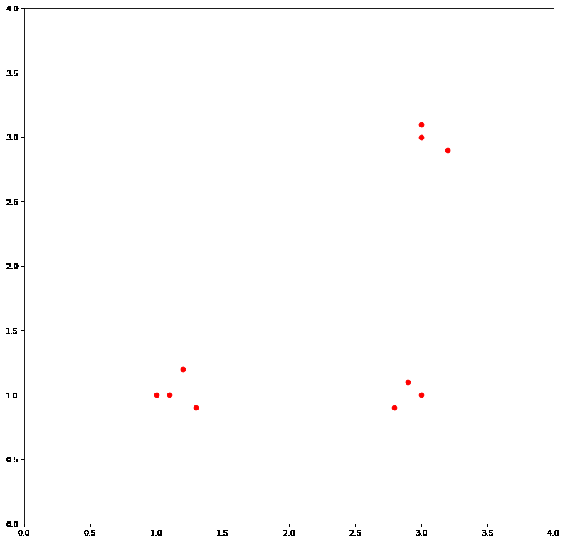

# Aprendizaje Automático
## Evaluación — Curso 2018

**Duración:** 3:00 horas.  
*Justifique todas sus respuestas.*

---

## Ejercicio 1 (18 puntos)

### a)
Sea el siguiente conjunto de entrenamiento; los atributos toman los valores dados en la tabla:

| # | $A_1$ | $A_2$ | $A_3$ | $c(x)$ |
|---|---|---|---|---|
| 1 | a | q | a | sí |
| 2 | b | q | c | no |
| 3 | b | q | b | sí |
| 4 | a | p | c | no |
| 5 | a | p | b | no |

- **i.** Dé el árbol resultante de aplicar el algoritmo ID3.
- **ii.** ¿Cuál es la clasificación de la instancia $(a, q, b)$ según Naive Bayes? Justifique.
- **iii.** Defina una función de distancia para K-NN y dé la clasificación para la instancia de la parte anterior según 3-NN.
- **iv.** Explique cómo se modifican los tres algoritmos anteriores si, además de los valores de la tabla, el atributo $A_3$ puede tomar el valor $d$.

### b)
Indique si las siguientes afirmaciones son verdaderas o falsas. Justifique.

- **i.** ID3 no tiene sesgo.
- **ii.** FIND-S y K-NN tienen la misma sensibilidad al ruido del conjunto de entrenamiento.
- **iii.** El error en el conjunto de entrenamiento es un buen estimador del error que va a cometer el modelo obtenido sobre instancias no vistas.

---

## Ejercicio 2 (12 puntos)

Considere el siguiente conjunto de entrenamiento:

| $x$ | $y$ |
|:---:|:---:|
| 0.0 | 0.1 |
| 0.5 | 0.9 |
| 1.0 | 2.0 |
| 1.5 | 4.0 |
| 2.0 | 8.9 |

- **a)** Defina regresión lineal. ¿Cuál es la función de hipótesis?
- **b)** ¿Tiene sentido realizar regresión lineal sobre este conjunto de entrenamiento? ¿Qué inconveniente tiene? ¿Cómo lo resolvería?
- **c)** ¿Qué es la función de costo y para qué se utiliza? ¿Cuál es la función de costo utilizada usualmente en la regresión lineal?
- **d)** ¿Cuál es el objetivo del descenso por gradiente? ¿Cómo se aplica en el contexto de la regresión lineal?
- **e)** ¿Cuál es la diferencia entre descenso por gradiente *batch* y descenso por gradiente estocástico? ¿Cuáles son las ventajas y desventajas de cada uno?

---

## Ejercicio 3 (12 puntos)

Sea el siguiente mundo, en donde el agente se mueve horizontal o verticalmente, con $\gamma = 0{,}9$. Se aplica el algoritmo Q, comenzando por la tabla $Q_0$. Todos los retornos son nulos salvo los indicados.

#### Mundo y Tablas de Estados:

**Mundo (Recompensas inmediatas $r$):**

| | | |
|:---:|:---:|:---:|
| | 100 | |
| | **G** | |
| 100 | | |

**Tabla inicial $Q_0$:**

| | | |
|:---:|:---:|:---:|
| | $\begin{matrix} & 20 & \\ 30 & & 70 \end{matrix}$ | $\begin{matrix} 80 \\ 200 \end{matrix}$ |
| | 20 | |
| | 90 | |

**Episodio 1 (Pasos del recorrido):**

| | | |
|:---:|:---:|:---:|
| 2 | 3 | 4 |
| 1 | 8 | 5 |
| 0 | 7 | 6 |

*(Recorrido: $0 \to 1 \to 2 \to 3 \to 4 \to 5 \to 6 \to 7 \to 8$)*

**Episodio 2 (Pasos del recorrido):**

| | | |
|:---:|:---:|:---:|
| | 4 | 3 |
| | 5 | 2 |
| | 0 | 1 |

*(Recorrido: $0 \to 1 \to 2 \to 3 \to 4 \to 5$)*

- **a)** Defina $V$, $V^*$, $Q$, $\pi$ y $\pi^*$.
- **b)** Calcule $V^*$, $Q$ y dé una política óptima.
- **c)** Dé la tabla $Q_1$ resultante de actualizar $Q_0$ luego de realizado el recorrido del episodio 1.
- **d)** Obtenga la tabla $Q_2$ resultante de realizar el episodio 2, partiendo de $Q_1$, guardando en memoria la secuencia y actualizando en orden inverso al recorrido.
- **e)** Dé una secuencia de explotación según $Q_2$, a partir de la casilla 0 del episodio 1.

---

## Ejercicio 4 (8 puntos)

- **a)** Explique la diferencia entre aprendizaje supervisado y no supervisado.  
- **b)** Dé los centroides resultantes de aplicar el algoritmo K-Means con $k=3$, dados los puntos de la figura y asumiendo una inicialización de centroides en $(1, 1)$, $(3, 1)$ y $(2.8, 0.9)$.

  

**Puntos:**
- $(1, 1)$
- $(1.2, 1.2)$
- $(1.1, 1)$
- $(1.3, 0.9)$
- $(3.2, 2.9)$
- $(3, 3.1)$
- $(3, 3)$
- $(3, 1)$
- $(2.9, 1.1)$
- $(2.8, 0.9)$

---

## Ejercicio 5 (10 puntos)

Considere una red neuronal de 4 capas, con 3 entradas, 4 neuronas en la segunda capa (sin contar unidades de sesgo), 3 neuronas en la tercera y 3 categorías posibles para la clasificación.  

- **a)** Dibuje un esquema de la red neuronal, indicando los componentes de cada una de las capas.  
- **b)** ¿Cuáles son las dimensiones de las matrices de pesos? ¿Cuántos pesos tiene en total la red? ¿Cuáles son los elementos de $\Theta^{(2)}$?
- **c)** ¿Cuál es el valor de $a_2^{(3)}$ en función de los valores de activación de la capa anterior? ¿Cuál es el valor del vector $a^{(3)}$?
- **d)** ¿Cuál es la función de hipótesis $h_\Theta(x)$ para la red?  

---

## Fórmulas

- $\text{Entropía}(S) = -\sum p_i \log_2 p_i$
- $\text{Ganancia}(S, A) = \text{Entropía}(S) - \sum_{v \in \text{Val}(A)} \frac{|S_v|}{|S|} \text{Entropía}(S_v)$
