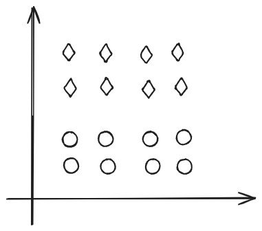
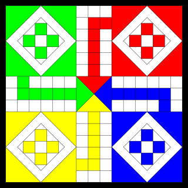

# Aprendizaje Automático
## Evaluación — Curso 2024

**Duración:** 3:00 horas.  
*Justifique todas sus respuestas.*

---

## Ejercicio 1 (10 puntos)

Considere un espacio de hipótesis $H$ que contiene al objetivo $c$, y $D$ un conjunto sin ruido. Indique si las siguientes afirmaciones son verdaderas o falsas. Justifique.

- **i.** Si todas las hipótesis de $VS_{H,D}$ clasifican a $x$ como verdadera, $c(x)$ es verdadero.
- **ii.** Si todas las hipótesis de $G_{H,D}$ clasifican a $x$ como verdadera, $c(x)$ es verdadero.
- **iii.** Los algoritmos perezosos son menos expresivos que su contraparte ansiosa para una misma complejidad de modelo, por ejemplo, la regresión lineal.
- **iv.** El bajo costo computacional de *entrenamiento* es una ventaja de los algoritmos perezosos.
- **v.** El bajo costo computacional de *clasificación* es una ventaja de los algoritmos perezosos.
- **vi.** La fácil incorporación de nuevos puntos de entrenamiento es una ventaja de los algoritmos perezosos.
- **vii.** El aprendizaje en redes neuronales consiste en encontrar los valores de las entradas que minimizan la función de pérdida.
- **viii.** El descenso por gradiente en redes neuronales siempre converge a un mínimo global.
- **ix.** La función de activación softmax permite normalizar la salida de una red neuronal para que represente una distribución de probabilidad sobre las predicciones para las clases objetivo.

---

## Ejercicio 2 (8 puntos)

El método de descenso por gradiente es un algoritmo numérico iterativo genérico que se puede utilizar para encontrar mínimos locales de cualquier función convexa derivable, desde un punto arbitrario y avanzando un paso $\alpha$ en la dirección opuesta al gradiente. 

Aplique este método sobre la función $f(x) = x^2 - 10x$, realizando solamente 4 iteraciones y comenzando siempre desde $x^{(0)} = 0$ con los siguientes cuatro valores de $\alpha$: $0.5$, $0.6$, $1.0$ y $2.0$.  
Indique, para cada caso, si el método converge, diverge u oscila sin converger.

---

## Ejercicio 3 (8 puntos)

Considere al juego del Ludo$^1$, en donde cada jugador debe trasladar las cuatro fichas de su color desde su cuadrante hasta el centro del tablero. El turno se da por la izquierda y las fichas se mueven en sentido antihorario. 

  

A cada jugador, en su turno, le corresponde lanzar el dado y mover sus fichas el número de espacios indicados por el dado. El 6 del dado sirve como salida: se utiliza para sacar fichas de la partida y se obtiene un turno extra. El jugador puede lanzar el 6 todas las veces que desee, sin perder su turno. Un jugador puede capturar las fichas de un contrincante, si en su turno ocupa la casilla de este último. Se puede usar dos dados o uno para hacer el avance de las fichas. 

Indique cuáles son los estados, acciones, función de transición y de recompensa que definen la tarea de jugar al ludo.

---
$^1$ *Adaptado de: https://es.wikipedia.org/wiki/Ludo*

---

## Ejercicio 4 (8 puntos)

La figura representa a un conjunto de datos de dos dimensiones, donde la forma de los puntos indica su *clustering* verdadero.

  

- **i.** Marque dos puntos $A_1$ y $A_2$, tales que, inicializando $k$-means con ellos, el algoritmo converge al *clustering* deseado.
- **ii.** Marque dos puntos $B_1$ y $B_2$, tales que, inicializando $k$-means con ellos, el algoritmo no converge al resultado esperado. 

Justifique su razonamiento.

---

## Ejercicio 5 (11 puntos)

La regresión logística es un método de clasificación de instancias $x = (a_1, a_2, \dots, a_N)$ en dos categorías posibles $y \in \{0, 1\}$. La función de costos utilizada para la regresión logística es conocida como función de entropía cruzada.

- **a)** Describa la función de hipótesis de la regresión logística y explique qué rol cumple la función sigmoide.
- **b)** ¿Por qué la regresión logística es un clasificador probabilístico?
- **c)** Exprese la fórmula que mide cuánto es la contribución de cada instancia, bien o mal clasificada, al cálculo del error en la regresión logística.  
  Para esto asuma que, dada una instancia $x$ que debe ser clasificada como $y$, su predicción es $\hat{y} = H(x)$. Llene la tabla dada y a partir de ello exprese la función de entropía cruzada:

| | $y = 0$ | $y = 1$ |
|:---:|:---:|:---:|
| **$\hat{y} = 0$** | | |
| **$\hat{y} = 1$** | | |

- **d)** Explique cómo se generaliza el clasificador binario en un clasificador multiclase.

---

## Ejercicio 6 (15 puntos)

Sea el siguiente conjunto de entrenamiento:

| # | Color | Gramaje | Hojas | Reciclable | Valor |
|:---:|:---:|:---:|:---:|:---:|:---:|
| 1 | blanca | bajo | muchas | sí | Sí |
| 2 | amarilla | alto | pocas | no | Sí |
| 3 | blanca | alto | pocas | sí | No |
| 4 | amarilla | bajo | muchas | no | No |
| 5 | blanca | mediano | pocas | sí | Sí |

- **a)** Dé los dos primeros niveles del árbol de decisión resultante de aplicar ID3. Deje planteadas las siguientes recursiones en caso de necesitarlas.
- **b)** Implemente un clasificador bayesiano sencillo para resolver el problema.
- **c)** Implemente un clasificador 3-NN para este problema.
- **d)** Clasifique la siguiente instancia utilizando los modelos generados con ID3, CBS y 3-NN:

| # | Color | Gramaje | Hojas | Reciclable | Valor |
|:---:|:---:|:---:|:---:|:---:|:---:|
| 6 | blanca | mediano | muchas | sí | ? |

- **e)** Sea un modelo $M$ que únicamente clasifica como negativa a la instancia #4. Dé la matriz de confusión y calcule Acierto, Precisión y Recall, estas dos últimas para cada clase.

---

## Fórmulas

- $\text{Entropía}(S) = -\sum p_i \log_2 p_i$
- $\text{Ganancia}(S, A) = \text{Entropía}(S) - \sum_{v \in \text{Val}(A)} \frac{|S_v|}{|S|} \text{Entropía}(S_v)$
