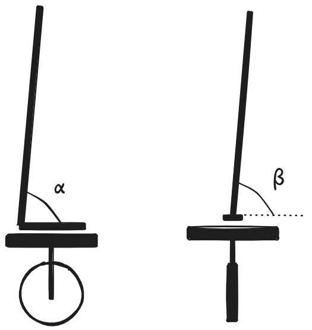

# Aprendizaje Automático
## Evaluación — Curso 2025

**Duración:** 3:00 horas.  
*Justifique todas sus respuestas.*

---

## Ejercicio 1 (18 puntos)

Se desea aprender a pronosticar la crítica de una película a partir de los siguientes datos:

| # | Género | Director/a | Actriz/Actor | Crítica |
|:---:|:---:|:---:|:---:|:---:|
| 1 | acción | Nolan | Hathaway | Buena |
| 2 | ciencia ficción | Villeneuve | Damon | Buena |
| 3 | drama | Nolan | Damon | Regular |
| 4 | ciencia ficción | Villeneuve | Ferguson | Regular |
| 5 | drama | Scott | Ferguson | Buena |
| 6 | acción | Scott | Hathaway | Mala |

- **a)** Defina los sesgos inductivo, restrictivo y preferencial de un algoritmo de aprendizaje.
- **b)** Plantee dos ejemplos: un ejemplo que tenga los sesgos preferencial y restrictivo, y otro con únicamente uno de los dos.
- **c)** Dé una ventaja y una desventaja de aplicar cada uno de los siguientes métodos:
  - **i.** ID3
  - **ii.** Clasificador Bayesiano Sencillo (NB)
  - **iii.** K-NN
- **d)** Implemente un clasificador NB para resolver el problema.
- **e)** Implemente un clasificador k-NN para este problema.
- **f)** Clasifique la siguiente instancia utilizando los modelos obtenidos con NB y 5-NN:

| # | Género | Director/a | Actriz/Actor | Crítica |
|:---:|:---:|:---:|:---:|:---:|
| 7 | ciencia ficción | Nolan | Ferguson | ? |

---

## Ejercicio 2 (12 puntos)

Se tienen una lista de 100 categorías y un conjunto de imágenes de $200 \times 200$ píxeles en formato RGB —cada píxel se representa por tres valores reales entre 0 y 255—. Se desea asociar a cada imagen la probabilidad de pertenecer a cada una de las categorías. Suponga que se construye una red *feedforward* con dos capas ocultas de $m$ neuronas cada una para resolver el problema.

- **a)** Dibuje el esquema de la red propuesta.
- **b)** Indique cuántos parámetros tendría la red. Justifique.
- **c)** ¿Qué función de activación utilizaría en la capa de salida?
- **d)** ¿Qué función de pérdida utilizaría para el aprendizaje?
- **e)** ¿Cómo ajustaría el número de capas de su red y la cantidad de neuronas en cada capa?
- **f)** ¿Cómo podría identificar un eventual sobreajuste en su red? Proponga una forma de mitigarlo.

---

## Ejercicio 3 (18 puntos)

Se desea estudiar cómo ciertos hábitos de vida influyen en el control de la glucosa en sangre y en el riesgo de desarrollar diabetes, una enfermedad que en Uruguay afecta al 9.5% de la población adulta. Para ello, se cuenta con observaciones de miles de pacientes con las siguientes variables:

| Variable | Tipo | Descripción |
|---|---|---|
| `edad` | numérica (años) | Edad del paciente |
| `peso` | numérica (kilos) | Peso del paciente |
| `altura` | numérico (cm) | Altura del paciente |
| `IMC` | numérica (kg/m²) | Índice de masa corporal |
| `ejercicio` | numérica (horas/semana) | Promedio de horas de actividad física semanal |
| `azucar_diaria` | numérica (g/día) | Consumo promedio de azúcar por día |
| `glucosa` | numérica (mg/dL) | Nivel de glucosa en ayunas |
| `diabetes` | categórica ($0 = \text{No}, 1 = \text{Sí}$) | Diagnóstico confirmado de diabetes |

- **a)** ¿Qué preprocesamiento haría sobre el *dataset*?
- **b)** ¿Qué consideraciones tendría a la hora de la división de datos?
- **c)** Plantee el modelo de regresión lineal para predecir el nivel de glucosa en función de los atributos seleccionados en la parte (a).
- **d)** Suponga que en la etapa de preprocesamiento se transforman los datos centrando todos los valores respecto del promedio de cada atributo: $\text{edad}' = \text{edad} - \overline{\text{edad}}\dots$ ¿Cuál sería la interpretación del coeficiente cero (el sesgo)?
- **e)** Dado que «aprender es minimizar una función»:
  - **i.** ¿Qué función se utiliza en regresión lineal para medir el error?
  - **ii.** ¿Qué métodos conoce para minimizar el error?
- **f)** Se desea predecir la probabilidad de tener diabetes, $P(\text{diabetes}=1)$, a partir de los mismos atributos. Plantee el modelo de regresión logística para este caso.
- **g)** Explique por qué la regresión logística maneja mejor los *outliers* que la regresión lineal.

---

## Ejercicio 4 (12 puntos)

Un robot minimalista, llamado Pendulito, quiere aprender a andar en una patineta eléctrica de una sola rueda. Pendulito consta de un único pie, unido a una varilla mediante una articulación similar a un tobillo, que permite movimiento en dos direcciones:
- rotación hacia adelante/atrás, determinada por un ángulo $\alpha$
- rotación hacia los costados, determinada por un ángulo $\beta$

  

La patineta, adaptada para Pendulito, consta de una rueda unida a una plataforma. Si la plataforma se inclina hacia adelante, la rueda avanza. Si se inclina hacia atrás, retrocede. El equilibrio lateral es responsabilidad del conductor.

Pendulito necesita ayuda para aprender utilizando aprendizaje por refuerzos para llegar a una meta dada, a pocos metros del punto de partida:

- **a)** Describa el problema en el marco de aprendizaje por refuerzos. No es necesario analizar la física del sistema.
- **b)** Describa una posible implementación capaz de aprender el problema, que incluya:
  - **i.** Variante de aprendizaje por refuerzos a utilizar.
  - **ii.** Potenciales problemas a tener en cuenta en el proceso de entrenamiento.
- **c)** Describa a alto nivel la política que esperaría que aprenda Pendulito.
