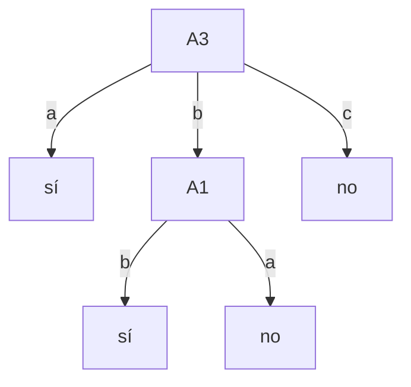
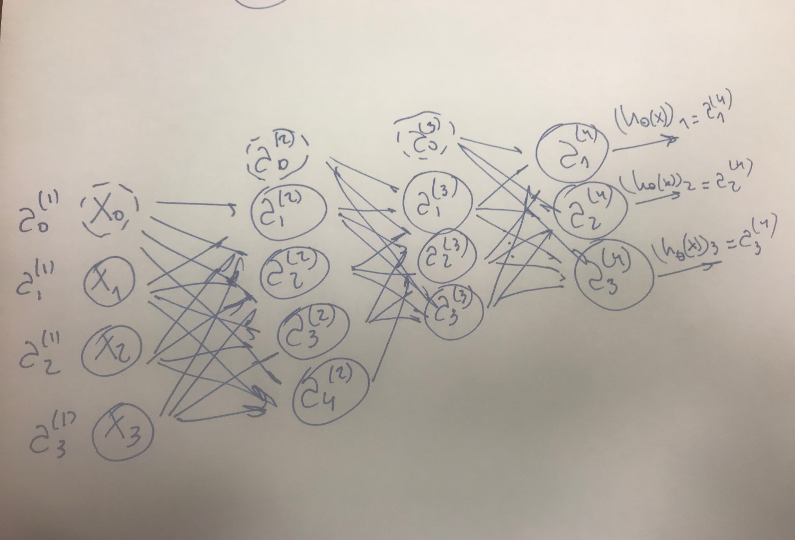

# Aprendizaje Automático
## Soluciones de la Evaluación — Curso 2018

---

## Ejercicio 1

### a)

#### i.
Busco el atributo $A$ que maximiza $\text{Ganancia}(S, A)$, o sea el que minimiza:

$$\sum_{v \in \text{Val}(A)} \frac{|S_v|}{|S|} \text{Entropía}(S_v)$$

**Nodo raíz:**
- **Para $A_1$:**
  $$-\frac{3}{5} \left(\frac{1}{3}\log_2\frac{1}{3} + \frac{2}{3}\log_2\frac{2}{3}\right) + \frac{2}{5} \times 1 \approx 0{,}95$$
- **Para $A_2$:**
  $$-\frac{3}{5} \left(\frac{1}{3}\log_2\frac{1}{3} + \frac{2}{3}\log_2\frac{2}{3}\right) - \frac{2}{5} \times 0 \approx 0{,}55$$
- **Para $A_3$:**
  $$-\frac{1}{5} \times 0 - \frac{2}{5} \times 0 + \frac{2}{5} \times 1 = 0{,}40$$

El atributo elegido es **$A_3$**.

- **Rama $A_3 = a$:** El conjunto tiene todos los elementos positivos, se genera una hoja etiquetada **sí**.
- **Rama $A_3 = c$:** Todos los elementos son negativos, se genera una hoja etiquetada **no**.
- **Rama $A_3 = b$:** Calculo atributo que maximiza ganancia en $\{\#3, \#5\}$:
  - Para $A_1$: $-\frac{1}{2} \times 0 - \frac{1}{2} \times 0 = 0$
  - Para $A_2$: $-\frac{1}{2} \times 0 - \frac{1}{2} \times 0 = 0$
  
  Ambos tienen igual ganancia. Se elige **$A_1$** (uno cualquiera de los dos).
  - **Rama $A_1 = b$:** Todos los elementos son positivos $\to$ hoja etiquetada **sí**.
  - **Rama $A_1 = a$:** Todos los elementos son negativos $\to$ hoja etiquetada **no**.

**Árbol resultante:**



```
       [ A3 ]
      /  |   \
   a / b |    \ c
    /    |     \
 [sí]  [ A1 ]  [no]
       /    \
    b /      \ a
     /        \
   [sí]      [no]
```

---

#### ii.
$$P(A_1 = a \mid \text{sí}) \cdot P(A_2 = q \mid \text{sí}) \cdot P(A_3 = b \mid \text{sí}) \cdot P(\text{sí}) \approx \frac{1}{2} \times 1 \times \frac{1}{2} \times \frac{2}{5} = \frac{1}{10} = 0{,}10$$

$$P(A_1 = a \mid \text{no}) \cdot P(A_2 = q \mid \text{no}) \cdot P(A_3 = b \mid \text{no}) \cdot P(\text{no}) \approx \frac{2}{3} \times \frac{1}{3} \times \frac{1}{3} \times \frac{3}{5} = \frac{2}{45} \approx 0{,}044$$

Luego, $\text{NB}(\langle a, q, b \rangle) =$ **sí**.

---

#### iii.
$$d(\langle a_1, a_2, a_3 \rangle, \langle b_1, b_2, b_3 \rangle) = \sqrt{\sum_{i=1}^3 \delta(a_i, b_i)^2}$$

donde:
$$\delta(a, b) = \begin{cases} 0 & \text{si } a = b \\ 1 & \text{si } a \neq b \end{cases}$$

Distancias al punto $\langle a, q, b \rangle$:

| # | Instancia | $\text{dist}^2$ | $c(x)$ |
|:---:|:---:|:---:|:---:|
| 1 | $\langle a, q, a \rangle$ | 1 | sí |
| 2 | $\langle b, q, c \rangle$ | 2 | no |
| 3 | $\langle b, q, b \rangle$ | 1 | sí |
| 4 | $\langle a, p, c \rangle$ | 2 | no |
| 5 | $\langle a, p, b \rangle$ | 1 | no |

Votan las 3 instancias más cercanas (#1, #3 y #5): dos votan **sí** y una vota **no**.  
Luego, $3\text{-NN}(\langle a, q, b \rangle) =$ **sí**.

---

#### iv.
*Ver teórico.*

---

### b)
- **i. Falso.** ID3 tiene un sesgo preferencial (prefiere árboles más cortos y coloca atributos con mayor ganancia de información cerca de la raíz).
- **ii. Falso.** Find-S es extremadamente sensible al ruido (un solo ejemplo positivo con ruido puede generalizar incorrectamente la hipótesis), mientras que $k$-NN es más robusto al ruido al tomar una votación mayoritaria entre los $k$ vecinos.
- **iii. Falso.** El error en el conjunto de entrenamiento es una subestimación optimista del error sobre futuras instancias no vistas (puede haber sobreajuste).

---

## Ejercicio 2

- **a)** *Ver teórico.*
- **b)** La relación entre la variable de salida y la de entrada no es lineal, por lo que ajustar con una recta pura no va a funcionar adecuadamente. Para resolverlo, debemos construir atributos de entrada polinomiales a partir de potencias de $x$ ($x^2, x^3$, por ejemplo).
- **c)** La función de costo es una medida de cuánto se está equivocando el modelo al comparar las predicciones con los valores reales del conjunto de entrenamiento. Usualmente en regresión lineal se utiliza la función de mínimos cuadrados:

$$J(\theta) = \frac{1}{2m} \sum_{i=1}^m \left(h_\theta(x^{(i)}) - y^{(i)}\right)^2$$

- **d)** El descenso por gradiente es un método numérico iterativo para buscar un mínimo de una función de múltiples variables. En la regresión lineal se utiliza para obtener iterativamente los parámetros/pesos $\theta$ que minimizan la función de costo $J(\theta)$.
- **e)** *Ver teórico.* (Batch usa todo el conjunto de entrenamiento en cada paso; Estocástico actualiza los pesos con un único ejemplo a la vez).

---

## Ejercicio 3

- **a)** *Ver teórico.*
- **b)** Con $\gamma = 0{,}9$:

**Función de valor $V^*$ y Política óptima $\pi^*$:**

| $V^*$ | | |
|:---:|:---:|:---:|
| 90 | 100 | 90 |
| 81 | 0 | 81 |
| 90 | 100 | 90 |

| $\pi^*$ | | |
|:---:|:---:|:---:|
| $\longrightarrow$ | $\downarrow$ | $\longleftarrow$ |
| $\downarrow$ | $\circlearrowleft$ | $\uparrow$ |
| $\longrightarrow$ | $\uparrow$ | $\longleftarrow$ |

**Valores $Q(s, a)$:**

| | | |
|:---:|:---:|:---:|
| $\begin{matrix} & 90 & \\ 73 & & 81 \\ & 73 & \end{matrix}$ | $\begin{matrix} & 81 & \\ 81 & & 81 \\ & 100 & \end{matrix}$ | $\begin{matrix} & 90 & \\ 81 & & 73 \\ & 73 & \end{matrix}$ |
| $\begin{matrix} & 81 & \\ 73 & & 0 \\ & 81 & \end{matrix}$ | $\begin{matrix} & 0 & \\ 0 & & 0 \\ & 0 & \end{matrix}$ | $\begin{matrix} & 81 & \\ 0 & & 73 \\ & 81 & \end{matrix}$ |
| $\begin{matrix} & 73 & \\ 73 & & 81 \\ & 90 & \end{matrix}$ | $\begin{matrix} & 100 & \\ 81 & & 81 \\ & 81 & \end{matrix}$ | $\begin{matrix} & 73 & \\ 81 & & 73 \\ & 90 & \end{matrix}$ |

- **c) y d)**

**Tabla $Q_1$ (tras episodio 1):**

| | | |
|:---:|:---:|:---:|
| $\begin{matrix} & 63 & \\ 30 & & 70 \\ 27 & & \end{matrix}$ | $\begin{matrix} & 72 & \\ 0 & & 0 \\ & 180 & \end{matrix}$ | $\begin{matrix} & 0 & \\ 0 & & 0 \\ & 0 & \end{matrix}$ |
| $\begin{matrix} & 20 & \\ 0 & & 0 \end{matrix}$ | $\begin{matrix} & 0 & \\ 0 & & 0 \end{matrix}$ | $\begin{matrix} & 200 & \\ 0 & & 0 \\ & 0 & \end{matrix}$ |
| $\begin{matrix} & 18 & \\ 0 & & 0 \\ & 90 & \end{matrix}$ | $\begin{matrix} & 100 & \\ 0 & & 81 \end{matrix}$ | $\begin{matrix} & 0 & \\ 0 & & 0 \end{matrix}$ |

**Tabla $Q_2$ (tras episodio 2, actualización inversa):**

| | | |
|:---:|:---:|:---:|
| $\begin{matrix} & 63 & \\ 30 & & 70 \\ 27 & & \end{matrix}$ | $\begin{matrix} & 72 & \\ 0 & & 90 \\ & 100 & \end{matrix}$ | $\begin{matrix} & 0 & \\ 180 & & 0 \\ & 162 & \end{matrix}$ |
| $\begin{matrix} & 20 & \\ 0 & & 0 \end{matrix}$ | $\begin{matrix} & 0 & \\ 0 & & 0 \end{matrix}$ | $\begin{matrix} & 0 & \\ 0 & & 0 \\ & 0 & \end{matrix}$ |
| $\begin{matrix} & 18 & \\ 0 & & 0 \\ & 90 & \end{matrix}$ | $\begin{matrix} & 100 & \\ 131 & & 81 \end{matrix}$ | $\begin{matrix} & 146 & \\ 0 & & 0 \\ & 0 & \end{matrix}$ |

---

## Ejercicio 4

- **a)** *Ver teórico.*
- **b)** Distancias a los centroides iniciales $M_1(1,1)$, $M_2(3,1)$ y $M_3(2.8, 0.9)$:

### Iteración 1:
| Punto | $M_1(1, 1)$ | $M_2(3, 1)$ | $M_3(2.8, 0.9)$ | Cluster asignado |
|:---:|:---:|:---:|:---:|:---:|
| $(1, 1)$ | **0** | 2 | 1.8028 | 1 |
| $(1.2, 1.2)$ | **0.2828** | 1.8111 | 1.6279 | 1 |
| $(1.1, 1)$ | **0.1** | 1.9 | 1.7029 | 1 |
| $(1.3, 0.9)$ | **0.3162** | 1.7029 | 1.5000 | 1 |
| $(3.2, 2.9)$ | 2.9069 | **1.9105** | 2.0396 | 2 |
| $(3, 3.1)$ | 2.9 | **2.1** | 2.2091 | 2 |
| $(3, 3)$ | 2.8284 | **2.0** | 2.1095 | 2 |
| $(3, 1)$ | 2 | **0** | 0.2236 | 2 |
| $(2.9, 1.1)$ | 1.9026 | **0.1414** | 0.2236 | 2 |
| $(2.8, 0.9)$ | 1.8028 | 0.2236 | **0.0** | 3 |

Nuevos centroides:
- $M_1 = (1.15, 1.025)$
- $M_2 = (3.02, 2.22)$
- $M_3 = (2.8, 0.9)$

### Iteración 2:
| Punto | $M_1(1.15, 1.025)$ | $M_2(3.02, 2.22)$ | $M_3(2.8, 0.9)$ | Cluster asignado |
|:---:|:---:|:---:|:---:|:---:|
| $(1, 1)$ | **0.1521** | 2.3598 | 1.8028 | 1 |
| $(1.2, 1.2)$ | **0.1820** | 2.0863 | 1.6279 | 1 |
| $(1.1, 1)$ | **0.0559** | 2.2748 | 1.7029 | 1 |
| $(1.3, 0.9)$ | **0.1953** | 2.1681 | 1.5000 | 1 |
| $(3.2, 2.9)$ | 2.7782 | **0.7034** | 2.0396 | 2 |
| $(3, 3.1)$ | 2.7800 | **0.8802** | 2.2091 | 2 |
| $(3, 3)$ | 2.7061 | **0.7803** | 2.1095 | 2 |
| $(3, 1)$ | 1.8502 | 1.2202 | **0.2236** | 3 |
| $(2.9, 1.1)$ | 1.7516 | 1.1264 | **0.2236** | 3 |
| $(2.8, 0.9)$ | 1.6547 | 1.3382 | **0.0** | 3 |

Nuevos centroides:
- $M_1 = (1.15, 1.025)$
- $M_2 = (3.07, 3)$
- $M_3 = (2.9, 1)$

### Iteración 3 (Convergencia):
| Punto | $M_1(1.15, 1.025)$ | $M_2(3.07, 3)$ | $M_3(2.9, 1)$ | Cluster asignado |
|:---:|:---:|:---:|:---:|:---:|
| $(1, 1)$ | **0.1521** | 2.8760 | 1.9 | 1 |
| $(1.2, 1.2)$ | **0.1820** | 2.5932 | 1.7117 | 1 |
| $(1.1, 1)$ | **0.0559** | 2.8050 | 1.8000 | 1 |
| $(1.3, 0.9)$ | **0.1953** | 2.7443 | 1.6031 | 1 |
| $(3.2, 2.9)$ | 2.7782 | **0.1667** | 1.9235 | 2 |
| $(3, 3.1)$ | 2.7800 | **0.1202** | 2.1024 | 2 |
| $(3, 3)$ | 2.7061 | **0.0667** | 2.0025 | 2 |
| $(3, 1)$ | 1.8502 | 2.0011 | **0.1** | 3 |
| $(2.9, 1.1)$ | 1.7516 | 1.9073 | **0.1** | 3 |
| $(2.8, 0.9)$ | 1.6547 | 2.1169 | **0.1414** | 3 |

**Centroides finales:**
- **Cluster 1:** $(1.15, 1.025)$
- **Cluster 2:** $(3.07, 3)$
- **Cluster 3:** $(2.9, 1)$

---

## Ejercicio 5

### a) Esquema de la red:

<div align="center">
  
</div>

### b) Dimensiones de las matrices de pesos:
- $\Theta^{(1)} \in \mathbb{R}^{4 \times 4}$ (4 neuronas capa 2 $\times$ (3 entradas + 1 bias) = 16 pesos)
- $\Theta^{(2)} \in \mathbb{R}^{3 \times 5}$ (3 neuronas capa 3 $\times$ (4 neuronas capa 2 + 1 bias) = 15 pesos)
- $\Theta^{(3)} \in \mathbb{R}^{3 \times 4}$ (3 salidas $\times$ (3 neuronas capa 3 + 1 bias) = 12 pesos)

**Total de parámetros:** $16 + 15 + 12 = 43$ pesos.

$$\Theta^{(2)} = \begin{pmatrix}
\theta_{10}^{(2)} & \theta_{11}^{(2)} & \theta_{12}^{(2)} & \theta_{13}^{(2)} & \theta_{14}^{(2)} \\
\theta_{20}^{(2)} & \theta_{21}^{(2)} & \theta_{22}^{(2)} & \theta_{23}^{(2)} & \theta_{24}^{(2)} \\
\theta_{30}^{(2)} & \theta_{31}^{(2)} & \theta_{32}^{(2)} & \theta_{33}^{(2)} & \theta_{34}^{(2)}
\end{pmatrix}$$

### c) Activación:
$$a_2^{(3)} = g(z_2^{(3)})$$

donde:
$$z_2^{(3)} = \theta_{20}^{(2)} a_0^{(2)} + \theta_{21}^{(2)} a_1^{(2)} + \theta_{22}^{(2)} a_2^{(2)} + \theta_{23}^{(2)} a_3^{(2)} + \theta_{24}^{(2)} a_4^{(2)}$$

Forma vectorial:
$$a^{(3)} = g(z^{(3)}), \quad z^{(3)} = \Theta^{(2)} a^{(2)}$$

### d) Función de hipótesis:
$$h_\Theta(x) = a^{(4)}$$
