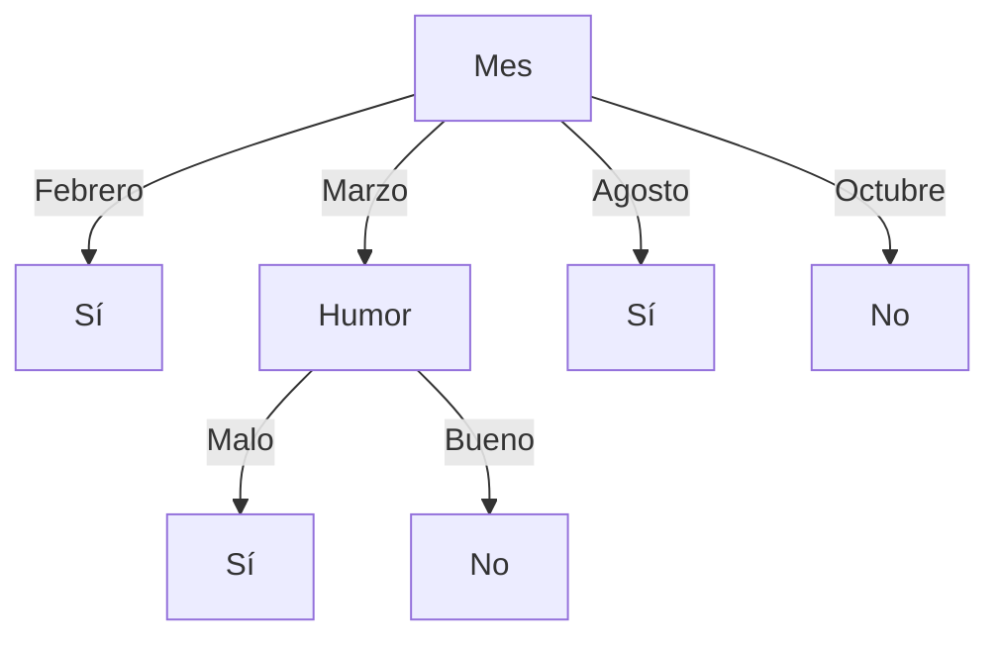

# Aprendizaje Automático
## Soluciones de la Evaluación — Curso 2019

---

## Ejercicio 1

- **a) Verdadero.** Un algoritmo que no posee sesgo inductivo no puede generalizar más allá de los datos observados y se limitaría únicamente a clasificar instancias ya vistas.
- **b) Verdadero.** Si se introduce un ejemplo con ruido o incorrectamente etiquetado, el algoritmo *Candidate-Elimination* puede eliminar la hipótesis objetivo verdadera del espacio de versiones ($VS$), volviéndolo vacío o inconsistente.
- **c) Falso.** Al no disponer de etiquetas reales en el aprendizaje no supervisado, la evaluación de calidad es intrínseca o relativa (mediante métricas como el índice Silhouette o ARI si hay referencia externa), resultando más compleja que en el aprendizaje supervisado donde se compara directamente contra etiquetas reales.
- **d) Falso.** Al no contar con etiquetas directas de supervisión, los algoritmos de aprendizaje no supervisado típicamente requieren grandes volúmenes de datos para capturar patrones y estructuras subyacentes significativas.
- **e) Falso.** Los clasificadores «perezosos» (*lazy learners* como $k$-NN) difieren el procesamiento computacional a la fase de inferencia/clasificación, realizando un entrenamiento prácticamente nulo.

---

## Ejercicio 2

### a) Manejo del valor faltante:
1. **Imputación por valor más frecuente (moda):** Reemplazar el valor faltante de `Calidad` en la instancia 4 por el valor más común (`Buena`), aprovechando el ejemplo en el entrenamiento.
2. **Eliminación del ejemplo:** Descartar la instancia 4 del conjunto de entrenamiento.

---

### b) Clasificador con regla: *«¿Compra? = Sí si Peso > 0,600 kg»*

#### i. Matriz de confusión:
*(Instancia clasificada como Sí: #4. Instancias clasificadas como No: #1, #2, #3, #5)*

| | Predicción: Sí | Predicción: No | Total Real |
|:---:|:---:|:---:|:---:|
| **Real: Sí** | 1 (VP: #4) | 2 (FN: #1, #3) | 3 |
| **Real: No** | 0 (FP) | 2 (VN: #2, #5) | 2 |
| **Total Predicho** | 1 | 4 | 5 |

#### ii. Estimación del Acierto (*Accuracy*):
- $$\text{Acierto}_{\text{micro}} = \frac{\text{VP} + \text{VN}}{\text{Total}} = \frac{1 + 2}{5} = \frac{3}{5} = 0{,}60$$
- $$\text{Acierto}_{\text{macro}} = \frac{\text{Acierto}_{\text{Sí}} + \text{Acierto}_{\text{No}}}{2} = \frac{\frac{1}{3} + \frac{2}{2}}{2} = \frac{\frac{1}{3} + 1}{2} = \frac{2}{3} \approx 0{,}667$$

#### iii. Precisión y *Recall* de la clase positiva:
- $$P_{\text{sí}} = \frac{\text{VP}}{\text{VP} + \text{FP}} = \frac{1}{1 + 0} = 1{,}0$$
- $$R_{\text{sí}} = \frac{\text{VP}}{\text{VP} + \text{FN}} = \frac{1}{1 + 2} = \frac{1}{3} \approx 0{,}333$$

---

### c) Modificaciones al corpus para aplicar KNN:
1. **One-Hot Encoding** para el atributo nominal no ordinal `Ciudad` (evitando imponer un orden artificial).
2. **Codificación numérica/ordinal** para `Humor` ($\text{Malo}=0, \text{Bueno}=1$), `Calidad` ($\text{Mala}=0, \text{Media}=1, \text{Buena}=2$) y `Mes` (considerando distancia circular, donde $d(\text{Diciembre}, \text{Enero}) = 1$).
3. **Normalización (Min-Max o Z-score)** para los atributos numéricos `Precio` y `Peso`, de forma que sus escalas no dominen la distancia euclídea.

---

### d) Efecto de aumentar $K$ en KNN:
- **Ventaja:** Mayor robustez frente al ruido y valores atípicos (*outliers*), ya que la decisión se suaviza por votación mayoritaria.
- **Desventaja:** Fronteras de decisión menos locales y mayor sesgo hacia las clases mayoritarias en regiones desbalanceadas.

---

### e) Clasificación Naïve Bayes para la instancia #6:
Discretizando `Precio` ($\le 100$: Bajo, $110-150$: Medio, $\ge 160$: Alto), `Peso` ($\le 0{,}300$: Liviano, $\ge 0{,}500$: Pesado) e imputando la moda (`Calidad = Buena`):

- **Instancia 6:** $\langle \text{Precio}=\text{Medio}, \text{Ciudad}=\text{Salto}, \text{Mes}=\text{Marzo}, \text{Humor}=\text{Malo}, \text{Calidad}=\text{Buena}, \text{Peso}=\text{Liviano} \rangle$

**Probabilidades a priori:**
$$P(\text{Sí}) = \frac{3}{5}, \quad P(\text{No}) = \frac{2}{5}$$

**Probabilidades condicionales:**
| Atributo | $P(\cdot \mid \text{Sí})$ | $P(\cdot \mid \text{No})$ |
|---|:---:|:---:|
| $\text{Precio} = \text{Medio}$ | $1/3$ | $1/2$ |
| $\text{Ciudad} = \text{Salto}$ | $2/3$ | $1/2$ |
| $\text{Mes} = \text{Marzo}$ | $1/3$ | $1/2$ |
| $\text{Humor} = \text{Malo}$ | $1/3$ | $1/2$ |
| $\text{Calidad} = \text{Buena}$ | $1$ | $1/2$ |
| $\text{Peso} = \text{Liviano}$ | $1/3$ | $1$ |

**Cálculo final:**
$$P(\text{Sí}) \prod P(x_i \mid \text{Sí}) = \frac{3}{5} \times \frac{1}{3} \times \frac{2}{3} \times \frac{1}{3} \times \frac{1}{3} \times 1 \times \frac{1}{3} = \frac{2}{405} \approx 0{,}00494$$

$$P(\text{No}) \prod P(x_i \mid \text{No}) = \frac{2}{5} \times \frac{1}{2} \times \frac{1}{2} \times \frac{1}{2} \times \frac{1}{2} \times \frac{1}{2} \times 1 = \frac{1}{80} = 0{,}01250$$

Como $P(\text{No} \mid x) > P(\text{Sí} \mid x)$, el modelo predice: **¿Compra? = No**.

---

## Ejercicio 3

### a) Aplicación de ID3:
Buscamos el atributo que minimiza $\sum_{v \in \text{Val}(A)} \frac{|S_v|}{|S|} \text{Entropía}(S_v)$:

- **Para Mes:**
  $$\frac{1}{5}(0) + \frac{2}{5}(1) + \frac{1}{5}(0) + \frac{1}{5}(0) = 0{,}40$$
- **Para Humor:**
  $$-\frac{3}{5}\left(\frac{2}{3}\log_2\frac{2}{3} + \frac{1}{3}\log_2\frac{1}{3}\right) + \frac{2}{5}(1) \approx 0{,}95$$

Se selecciona **Mes** como raíz:
- $\text{Mes} = \text{Febrero} \implies \text{Sí}$
- $\text{Mes} = \text{Agosto} \implies \text{Sí}$
- $\text{Mes} = \text{Octubre} \implies \text{No}$
- $\text{Mes} = \text{Marzo} \implies$ se evalúa el atributo restante **Humor**:
  - $\text{Humor} = \text{Malo} \implies$ empate (1 Sí, 1 No) $\to$ se asigna clase mayoritaria global (**Sí** o **No**).
  - $\text{Humor} = \text{Bueno} \implies$ conjunto vacío $\to$ se asigna clase mayoritaria global.

### b) Tratamiento de atributos con muchos valores:
1. **Preprocesamiento:** Discretizar/agrupar los valores en rangos o categorías más amplias (ej. agrupar fechas por trimestres o estaciones).
2. **Selección de atributos:** Utilizar **Gain Ratio** (tasa de ganancia) en lugar de Ganancia de Información estándar para penalizar atributos con alta entropía de partición (*SplitInformation*).

---

## Ejercicio 4

- **a)** *Ver teórico.*
- **b)** Con $\gamma = 0{,}8$ en grilla circular:

**Función $V^*$ y Políticas óptimas $\pi_1^*$ y $\pi_2^*$:**

| $V^*$ | | |
|:---:|:---:|:---:|
| 0 | 160 | 200 |
| 102 | 128 | 0 |
| 128 | 128 | 160 |

| $\pi_1^*$ | | |
|:---:|:---:|:---:|
| $\circlearrowleft$ | $\Rightarrow$ | $\Downarrow$ |
| $\Rightarrow$ | $\Uparrow$ | $\circlearrowleft$ |
| $\Leftarrow$ | $\Downarrow$ | $\Downarrow$ |

| $\pi_2^*$ | | |
|:---:|:---:|:---:|
| $\circlearrowleft$ | $\Rightarrow$ | $\Downarrow$ |
| $\Downarrow$ | $\Uparrow$ | $\circlearrowleft$ |
| $\Leftarrow$ | $\Rightarrow$ | $\Downarrow$ |

**Valores $Q(s, a)$:**

| | | |
|:---:|:---:|:---:|
| $\begin{matrix} & 0 & \\ 0 & & 160 \\ & 102 & \end{matrix}$ | $\begin{matrix} & 128 & \\ 0 & & 200 \\ & 128 & \end{matrix}$ | $\begin{matrix} & 0 & \\ 102 & & 102 \\ & 0 & \end{matrix}$ |
| $\begin{matrix} & 0 & \\ 82 & & 128 \\ & 102 & \end{matrix}$ | $\begin{matrix} & 128 & \\ 102 & & 0 \\ & 102 & \end{matrix}$ | $\begin{matrix} & 0 & \\ 102 & & 102 \\ & 0 & \end{matrix}$ |
| $\begin{matrix} & 82 & \\ 128 & & 102 \\ & 0 & \end{matrix}$ | $\begin{matrix} & 102 & \\ 102 & & 128 \\ & 128 & \end{matrix}$ | $\begin{matrix} & 0 & \\ 102 & & 102 \\ & 160 & \end{matrix}$ |

- **c) Secuencia de explotación desde A:** $0 \to 1 \to 2 \to 3 \to 4$.
- **d) Tabla $Q_1$ resultante:**

| | | |
|:---:|:---:|:---:|
| | $\begin{matrix} & 200 & \\ & & 160 \end{matrix}$ | |
| | $\begin{matrix} & 160 & \\ & & 20 \end{matrix}$ | |
| 10 | $\begin{matrix} 150 & 128 \\ & 120 \end{matrix}$ | |

- **e)** Es una secuencia de **exploración**, dado que en el paso 3 se opta por la derecha a pesar de que la acción hacia la izquierda tenía mayor valor inicial en $Q_0$.

---

## Ejercicio 5

1. **Diferencia:** La regresión lineal predice valores continuos en $\mathbb{R}$, mientras que la regresión logística clasifica instancias en categorías discretas mapeando mediante una función sigmoide/softmax a probabilidades.
2. **Multiclase ($N > 2$):** Se puede utilizar el enfoque *One-vs-All* (entrenar $N$ clasificadores binarios y predecir la clase con mayor probabilidad) o la regresión logística multinomial mediante la función *Softmax*.
3. **Underfitting:** Sí, es posible resolver el problema incorporando características polinomiales como $x^2$ como atributo de entrada, ya que la relación exhibe un comportamiento parabólico/cuadrático.
4. **PCA y reducción de dimensionalidad:** No para "seleccionar" atributos originales directamente, sino para proyectar el espacio sobre nuevas combinaciones lineales ortogonales (componentes principales) ordenadas por su varianza.
5. **Descenso por gradiente vs. Ecuaciones normales:** Se utiliza descenso por gradiente porque las ecuaciones normales requieren calcular la inversa de una matriz $(X^T X)^{-1}$, cuya complejidad computacional es $O(n^3)$, haciéndola prohibitiva para espacios con miles de características o datos masivos.
