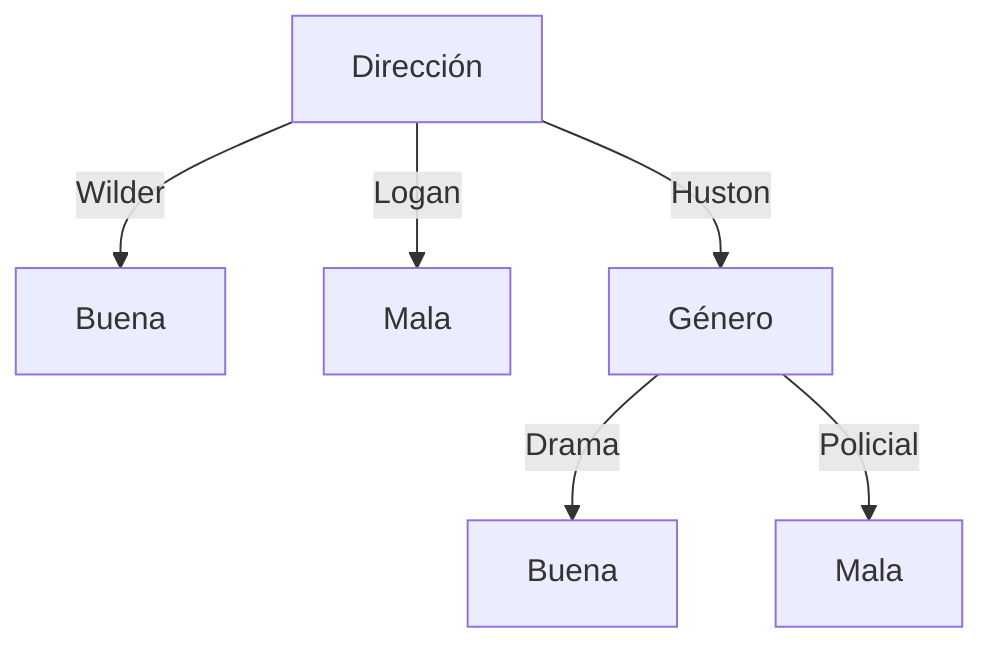

# Aprendizaje Automático
## Solución de la Evaluación — Curso 2020

---

## Ejercicio 1

- **a) Verdadero.** Gracias a su sesgo preferencial (busca la hipótesis más específica consistente), FIND-S puede aprender aun en un espacio de hipótesis completo sin requerir un sesgo restrictivo.
- **b) Falso.** A diferencia de FIND-S, el algoritmo ID3 no es tan sensible al ruido ya que utiliza medidas estadísticas globales (entropía y ganancia de información) sobre todas las instancias del nodo para tomar decisiones de división.
- **c) Verdadero.** En $1$-NN un único ejemplo ruidoso o mal etiquetado determina directamente la predicción de su vecindad. Al aumentar $K$, la votación mayoritaria amortigua el impacto del ruido.
- **d) Falso.** En problemas con clases fuertemente desbalanceadas, el acierto (*accuracy*) es engañoso (un clasificador trivial que siempre predice la clase mayoritaria puede obtener un acierto alto pero ser inútil).
- **e) Falso.** El Clasificador Bayesiano Óptimo combina ponderadamente las predicciones de todas las hipótesis del espacio $H$. Por ende, la hipótesis combinada resultante puede no pertenecer al espacio $H$ original.
- **f) Falso.** El resultado de $K$-Means depende fuertemente de la inicialización de los centroides, pudiendo converger a diferentes óptimos locales. Por ello, se suele ejecutar múltiples veces con diferentes inicializaciones.
- **g) Falso.** El descenso por gradiente es un método de optimización general para hallar mínimos locales de funciones diferenciables. *Backpropagation* es el algoritmo que calcula eficientemente las derivadas parciales de la función de costo con respecto a los pesos en una red neuronal para que el descenso por gradiente las utilice.

---

## Ejercicio 2

- **a)** Es una secuencia de **exploración**. Si fuese de explotación pura, en su segunda acción debería haber seleccionado la acción con mayor valor estimado (hacia arriba con retorno de $200$, en lugar de hacia la izquierda con retorno de $100$).
- **b)** Para una secuencia de **explotación**, se deben seguir siempre las acciones de mayor valor estimado en $Q_0$:

```
Casilla inicial ● ──(↑)──> Casilla superior ──(←)──> Casilla superior izquierda
```

- **c) Tabla $Q_1$:** *(Recompensa final $+100$)*
  Valores actualizados respecto a $Q_0$:

| | | |
|:---:|:---:|:---:|
| $\begin{matrix} \mathbf{90} & 100 \end{matrix}$ | 100 | |
| 100 | $\mathbf{0}$ | 20 |
| $\mathbf{90}$ | $\begin{matrix} 200 \\ \mathbf{9} \end{matrix}$ | $\begin{matrix} 10 \\ \mathbf{180} \end{matrix}$ |

- **d) Tabla $Q_1$ con actualización en orden inverso:**

| | | |
|:---:|:---:|:---:|
| $\begin{matrix} \mathbf{90} & 100 \end{matrix}$ | 100 | |
| 100 | $\mathbf{81}$ | 20 |
| $\mathbf{73}$ | $\begin{matrix} 200 \\ \mathbf{66} \end{matrix}$ | $\begin{matrix} 10 \\ \mathbf{180} \end{matrix}$ |

- **e) Función de recompensa $r(s, a)$ para hacer óptima a $\pi_e$:**
  Todos los retornos son nulos salvo los indicados:

| | | |
|:---:|:---:|:---:|
| | 100 | |
| 90 | | |
| | 80 | |

- **f) Valores $V^*$ y $Q$:**

| $V^*$ | | |
|:---:|:---:|:---:|
| 90 | 100 | 90 |
| 81 | 90 | 81 |
| 73 | 81 | 73 |

**Valores $Q(s, a)$:**

| | | |
|:---:|:---:|:---:|
| $\begin{matrix} & 90 & \\ 81 & & 81 \\ & 100 & \end{matrix}$ | $\begin{matrix} & 90 & \\ 73 & & 90 \\ & 0 & \end{matrix}$ | $\begin{matrix} & 81 & \\ 81 & & 90 \\ & 73 & \end{matrix}$ |
| $\begin{matrix} & 0 & \\ 81 & & 0 \\ & 66 & \end{matrix}$ | $\begin{matrix} & 81 & \\ 80 & & 73 \\ & 81 & \end{matrix}$ | $\begin{matrix} & 72 & \\ 80 & & 73 \\ & 66 & \end{matrix}$ |
| $\begin{matrix} & 73 & \\ 72 & & \end{matrix}$ | | |

---

## Ejercicio 3

### a) Validación cruzada con 5 *folds*:
1. Dividir las 8000 instancias de entrenamiento en 5 particiones disjuntas de 1600 elementos cada una ($C_1, C_2, C_3, C_4, C_5$).
2. Para cada candidato del hiperparámetro $\alpha$:
   - Para $i = 1, \dots, 5$: entrenar el modelo en las 4 particiones restantes y evaluar el *accuracy* sobre $C_i$.
   - Calcular el *accuracy* promedio de los 5 *folds*.
3. Seleccionar el valor de $\alpha$ que maximice dicho rendimiento promedio y reentrenar el modelo final sobre las 8000 instancias.

---

### b) Partición de datos desbalanceados:
- Realizar primero un barajado aleatorio (*shuffle*).
- Aplicar **muestreo estratificado** (*stratified sampling*) para conservar exactamente las proporciones de las clases $A$ ($92{,}4\%$), $B$ ($5{,}4\%$) y $C$ ($2{,}2\%$) tanto en el conjunto de entrenamiento como en el de evaluación/test.

---

### c) Métricas sobre matriz de confusión:

| | A (pred) | B (pred) | C (pred) | Total Real |
|:---:|:---:|:---:|:---:|:---:|
| **A (real)** | **910** | 5 | 5 | 920 |
| **B (real)** | 5 | **20** | 20 | 45 |
| **C (real)** | 6 | 4 | **15** | 25 |
| **Total Pred** | 921 | 29 | 40 | 990 |

#### i. Métricas por clase:
- **Accuracy global:**
  $$\text{Accuracy} = \frac{910 + 20 + 15}{990} = \frac{945}{990} \approx 0{,}955$$
- **Clase A:**
  $$P_A = \frac{910}{921} \approx 0{,}988, \quad R_A = \frac{910}{920} \approx 0{,}989, \quad F_{1, A} \approx 0{,}989$$
- **Clase B:**
  $$P_B = \frac{20}{29} \approx 0{,}690, \quad R_B = \frac{20}{45} \approx 0{,}444, \quad F_{1, B} \approx 0{,}541$$
- **Clase C:**
  $$P_C = \frac{15}{40} = 0{,}375, \quad R_C = \frac{15}{25} = 0{,}600, \quad F_{1, C} \approx 0{,}462$$

#### ii. Promedios Macro y Micro:
- **Micro-average:** $P_{\text{micro}} = R_{\text{micro}} = F_{1, \text{micro}} \approx 0{,}955$
- **Macro-average:**
  $$P_{\text{macro}} = \frac{0{,}988 + 0{,}690 + 0{,}375}{3} \approx 0{,}684$$
  $$R_{\text{macro}} = \frac{0{,}989 + 0{,}444 + 0{,}600}{3} \approx 0{,}678$$
  $$F_{1, \text{macro}} = \frac{0{,}989 + 0{,}541 + 0{,}462}{3} \approx 0{,}664$$

**Análisis:** Las métricas macro son considerablemente menores a las micro debido a que otorgan el mismo peso a todas las clases. El *micro-average* queda dominado por el alto rendimiento sobre la clase mayoritaria $A$, ocultando el rendimiento deficiente sobre las clases minoritarias $B$ y $C$.

---

## Ejercicio 4

### a) 3-NN para regresión sobre la instancia #7:
- **Atributos categóricos:** distancia 0 si coinciden, 1 si difieren.
- **Atributo Año normalizado:** $\text{Año}_{\text{norm}} = \frac{\text{Año} - 1939}{1970 - 1939} = \frac{\text{Año} - 1939}{31}$

Instancia #7: $\langle \text{Policial}, \text{Huston}, 1976 \to \text{norm} = 1{,}19, \text{Monroe} \rangle$

Distancias euclídeas al cuadrado:
- $d(\#1, \#7)^2 = 1 + 1 + (0 - 1{,}19)^2 + 1 = 4{,}42$
- $d(\#2, \#7)^2 = 0 + 0 + (0{,}06 - 1{,}19)^2 + 1 = 2{,}27$
- $d(\#3, \#7)^2 = 1 + 1 + (0{,}55 - 1{,}19)^2 + 0 = 2{,}42$
- $d(\#4, \#7)^2 = 1 + 1 + (0{,}65 - 1{,}19)^2 + 0 = 2{,}30$
- $d(\#5, \#7)^2 = 1 + 0 + (0{,}71 - 1{,}19)^2 + 0 = 1{,}23$
- $d(\#6, \#7)^2 = 0 + 0 + (1{,}00 - 1{,}19)^2 + 1 = 1{,}04$

Los 3 vecinos más cercanos son **#6, #5 y #2**:
$$3\text{-NN}(\#7) = \frac{\text{Calificación}(\#6) + \text{Calificación}(\#5) + \text{Calificación}(\#2)}{3} = \frac{45 + 85 + 80}{3} = \frac{210}{3} = 70$$

---

### b) Discretización (Calificación $> 50 \implies \text{Buena}$, $\le 50 \implies \text{Mala}$)

#### i. Clasificador Bayesiano Sencillo (sin Año):
- $P(\text{Policial} \mid \text{Buena}) \cdot P(\text{Huston} \mid \text{Buena}) \cdot P(\text{Monroe} \mid \text{Buena}) \cdot P(\text{Buena}) = \frac{1}{4} \times \frac{2}{4} \times \frac{2}{4} \times \frac{4}{6} = \frac{1}{24}$
- $P(\text{Policial} \mid \text{Mala}) \cdot P(\text{Huston} \mid \text{Mala}) \cdot P(\text{Monroe} \mid \text{Mala}) \cdot P(\text{Mala}) = \frac{1}{2} \times \frac{1}{2} \times \frac{1}{2} \times \frac{2}{6} = \frac{1}{24}$

Ambas clases son equiprobables ($\frac{1}{24}$ vs $\frac{1}{24}$), produciendo un empate.

#### ii. ID3 con Género y Dirección:
- **Entropía residual para Género:** $\frac{2}{6}(0) + \frac{2}{6}(1) + \frac{2}{6}(1) = \frac{2}{3} \approx 0{,}667$
- **Entropía residual para Dirección:** $\frac{2}{6}(0) + \frac{3}{6}\text{Entropía}(2+, 1-) + \frac{1}{6}(0) = \frac{1}{2}\left(-\frac{2}{3}\log_2\frac{2}{3} - \frac{1}{3}\log_2\frac{1}{3}\right) \approx 0{,}459$

Como $\text{Ganancia}(\text{Dirección}) > \text{Ganancia}(\text{Género})$, la raíz es **Dirección**:
- $\text{Dirección} = \text{Wilder} \implies \text{Buena}$
- $\text{Dirección} = \text{Logan} \implies \text{Mala}$
- $\text{Dirección} = \text{Huston} \implies$ se evalúa **Género**:
  - $\text{Género} = \text{Drama} \implies \text{Buena}$
  - $\text{Género} = \text{Policial} \implies$ empate (1+, 1-) $\to$ valor asignado: **Mala** (o según criterio de desempate).



---

### c) Discretización del atributo continuo Año:
*Ver teórico* (ordenar las instancias por Año, identificar puntos de cambio de clase y evaluar la ganancia de información de cada punto de corte candidato $c$).
