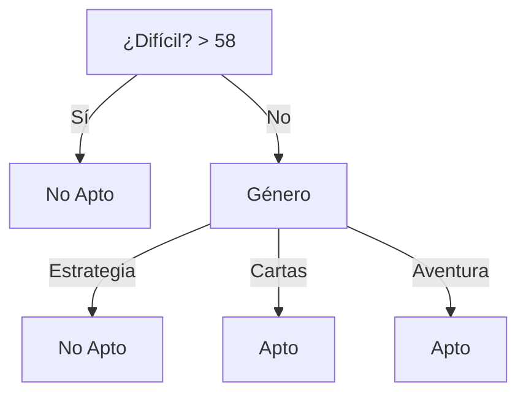

# Aprendizaje Automático
## Solución de la Evaluación — Curso 2021

---

## Ejercicio 1

### a) ID3 con manejo de atributos continuos

**Paso 1: Discretización del atributo continuo `Dificultad`**  
Ordenamos las instancias por `Dificultad`:

| # | Dificultad | Apto para niños |
|:---:|:---:|:---:|
| 4 | 25 | Apto |
| 1 | 30 | No apto |
| 3 | 32 | Apto |
| 2 | 45 | Apto |
| 5 | 70 | No apto |

Puntos de corte candidatos donde cambia la clase:
- Entre 25 y 30: **27.5** (o 27)
- Entre 30 y 32: **31**
- Entre 45 y 70: **57.5** (o 58)

Evaluación de la entropía residual $\sum \frac{|S_v|}{|S|} \text{Entropía}(S_v)$:
- **Corte en 27.5:** $\frac{1}{5}(0) + \frac{4}{5}(1) = 0{,}80$
- **Corte en 31:** $\frac{2}{5}(1) + \frac{3}{5}\left(-\frac{2}{3}\log_2\frac{2}{3} - \frac{1}{3}\log_2\frac{1}{3}\right) \approx 0{,}95$
- **Corte en 57.5:** $\frac{4}{5}\left(-\frac{3}{4}\log_2\frac{3}{4} - \frac{1}{4}\log_2\frac{1}{4}\right) + \frac{1}{5}(0) \approx 0{,}65$

Se elige el punto de corte en **57.5 / 58** ($\text{¿Difícil?} = \text{Dificultad} > 58$).

**Conjunto discretizado:**

| # | Género | ¿Difícil? ($>58$) | Apto para niños |
|:---:|:---:|:---:|:---:|
| 1 | Estrategia | No | No apto |
| 2 | Aventura | No | Apto |
| 3 | Estrategia | No | Apto |
| 4 | Cartas | No | Apto |
| 5 | Cartas | Sí | No apto |

**Paso 2: Selección del atributo raíz**
- Para **¿Difícil?**: Entropía residual $\approx 0{,}65$
- Para **Género**: $\frac{1}{5}(0) + \frac{2}{5}(1) + \frac{2}{5}(1) = 0{,}80$

Se elige **¿Difícil?** como raíz:
- $\text{¿Difícil?} = \text{Sí} \implies$ **No apto**
- $\text{¿Difícil?} = \text{No} \implies$ se evalúa el atributo restante **Género**:
  - $\text{Género} = \text{Aventura} \implies$ **Apto**
  - $\text{Género} = \text{Cartas} \implies$ **Apto**
  - $\text{Género} = \text{Estrategia} \implies$ empate (1 Apto, 1 No apto) $\to$ se asigna valor por defecto: **No apto** (o **Apto**).

---

### b) Sesgo de ID3
- **Sesgo Restrictivo:** Ninguno (el espacio de hipótesis $H$ de árboles de decisión es completo; puede representar cualquier función booleana discreta).
- **Sesgo Preferencial:** Sí (prefiere árboles más cortos con atributos de alta ganancia de información más cercanos a la raíz).

---

### c) Reducción de sobreajuste en ID3
- Pre-poda (*early stopping* basado en umbrales de ganancia o tests estadísticos como $\chi^2$).
- Post-poda (*Reduced Error Pruning* utilizando un conjunto de validación, o *Rule Post-Pruning* como en C4.5).

---

### d) 3-NN para la instancia #3
Normalizamos `Dificultad` dividiendo entre 100, y definimos $g(x, y) = 0$ si coinciden y $1$ si no.

Instancia #3: $\langle \text{Estrategia}, 0{,}32 \rangle$

Distancias Manhattan/Euclídea:
- $d(\#1, \#3) = 0 + |0{,}30 - 0{,}32| = 0{,}02$
- $d(\#4, \#3) = 1 + |0{,}25 - 0{,}32| = 1{,}07$
- $d(\#2, \#3) = 1 + |0{,}45 - 0{,}32| = 1{,}13$
- $d(\#5, \#3) = 1 + |0{,}70 - 0{,}32| = 1{,}38$

Las 3 instancias más cercanas son **#1, #4 y #2**:
- #1 $\to$ No apto
- #4 $\to$ Apto
- #2 $\to$ Apto

Por mayoría (2 de 3), se clasifica la instancia #3 como: **Apto para niños**.

---

## Ejercicio 2

### a) Inferencia Bayesiana

Definiciones:
- $h$: consume sustancias (dopaje), $\neg h$: no consume.
- $\oplus$: resultado positivo, $\ominus$: resultado negativo.
- $P(h) = 0{,}01 \implies P(\neg h) = 0{,}99$
- $P(\oplus \mid h) = 0{,}90 \implies P(\ominus \mid h) = 0{,}10$
- $P(\ominus \mid \neg h) = 0{,}85 \implies P(\oplus \mid \neg h) = 0{,}15$

#### i. Probabilidad tras un test positivo:
$$P(\oplus) = P(\oplus \mid h)P(h) + P(\oplus \mid \neg h)P(\neg h) = 0{,}90 \times 0{,}01 + 0{,}15 \times 0{,}99 = 0{,}1575$$

$$P(h \mid \oplus) = \frac{P(\oplus \mid h)P(h)}{P(\oplus)} = \frac{0{,}90 \times 0{,}01}{0{,}1575} \approx 0{,}0571 \quad (5{,}71\%)$$

#### ii. Probabilidad tras un segundo test independiente negativo ($\oplus \ominus$):
$$P(\oplus \ominus \mid h) = P(\oplus \mid h)P(\ominus \mid h) = 0{,}90 \times 0{,}10 = 0{,}09$$
$$P(\oplus \ominus \mid \neg h) = P(\oplus \mid \neg h)P(\ominus \mid \neg h) = 0{,}15 \times 0{,}85 = 0{,}1275$$

$$P(\oplus \ominus) = 0{,}09 \times 0{,}01 + 0{,}1275 \times 0{,}99 = 0{,}127125$$

$$P(h \mid \oplus \ominus) = \frac{0{,}09 \times 0{,}01}{0{,}127125} \approx 0{,}00708 \quad (0{,}71\%)$$
$$P(\neg h \mid \oplus \ominus) = 1 - P(h \mid \oplus \ominus) \approx 0{,}99292 \quad (99{,}29\%)$$

---

### b) Verdadero / Falso
- **i. Falso.** Las redes neuronales cuentan habitualmente con una gran cantidad de parámetros libres, por lo que con pocas instancias sufren severo sobreajuste y no generalizan bien.
- **ii. Falso.** La función de costo depende directamente de las activaciones de las unidades de la capa de salida (comparadas con las etiquetas deseadas).
- **iii. Falso.** El error de entrenamiento no es un buen estimador del error de generalización debido al posible sobreajuste (*overfitting*).
- **iv. Falso.** Probar distintas particiones de evaluación puede cambiar el valor numérico obtenido por variabilidad del muestreo, pero no mejora el desempeño intrínseco del clasificador ya entrenado.
- **v. Verdadero.** El semi-ancho del intervalo de confianza es $1{,}96\sqrt{\frac{\text{error}(1-\text{error})}{n}}$, el cual se reduce a medida que $n$ (tamaño del conjunto de evaluación) aumenta.

---

## Ejercicio 3

### a) Preprocesamiento:
- **Sexo:** *One-Hot Encoding* con 3 variables binarias (`es_femenino`, `es_masculino`, `no_se_conoce`) para evitar imponer un orden artificial a Sam.
- **Edad:** Escalamiento min-max a $[0, 1]$: $\frac{\text{Edad} - 9}{20 - 9} = \frac{\text{Edad} - 9}{11}$.
- **Nivel en Minecraft:** Escalamiento ordinal: $A \to 1$, $B \to 0{,}5$, $C \to 0$.

**Dataset preprocesado:**

| Id | es_femenino | es_masculino | no_se_conoce | Edad | Nivel Minecraft |
|:---:|:---:|:---:|:---:|:---:|:---:|
| Ana | 1 | 0 | 0 | 0.09 | 1.0 |
| Luis | 0 | 1 | 0 | 0.82 | 0.0 |
| Pedro | 0 | 1 | 0 | 1.00 | 0.0 |
| María | 1 | 0 | 0 | 0.00 | 0.5 |
| Sam | 0 | 0 | 1 | 0.09 | 1.0 |

---

### b) $K$-Means con centroides iniciales $c_1$ (Ana) y $c_2$ (Luis)

- $c_1 = \langle 1, 0, 0, 0{,}09, 1 \rangle$
- $c_2 = \langle 0, 1, 0, 0{,}82, 0 \rangle$

**Iteración 1:**
- $d(\text{Pedro}, c_1)^2 = 1 + 1 + 0 + (1 - 0{,}09)^2 + (0 - 1)^2 = 3{,}828$
- $d(\text{Pedro}, c_2)^2 = 0 + 0 + 0 + (1 - 0{,}82)^2 + (0 - 0)^2 = 0{,}032 \implies$ **Cluster 2**
- $d(\text{María}, c_1)^2 = 0 + 0 + 0 + (0 - 0{,}09)^2 + (0{,}5 - 1)^2 = 0{,}258$
- $d(\text{María}, c_2)^2 = 1 + 1 + 0 + (0 - 0{,}82)^2 + (0{,}5 - 0)^2 = 2{,}922 \implies$ **Cluster 1**
- $d(\text{Sam}, c_1)^2 = 1 + 0 + 1 + (0{,}09 - 0{,}09)^2 + (1 - 1)^2 = 2{,}000$
- $d(\text{Sam}, c_2)^2 = 0 + 1 + 1 + (0{,}09 - 0{,}82)^2 + (1 - 0)^2 = 3{,}533 \implies$ **Cluster 1**

**Partición resultante:**
- **Cluster 1:** $\{\text{Ana}, \text{María}, \text{Sam}\}$
- **Cluster 2:** $\{\text{Luis}, \text{Pedro}\}$

**Actualización de centroides:**
- $c_1' = \langle 0{,}67, 0, 0{,}33, 0{,}06, 0{,}83 \rangle$
- $c_2' = \langle 0, 1, 0, 0{,}91, 0 \rangle$

En la Iteración 2 las asignaciones no cambian $\implies$ el algoritmo converge.

---

### c) Asignación de Sam:
Sam queda en el **Cluster 1** (junto con Ana y María) debido a la proximidad en edad y nivel de Minecraft.

---

## Ejercicio 4

- **a)** Con $\gamma = 0{,}8$ y recompensa $+100$ en la última acción:

**Tabla $Q_1$:**

| | | |
|:---:|:---:|:---:|
| $\begin{matrix} 80 \\ 80 \end{matrix}$ | $\begin{matrix} 80 & 64 \end{matrix}$ | $\begin{matrix} 80 \\ 100 \end{matrix}$ |
| $\begin{matrix} 200 \\ 100 \end{matrix}$ | 80 | |
| 80 | $\begin{matrix} 200 & 64 \\ 40 & \end{matrix}$ | $\begin{matrix} 80 & 160 \\ 64 & \end{matrix}$ |

**Tabla $Q_2$:**

| | | |
|:---:|:---:|:---:|
| $\begin{matrix} 100 & 64 \\ 80 & \end{matrix}$ | 80 | 100 |
| $\begin{matrix} 200 \\ 100 \end{matrix}$ | 64 | 80 |
| $\begin{matrix} 80 & 64 \\ 160 & 40 \end{matrix}$ | 64 | $\begin{matrix} 80 & 160 \\ 64 & \end{matrix}$ |

- **b) Convergencia:** No ha convergido aún. Se observan inconsistencias en estados vecinos (por ejemplo, el valor de $Q_2$ de $(3,3)$ a $(3,2)$ es $160$ mientras que el valor máximo estimado en $(3,2)$ es apenas $64$).
- **c) Episodio 3:**
  - **Exploración:** Secuencia con al menos una acción subóptima según $Q_2$.
  - **Explotación:** $\bullet \longrightarrow$ Casilla central $\uparrow \longrightarrow$ Casilla superior central $\longleftarrow \dots$
- **d) Actualización en memoria (orden inverso):**

**Tabla $Q_2$ (inversa):**

| | | |
|:---:|:---:|:---:|
| $\begin{matrix} 100 & 80 \\ 80 & \end{matrix}$ | 80 | 100 |
| $\begin{matrix} 200 \\ 100 \end{matrix}$ | 80 | 80 |
| $\begin{matrix} 80 & 64 \\ 160 & 40 \end{matrix}$ | $\begin{matrix} 51 & 64 \\ 64 & \end{matrix}$ | $\begin{matrix} 80 & 160 \\ 64 & \end{matrix}$ |

- **e) Valores $V^*$, $Q$ y política óptima $\pi^*$:**

| $V^*$ | | |
|:---:|:---:|:---:|
| 0 | 100 | 100 |
| 64 | 80 | 0 |
| 64 | 80 | 80 |

| $\pi^*$ | | |
|:---:|:---:|:---:|
| $\bullet$ | $\longleftarrow$ | $\downarrow$ |
| $\longrightarrow$ | $\uparrow$ | $\bullet$ |
| $\longleftarrow$ | $\downarrow$ | $\downarrow$ |
