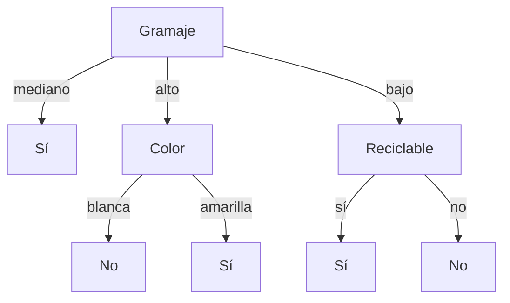

# Aprendizaje Automático
## Solución de la Evaluación — Curso 2024

---

## Ejercicio 1

- **i. Verdadero.** Dado que $D$ no contiene ruido, el concepto objetivo $c$ es consistente con todos los datos observados en $D$. Como además $c \in H$, necesariamente $c \in VS_{H, D}$. Por ende, si todas las hipótesis en $VS_{H, D}$ clasifican a $x$ como verdadera, $c(x)$ es indudablemente verdadero.
- **ii. Falso.** Que todas las hipótesis de $G_{H,D}$ (el conjunto más general consistente) clasifiquen a $x$ como positiva no implica que todas las hipótesis del espacio de versiones $VS_{H,D}$ lo hagan. Si el concepto objetivo fuera una hipótesis más específica consistente que clasifica a $x$ como negativa, $c(x)$ sería falso.
- **iii. Falso.** Los algoritmos perezosos (*lazy learners*, como la regresión ponderada localmente) ajustan hipótesis locales en el entorno de cada consulta particular, lo que les permite aproximar superficies complejas no lineales que un algoritmo ansioso lineal global no puede representar.
- **iv. Verdadero.** Los algoritmos perezosos almacenan los datos sin procesar durante el entrenamiento, posponiendo casi todo el costo computacional para la etapa de consulta/inferencia.
- **v. Falso.** La etapa de clasificación/consulta en algoritmos perezosos es costosa, pues requiere escanear todo el dataset para calcular distancias a todos los puntos vecinos.
- **vi. Verdadero.** Incorporar nuevos datos de entrenamiento es inmediato ($O(1)$) ya que solo requiere añadirlos al conjunto de datos almacenado, sin necesidad de reentrenar un modelo global.
- **vii. Falso.** El entrenamiento busca encontrar los valores óptimos de los **parámetros/pesos** de la red ($\Theta$) que minimicen la función de pérdida, no las entradas $x$.
- **viii. Falso.** Las superficies de costo en redes neuronales profundas son no convexas (con múltiples mínimos locales y puntos de ensilladura); el descenso por gradiente no garantiza converger al mínimo global.
- **ix. Verdadero.** La función *Softmax* mapea un vector de valores reales arbitrarios en una distribución de probabilidades válida (valores en $[0, 1]$ que suman $1$).

---

## Ejercicio 2

Dada la función convexa $f(x) = x^2 - 10x$, su derivada es:
$$f'(x) = 2x - 10$$

Regla de actualización de Descenso por Gradiente:
$$x^{(t+1)} = x^{(t)} - \alpha f'(x^{(t)}) = x^{(t)} - \alpha (2x^{(t)} - 10)$$

Comenzando desde $x^{(0)} = 0$:

### 1. Para $\alpha = 0{,}5$ (Converge en un paso al mínimo global $x^* = 5$):
- $t=0$: $x^{(0)} = 0 \implies f(0) = 0$
- $t=1$: $x^{(1)} = 0 - 0{,}5(2(0) - 10) = 5 \implies f(5) = -25$
- $t=2$: $x^{(2)} = 5 - 0{,}5(2(5) - 10) = 5 \implies f(5) = -25$
- $t=3$: $x^{(3)} = 5 \implies f(5) = -25$
- **Resultado:** **Converge** exactamente al mínimo $x = 5$.

### 2. Para $\alpha = 0{,}6$ (Converge monótonamente / de a poco):
- $t=0$: $x^{(0)} = 0 \implies f(0) = 0$
- $t=1$: $x^{(1)} = 0 - 0{,}6(-10) = 6 \implies f(6) = -24$
- $t=2$: $x^{(2)} = 6 - 0{,}6(2(6) - 10) = 6 - 1{,}2 = 4{,}8 \implies f(4{,}8) = -24{,}96$
- $t=3$: $x^{(3)} = 4{,}8 - 0{,}6(2(4{,}8) - 10) = 4{,}8 - 0{,}6(-0{,}4) = 5{,}04 \implies f(5{,}04) = -24{,}9984$
- **Resultado:** **Converge** oscilando amortiguadamente hacia $x = 5$.

### 3. Para $\alpha = 1{,}0$ (Oscila sin converger):
- $t=0$: $x^{(0)} = 0 \implies f(0) = 0$
- $t=1$: $x^{(1)} = 0 - 1{,}0(-10) = 10 \implies f(10) = 0$
- $t=2$: $x^{(2)} = 10 - 1{,}0(2(10) - 10) = 0 \implies f(0) = 0$
- $t=3$: $x^{(3)} = 0 - 1{,}0(-10) = 10 \implies f(10) = 0$
- **Resultado:** **Oscila indefinidamente** entre $x = 0$ y $x = 10$ sin converger.

### 4. Para $\alpha = 2{,}0$ (Diverge):
- $t=0$: $x^{(0)} = 0 \implies f(0) = 0$
- $t=1$: $x^{(1)} = 0 - 2{,}0(-10) = 20 \implies f(20) = 200$
- $t=2$: $x^{(2)} = 20 - 2{,}0(30) = -40 \implies f(-40) = 2000$
- $t=3$: $x^{(3)} = -40 - 2{,}0(-90) = 140 \implies f(140) = 18200$
- **Resultado:** **Diverge** hacia infinito ($\pm \infty$).

---

## Ejercicio 3

### Modelado de Aprendizaje por Refuerzos para Ludo:
- **Estados ($S$):** Vector con la posición de cada una de las 16 fichas numeradas $C_1, \dots, C_{16}$ en el tablero (casillas regulares, zona de salida o llegada), más el resultado actual del dado (valor entre 1 y 6).
- **Acciones ($A$):** Elegir cuál de las 4 fichas del color del jugador se desea mover: $a \in \{1, 2, 3, 4\}$.
- **Función de transición ($T(s, a, s')$):**
  - Si la ficha seleccionada $a$ puede avanzar la cantidad de casillas del dado, se actualiza su posición sumando dicho avance (o capturando una ficha rival si cae en su casilla).
  - Si la ficha está en la salida y el dado es 6, entra en juego.
  - Si la jugada es inválida o la ficha no puede moverse, el estado no cambia.
- **Función de recompensa ($R$):**
  $$r(s, a) = \begin{cases} +1 & \text{si el jugador logra llevar sus 4 fichas a la llegada (victoria)} \\ 0 & \text{en cualquier otro caso} \end{cases}$$

---

## Ejercicio 4

  

- **i. Inicialización que converge al clustering deseado:**  
  Seleccionar los puntos iniciales $A_1$ y $A_2$ ubicados en el centroide de la fila superior (rombos) y en el de la fila inferior (círculos), respectivamente. En la primera iteración, la asignación es horizontal y separa perfectamente las dos formas; las coordenadas de los centroides permanecen estables y el algoritmo converge a la partición deseada.

- **ii. Inicialización que converge a un clustering subóptimo:**  
  Seleccionar $B_1$ en el centroide del bloque izquierdo (4 rombos + 4 círculos de la izquierda) y $B_2$ en el centroide del bloque derecho. El algoritmo agrupará verticalmente los puntos según su posición en el eje $X$, separando izquierda de derecha en vez de arriba de abajo.

---

## Ejercicio 5

### a) Función de Hipótesis:
$$h_\theta(x) = \sigma(\theta^T x) = \frac{1}{1 + e^{-\theta^T x}}$$

Regla de decisión con umbral 0.5:
- Si $h_\theta(x) \ge 0{,}5 \implies \hat{y} = 1$ (clase positiva)
- Si $h_\theta(x) < 0{,}5 \implies \hat{y} = 0$ (clase negativa)

### b) Clasificador probabilístico:
Porque modela la probabilidad condicional de pertenencia a la clase positiva:
$$h_\theta(x) = P(y = 1 \mid x; \theta)$$
$$P(y = 0 \mid x; \theta) = 1 - h_\theta(x)$$

### c) Función de Entropía Cruzada:
La contribución de una instancia individual se define como $\hat{y}^y (1 - \hat{y})^{1-y}$:

| $\hat{y} \backslash y$ | $y = 0$ | $y = 1$ |
|:---:|:---:|:---:|
| **$\hat{y} = 0$** | **1** (correcto) | **0** (incorrecto) |
| **$\hat{y} = 1$** | **0** (incorrecto) | **1** (correcto) |

Aplicando el negativo del logaritmo (para minimizar la pérdida), obtenemos la función de entropía cruzada binaria:
$$L_{CE}(\hat{y}, y) = - \left[ y \log(\hat{y}) + (1 - y) \log(1 - \hat{y}) \right]$$

$$J(\theta) = -\frac{1}{m} \sum_{i=1}^m \left[ y^{(i)} \log\left(h_\theta(x^{(i)})\right) + (1 - y^{(i)}) \log\left(1 - h_\theta(x^{(i)})\right) \right]$$

### d) Generalización Multiclase (*One-vs-Rest* / *One-vs-All*):
Para $K$ clases, se entrenan $K$ clasificadores binarios independientes $h_\theta^{(k)}(x) = P(y = k \mid x; \theta)$. Para una nueva instancia $x$, se predice la clase con mayor probabilidad:
$$\hat{y} = \arg\max_{k \in \{1, \dots, K\}} h_\theta^{(k)}(x)$$

---

## Ejercicio 6

### a) Árbol de decisión ID3:

Evaluación de la entropía residual de los atributos:
- **Color:** $\frac{2}{5}(1) + \frac{3}{5}(0{,}918) \approx 0{,}951$
- **Gramaje:** $\frac{2}{5}(1) + \frac{2}{5}(1) + \frac{1}{5}(0) = 0{,}800$
- **Hojas:** $\frac{2}{5}(1) + \frac{3}{5}(0{,}918) \approx 0{,}951$
- **Reciclable:** $\frac{2}{5}(1) + \frac{3}{5}(0{,}918) \approx 0{,}951$

Se elige **Gramaje** como nodo raíz:
- **`Gramaje = mediano`:** Instancia #5 $\implies$ Hoja **Sí**.
- **`Gramaje = alto`:** Subconjunto $\{\#2, \#3\}$. Al evaluar los atributos restantes, `Color` y `Reciclable` tienen Ganancia 1:
  - Si se elige `Color`: `blanca` $\to$ **No** (#3), `amarilla` $\to$ **Sí** (#2).
- **`Gramaje = bajo`:** Subconjunto $\{\#1, \#4\}$. `Reciclable` tiene Ganancia 1:
  - `Reciclable = sí` $\to$ **Sí** (#1), `Reciclable = no` $\to$ **No** (#4).

---

### b) Probabilidades Naïve Bayes:
- $P(\text{Sí}) = \frac{3}{5}, \quad P(\text{No}) = \frac{2}{5}$
- **Color:** $P(\text{blanca} \mid \text{Sí}) = \frac{2}{3}, \quad P(\text{blanca} \mid \text{No}) = \frac{1}{2}$
- **Gramaje:** $P(\text{mediano} \mid \text{Sí}) = \frac{1}{3}, \quad P(\text{mediano} \mid \text{No}) = 0$
- **Hojas:** $P(\text{muchas} \mid \text{Sí}) = \frac{1}{3}, \quad P(\text{muchas} \mid \text{No}) = \frac{1}{2}$
- **Reciclable:** $P(\text{sí} \mid \text{Sí}) = \frac{2}{3}, \quad P(\text{sí} \mid \text{No}) = \frac{1}{2}$

---

### c) Clasificador 3-NN:
Utilizando distancia de Hamming/Manhattan ($1 - \delta(x_i, y_i)$).

---

### d) Clasificación de la instancia #6: $\langle \text{blanca}, \text{mediano}, \text{muchas}, \text{sí} \rangle$:
1. **ID3:** Gramaje = mediano $\implies$ **Sí**.
2. **CBS:**
   - $P(\text{Sí} \mid x) \propto \frac{3}{5} \times \frac{2}{3} \times \frac{1}{3} \times \frac{1}{3} \times \frac{2}{3} = \frac{4}{135} \approx 0{,}0296$
   - $P(\text{No} \mid x) \propto \frac{2}{5} \times \frac{1}{2} \times 0 \times \frac{1}{2} \times \frac{1}{2} = 0$  
   $\implies$ Predicción: **Sí**.
3. **3-NN:**  
   Distancias al cuadrado a la instancia #6:
   - $d(\#1, \#6)^2 = 0 + 1 + 0 + 0 = 1$ (Valor = Sí)
   - $d(\#5, \#6)^2 = 0 + 0 + 1 + 0 = 1$ (Valor = Sí)
   - $d(\#3, \#6)^2 = 0 + 1 + 1 + 0 = 2$ (Valor = No)  
   Vecinos más cercanos: #1, #5 y #3 $\implies$ 2 Sí, 1 No $\implies$ Predicción: **Sí**.

---

### e) Evaluación del Modelo $M$ (solo clasifica como No a la instancia #4):

| | Predicción: Sí | Predicción: No | Total Real |
|:---:|:---:|:---:|:---:|
| **Real: Sí** | 3 (VP) | 0 (FN) | 3 |
| **Real: No** | 1 (FP) | 1 (VN) | 2 |
| **Total Predicho** | 4 | 1 | 5 |

- **Acierto (*Accuracy*):** $\frac{3 + 1}{5} = \frac{4}{5} = 0{,}80$
- **Clase Sí:**
  - $P_{\text{Sí}} = \frac{3}{4} = 0{,}75$
  - $R_{\text{Sí}} = \frac{3}{3} = 1{,}00$
- **Clase No:**
  - $P_{\text{No}} = \frac{1}{1} = 1{,}00$
  - $R_{\text{No}} = \frac{1}{2} = 0{,}50$
