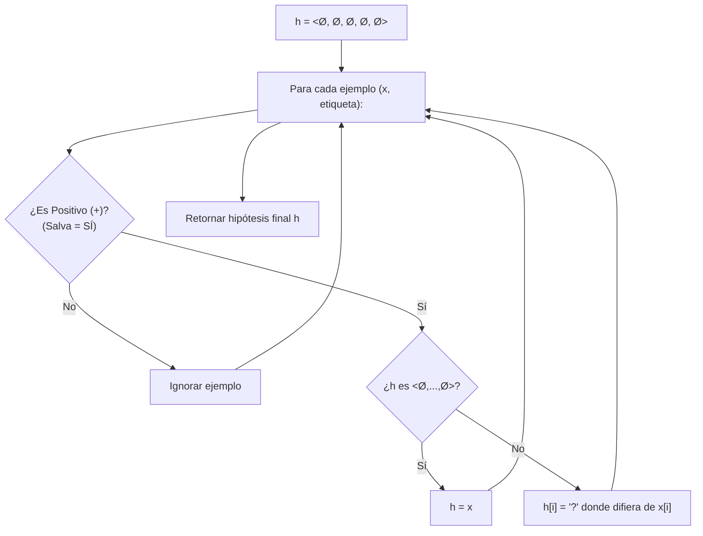

# Ejercicio 4: Implementación y Experimentación de Find-S

**Práctico 1: Introducción y Aprendizaje Conceptual**  
**Curso:** Aprendizaje Automático

---

## Enunciado

### a)
Implemente el algoritmo FIND-S para el problema de cuándo Pedro salva un examen.

### b)
Verifique su algoritmo contra el ejemplo visto en el teórico.

### c)
Implemente un programa que genere instancias aleatorias, y luego las clasifique de acuerdo al concepto: 
$$\langle ?, \text{Media}, ?, ?, ? \rangle$$
¿Cuántos ejemplos únicos (sin repetidos) tiene que generar en promedio para aprender el concepto? ¿Cuántos ejemplos únicos positivos?

---

## Solución y Desarrollo

### 💻 Código Ejecutable en Python
El código completo, tipado y listo para ejecutar se encuentra en:
* 🐍 [**`scripts/ejercicio_04_find_s.py`**](./scripts/ejercicio_04_find_s.py)

Para ejecutarlo desde la terminal:
```bash
python "practicos/practico 1/resultados/scripts/ejercicio_04_find_s.py"
```

---

### Parte a) Lógica del Algoritmo Find-S

Find-S inicializa su hipótesis con la más específica posible ($\langle \emptyset, \emptyset, \emptyset, \emptyset, \emptyset \rangle$). Para cada ejemplo de entrenamiento:
* Si el ejemplo es **positivo**, compara cada atributo con la hipótesis actual: si difieren, generaliza reemplazándolo por `?`.
* Si el ejemplo es **negativo**, se ignora completamente.



---

### Parte b) Verificación Paso a Paso con el Teórico

#### Conjunto de Entrenamiento $D$:
| # | Dedicación | Dificultad | Horario | Humedad | HumorDoc | Pedro Salva? |
| :-: | :---: | :---: | :---: | :---: | :---: | :---: |
| $x_1$ | Alta | Alta | Nocturno | Media | Bueno | **SÍ (+)** |
| $x_2$ | Baja | Media | Matutino | Alta | Malo | **NO (-)** |
| $x_3$ | Media | Alta | Nocturno | Media | Malo | **SÍ (+)** |
| $x_4$ | Media | Alta | Matutino | Alta | Bueno | **NO (-)** |

#### Traza de Ejecución:
1. **Paso 0:** $h_0 = \langle \emptyset, \emptyset, \emptyset, \emptyset, \emptyset \rangle$
2. **Paso 1 ($x_1$, $+$):** Adopta los valores del primer positivo:  
   $$h_1 = \langle \text{Alta}, \text{Alta}, \text{Nocturno}, \text{Media}, \text{Bueno} \rangle$$
3. **Paso 2 ($x_2$, $-$):** Es negativo $\implies$ se ignora ($h_2 = h_1$).
4. **Paso 3 ($x_3$, $+$):** Compara con $x_3$ (difiere en Dedicación y HumorDoc $\to `?`$):  
   $$h_3 = \langle ?, \text{Alta}, \text{Nocturno}, \text{Media}, ? \rangle$$
5. **Paso 4 ($x_4$, $-$):** Es negativo $\implies$ se ignora ($h_{\text{final}} = h_3$).

*(El script confirma automáticamente que la salida coincide de forma idéntica con el teórico).*

---

### Parte c) Simulación de Aprendizaje Conceptual

#### 1. Contexto del Problema:

La consigna pregunta cuántos ejemplos se requieren **en promedio** (*"¿Cuántos ejemplos... tiene que generar en promedio?"*).  
Como la generación de ejemplos es un proceso aleatorio (estocástico), una sola ejecución podría necesitar por pura suerte $4$ ejemplos, o $30$ si tocan muchos negativos o ejemplos redundantes. El método de **Monte Carlo** consiste en repetir el experimento muchas veces ($10.000$ repeticiones independientes) y promediar los resultados, garantizando por la **Ley de los Grandes Números** que la media converja con altísima precisión al valor esperado real.

---

#### 2. Cómo funciona el programa de simulación:
1. **Concepto Objetivo:** Se fija $c = \langle ?, \text{Media}, ?, ?, ? \rangle$ (positivo si y solo si `Dificultad = Media`).
2. **Bucle de Aprendizaje:**
   * Genera instancias al azar uniformemente desde las $108$ posibles en el espacio $X$.
   * Las clasifica con la regla del concepto objetivo $c$.
   * Si es **positiva**, Find-S actualiza $h$ generalizando con `?` los atributos que difieran.
   * El bucle termina cuando $h$ coincide exactamente con $\langle ?, \text{Media}, ?, ?, ? \rangle$ (es decir, cuando los 4 atributos libres ya vieron variaciones y cambiaron a `?`).
3. **Métricas Registradas:** Se cuenta la cantidad de ejemplos únicos totales y positivos únicos observados.
4. **Repeticiones:** Se repite el experimento $10.000$ veces para obtener un promedio estadístico representativo.


**¿De dónde salen las $108$ instancias posibles de $X$?**  
El espacio de instancias $X$ es el producto cartesiano de los valores posibles de los $5$ atributos del problema:
  * $\text{Dedicación} \in \{\text{Alta}, \text{Media}, \text{Baja}\} \implies 3 \text{ valores}$
  * $\text{Dificultad} \in \{\text{Alta}, \text{Media}, \text{Baja}\} \implies 3 \text{ valores}$
  * $\text{Horario} \in \{\text{Matutino}, \text{Nocturno}\} \implies 2 \text{ valores}$
  * $\text{Humedad} \in \{\text{Alta}, \text{Media}, \text{Baja}\} \implies 3 \text{ valores}$
  * $\text{HumorDoc} \in \{\text{Bueno}, \text{Malo}\} \implies 2 \text{ valores}$
  $$|X| = 3 \times 3 \times 2 \times 3 \times 2 = \mathbf{108 \text{ instancias posibles}}$$

---

#### 3. Resultados Obtenidos por el Programa:

| Métrica | Valor Promedio (Simulación Monte Carlo) |
| :--- | :---: |
| **Ejemplos Únicos Positivos necesarios:** | **$\approx 3.82 \pm 1.34$ ejemplos** |
| **Ejemplos Únicos Totales necesarios:** | **$\approx 11.33 \pm 5.91$ ejemplos** |

---

#### 4. Justificación Conceptual de los Resultados:
* **¿Por qué se requieren $\approx 3.8$ ejemplos positivos?**  
  Para que Find-S generalice los 4 atributos libres a `?`, necesita observar al menos dos valores distintos en cada uno de ellos (`Dedicación`, `Horario`, `Humedad`, `HumorDoc`). En promedio, tras extraer entre $3$ y $4$ positivos al azar, ya se han observado suficientes variaciones en todos los atributos.

* **¿Por qué los ejemplos totales son aproximadamente el triple ($\approx 11.3$)?**  
  De las $108$ instancias totales, exactamente $36$ son positivas ($3 \times 1 \times 2 \times 3 \times 2 = 36$).  
  Por lo tanto, la probabilidad de que una instancia aleatoria sea positiva es:
  $$P(\text{Positivo}) = \frac{36}{108} = \frac{1}{3}$$
  Como solo $1$ de cada $3$ ejemplos generados al azar resulta ser positivo, se requiere generar en promedio **el triple de ejemplos totales** para obtener los $\approx 3.8$ positivos necesarios:
  $$\text{Total Promedio} \approx 3.82 \times 3 \approx \mathbf{11.4 \text{ ejemplos}}$$

