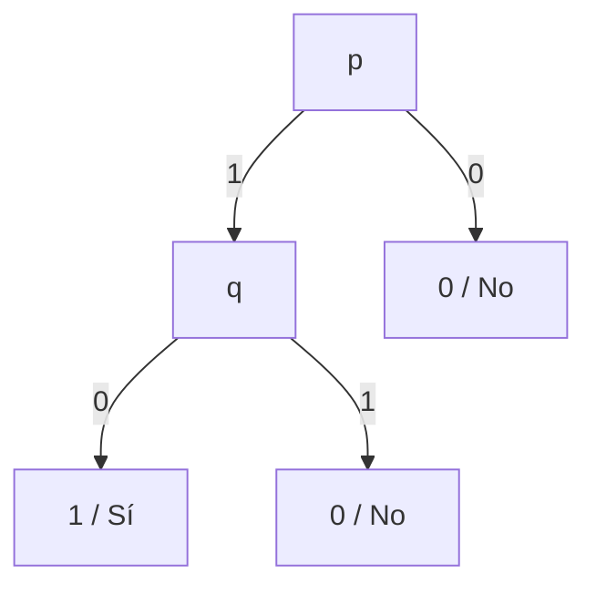
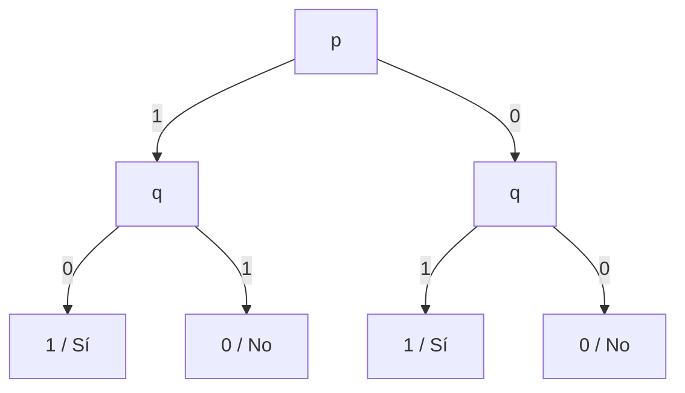
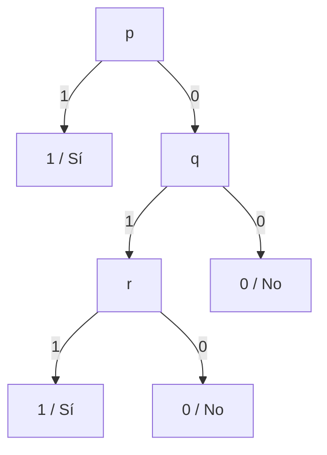
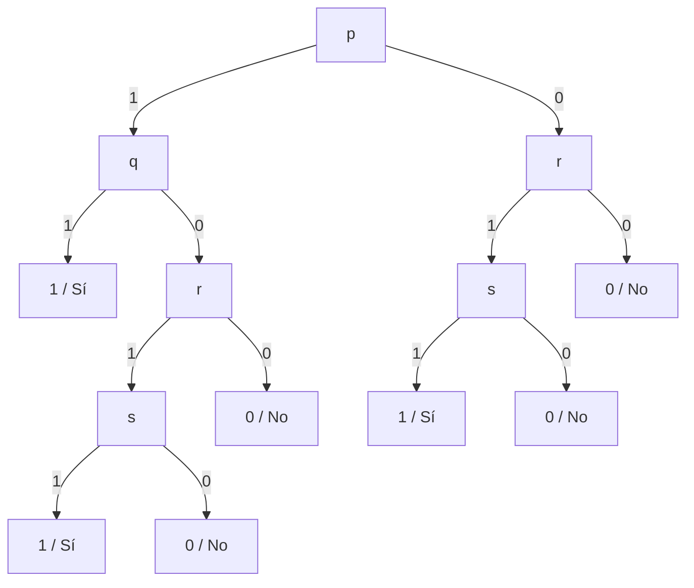
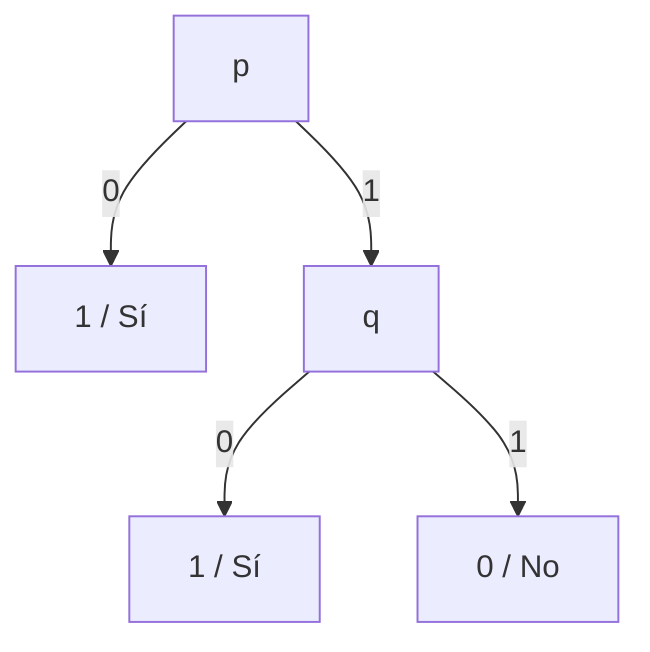

# Ejercicio 1: Representación de Funciones Booleanas con Árboles de Decisión

**Práctico 2: Árboles de Decisión**  
**Curso:** Aprendizaje Automático

---

## Enunciado

Dé árboles de decisión que representen las siguientes funciones booleanas:

1. $p \land \neg q$
2. $p \oplus q$ ($p \text{ XOR } q$)
3. $p \lor (q \land r)$
4. $(p \land q) \lor (r \land s)$
5. $\neg (p \land q)$

---

## Solución Detallada

> [!NOTE]
> **Propiedad Fundamental:** El espacio de hipótesis de los árboles de decisión $H_{\text{DT}}$ es **completo** para atributos discretos. Esto significa que cualquier función booleana sobre variables proposicionales puede ser representada de forma exacta mediante al menos un árbol de decisión equivalente a su Forma Normal Disyuntiva (DNF).

---

### 1. Función $f_1 = p \land \neg q$

#### Tabla de Verdad:
| $p$ | $q$ | $p \land \neg q$ |
|:---:|:---:|:---:|
| 1 | 0 | **1 (Sí)** |
| 1 | 1 | 0 (No) |
| 0 | 0 | 0 (No) |
| 0 | 1 | 0 (No) |

#### Árbol de Decisión:



```
       [ p ]
      /     \
   1 /       \ 0
    /         \
  [ q ]       [ 0 ]
  /   \
0/     \1
/       \
[ 1 ]   [ 0 ]
```

---

### 2. Función $f_2 = p \oplus q$ ($p \text{ XOR } q$)

#### Tabla de Verdad:
| $p$ | $q$ | $p \oplus q$ |
|:---:|:---:|:---:|
| 1 | 0 | **1 (Sí)** |
| 0 | 1 | **1 (Sí)** |
| 0 | 0 | 0 (No) |
| 1 | 1 | 0 (No) |

#### Árbol de Decisión:



```
          [ p ]
        /       \
     1 /         \ 0
      /           \
    [ q ]        [ q ]
    /   \        /   \
  0/     \1    1/     \0
  /       \    /       \
[ 1 ]   [ 0 ] [ 1 ]   [ 0 ]
```

> [!TIP]
> **Observación sobre Paridad / XOR:** La función de paridad requiere inspeccionar obligatoriamente todas las variables de entrada en todas las ramas, generando un árbol completo de profundidad $n$ con $2^n$ hojas.

---

### 3. Función $f_3 = p \lor (q \land r)$

#### Tabla de Verdad Resumida:
- Si $p = 1 \implies f_3 = 1$ (independientemente de $q$ y $r$).
- Si $p = 0 \implies f_3 = 1 \iff q = 1 \land r = 1$.

#### Árbol de Decisión:



```
       [ p ]
      /     \
   1 /       \ 0
    /         \
  [ 1 ]      [ q ]
            /     \
         1 /       \ 0
          /         \
        [ r ]       [ 0 ]
        /   \
     1 /     \ 0
      /       \
    [ 1 ]     [ 0 ]
```

---

### 4. Función $f_4 = (p \land q) \lor (r \land s)$

#### Árbol de Decisión:



```
                [ p ]
              /       \
           1 /         \ 0
            /           \
          [ q ]         [ r ]
         /     \        /   \
      1 /     0 \    1 /     \ 0
       /         \    /       \
     [ 1 ]      [ r ] [ s ]   [ 0 ]
                /   \  / \
             1 /   0 \1/  \0
              /       X    \
            [ s ]   [ 1 ] [ 0 ]
            /   \
         1 /     \ 0
          /       \
        [ 1 ]     [ 0 ]
```

---

### 5. Función $f_5 = \neg (p \land q) \equiv \neg p \lor \neg q$ (Ley de De Morgan / NAND)

#### Tabla de Verdad:
| $p$ | $q$ | $p \land q$ | $\neg(p \land q)$ |
|:---:|:---:|:---:|:---:|
| 0 | 0 | 0 | **1 (Sí)** |
| 0 | 1 | 0 | **1 (Sí)** |
| 1 | 0 | 0 | **1 (Sí)** |
| 1 | 1 | 1 | **0 (No)** |

#### Árbol de Decisión:



```
       [ p ]
      /     \
   0 /       \ 1
    /         \
  [ 1 ]      [ q ]
             /   \
          0 /     \ 1
           /       \
         [ 1 ]     [ 0 ]
```
