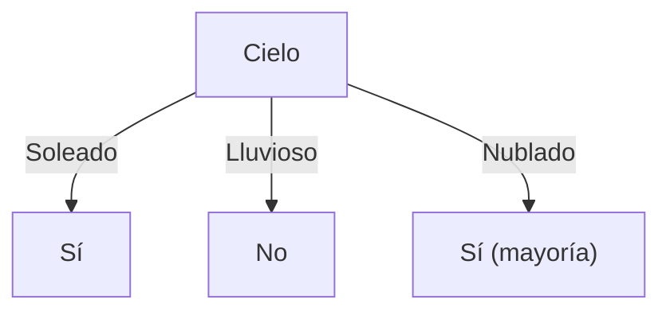
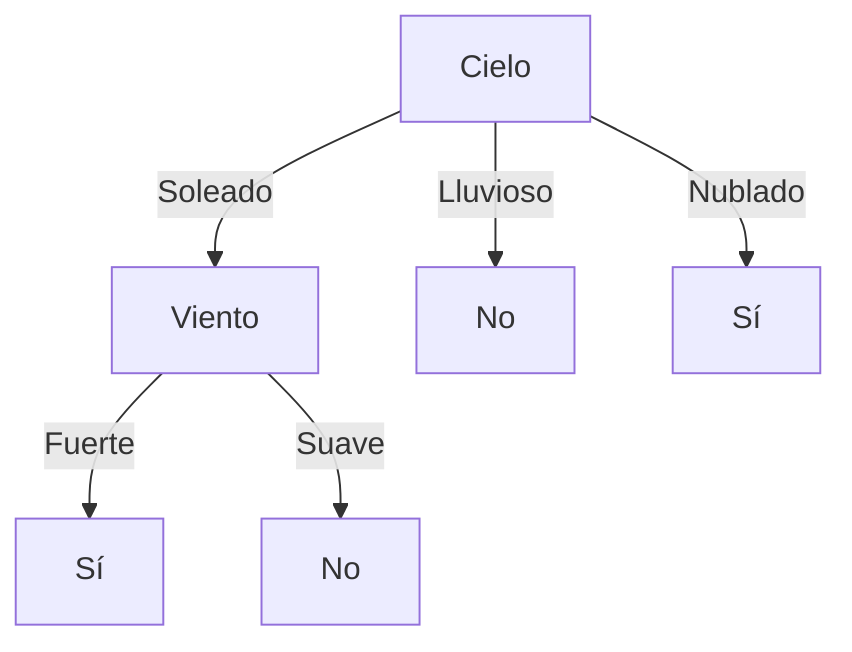

# Ejercicio 3: Inducción de Árboles de Decisión (ID3) - Pedro Juega al Fútbol en la Playa

**Práctico 2: Árboles de Decisión**  
**Curso:** Aprendizaje Automático

---

## Enunciado

Volviendo al problema de aprender bajo qué condiciones a Pedro le gusta ir a jugar al fútbol a la playa:

| # | Cielo | Temp | Humedad | Viento | Tmp. Agua | Tiempo | Juega |
|:---:|:---:|:---:|:---:|:---:|:---:|:---:|:---:|
| 1 | Soleado | Templado | Normal | Fuerte | Templada | Sin cambios | Sí |
| 2 | Soleado | Templado | Alta | Fuerte | Templada | Sin cambios | Sí |
| 3 | Lluvioso | Frío | Alta | Fuerte | Templada | Cambiante | No |
| 4 | Soleado | Templado | Alta | Fuerte | Fría | Cambiante | Sí |

Donde:
- $\text{Cielo} \in \{\text{Soleado}, \text{Lluvioso}, \text{Nublado}\}$
- $\text{Temperatura} \in \{\text{Templado}, \text{Frío}\}$
- $\text{Humedad} \in \{\text{Normal}, \text{Alta}\}$
- $\text{Viento} \in \{\text{Fuerte}, \text{Suave}\}$
- $\text{Temp.Agua} \in \{\text{Templada}, \text{Fría}\}$
- $\text{Tiempo} \in \{\text{Sin cambios}, \text{Cambiante}\}$

- **a)** Halle el árbol de decisión utilizando el algoritmo ID3.
- **b)** Halle el árbol de decisión si ahora se agrega el siguiente ejemplo al conjunto de entrenamiento:

| # | Cielo | Temp | Humedad | Viento | Tmp. Agua | Tiempo | Juega |
|:---:|:---:|:---:|:---:|:---:|:---:|:---:|:---:|
| 5 | Soleado | Templado | Normal | Suave | Templada | Sin cambios | No |

- **c)** ¿Qué respuesta daría a las siguientes instancias?

| # | Cielo | Temp | Humedad | Viento | Tmp. Agua | Tiempo | Juega |
|:---:|:---:|:---:|:---:|:---:|:---:|:---:|:---:|
| 6 | Soleado | Templado | Normal | Fuerte | Fría | Cambiante | ? |
| 7 | Lluvioso | Frío | Normal | Suave | Templada | Sin cambios | ? |
| 8 | Soleado | Templado | Normal | Suave | Templada | Sin cambios | ? |
| 9 | Soleado | Frío | Normal | Fuerte | Templada | Sin cambios | ? |

- **d)** ¿Pertenece la solución al espacio de versiones obtenido con el algoritmo Candidate-Elimination en el práctico anterior? ¿Es esto siempre esperable?

---

## Solución Detallada

### 💻 Código Ejecutable
Se incluye la implementación interactiva para verificar los cálculos y el árbol generado:
* 🐍 [**`scripts/ejercicio_03_id3_pedro.py`**](./scripts/ejercicio_03_id3_pedro.py)

---

### Parte a) Árbol de Decisión ID3 con 4 Instancias

#### 1. Entropía Inicial del Conjunto $S$:
- $|S| = 4$, con $3$ Sí y $1$ No ($p_+ = 3/4$, $p_- = 1/4$).
$$\text{Entropía}(S) = - \frac{3}{4}\log_2\left(\frac{3}{4}\right) - \frac{1}{4}\log_2\left(\frac{1}{4}\right) \approx 0{,}8113 \text{ bits}$$

#### 2. Ganancia de Información por Atributo:
- **Cielo:**
  - $\text{Cielo} = \text{Soleado}$ (instancias 1, 2, 4): $3$ Sí, $0$ No $\implies \text{Entropía} = 0{,}0$.
  - $\text{Cielo} = \text{Lluvioso}$ (instancia 3): $0$ Sí, $1$ No $\implies \text{Entropía} = 0{,}0$.
  - $\text{Entropía Residual} = \frac{3}{4}(0) + \frac{1}{4}(0) = 0{,}0 \implies \mathbf{\text{Ganancia}(S, \text{Cielo}) = 0{,}8113 \text{ bits}}$ (Máxima).

- **Temperatura:**
  - $\text{Temp} = \text{Templado}$: $3$ Sí $\implies \text{Entropía} = 0{,}0$.
  - $\text{Temp} = \text{Frío}$: $1$ No $\implies \text{Entropía} = 0{,}0$.
  - $\mathbf{\text{Ganancia}(S, \text{Temp}) = 0{,}8113 \text{ bits}}$ (Máxima).

- **Viento:** Todas las instancias tienen `Viento = Fuerte` $\implies \text{Ganancia} = 0{,}0$.
- **Humedad:** $\text{Ganancia} = 0{,}1226$.
- **Tmp.Agua:** $\text{Ganancia} = 0{,}1226$.
- **Tiempo:** $\text{Ganancia} = 0{,}3113$.

Seleccionando **`Cielo`** como raíz:
- $\text{Cielo} = \text{Soleado} \implies$ Hoja **Sí** ($3$ ejemplos, puro).
- $\text{Cielo} = \text{Lluvioso} \implies$ Hoja **No** ($1$ ejemplo, puro).
- $\text{Cielo} = \text{Nublado} \implies$ No hay ejemplos en entrenamiento $\to$ Hoja con clase mayoritaria global (**Sí**).

---

### Parte b) Incorporación de la Instancia #5

Instancia #5: $\langle \text{Soleado}, \text{Templado}, \text{Normal}, \text{Suave}, \text{Templada}, \text{Sin cambios} \rangle \to \text{Juega} = \mathbf{\text{No}}$.

#### 1. Entropía Inicial del Conjunto $S$:
- $|S| = 5$, con $3$ Sí y $2$ No ($p_+ = 3/5$, $p_- = 2/5$).
$$\text{Entropía}(S) = - \frac{3}{5}\log_2\left(\frac{3}{5}\right) - \frac{2}{5}\log_2\left(\frac{2}{5}\right) \approx 0{,}9710 \text{ bits}$$

#### 2. Ganancia de Información de los 6 Atributos en la Raíz:

- **`Cielo`:**
  - $\text{Soleado}$ (1, 2, 4, 5): $3$ Sí, $1$ No $\implies \text{Entropía} = - \frac{3}{4}\log_2\left(\frac{3}{4}\right) - \frac{1}{4}\log_2\left(\frac{1}{4}\right) \approx 0{,}8113$.
  - $\text{Lluvioso}$ (3): $0$ Sí, $1$ No $\implies \text{Entropía} = 0{,}0$.
  - $\text{Entropía Residual} = \frac{4}{5}(0{,}8113) + \frac{1}{5}(0) = 0{,}6490 \implies \mathbf{\text{Ganancia}(S, \text{Cielo}) = 0{,}9710 - 0{,}6490 = 0{,}3219 \text{ bits}}$.

- **`Temperatura`:**
  - $\text{Templado}$ (1, 2, 4, 5): $3$ Sí, $1$ No $\implies \text{Entropía} = 0{,}8113$.
  - $\text{Frío}$ (3): $0$ Sí, $1$ No $\implies \text{Entropía} = 0{,}0$.
  - $\text{Entropía Residual} = \frac{4}{5}(0{,}8113) + \frac{1}{5}(0) = 0{,}6490 \implies \mathbf{\text{Ganancia}(S, \text{Temp}) = 0{,}3219 \text{ bits}}$.

- **`Viento`:**
  - $\text{Fuerte}$ (1, 2, 3, 4): $3$ Sí, $1$ No $\implies \text{Entropía} = 0{,}8113$.
  - $\text{Suave}$ (5): $0$ Sí, $1$ No $\implies \text{Entropía} = 0{,}0$.
  - $\text{Entropía Residual} = \frac{4}{5}(0{,}8113) + \frac{1}{5}(0) = 0{,}6490 \implies \mathbf{\text{Ganancia}(S, \text{Viento}) = 0{,}3219 \text{ bits}}$.

- **`Tmp. Agua`:**
  - $\text{Templada}$ (1, 2, 3, 5): $2$ Sí, $2$ No $\implies \text{Entropía} = 1{,}0000$.
  - $\text{Fría}$ (4): $1$ Sí, $0$ No $\implies \text{Entropía} = 0{,}0$.
  - $\text{Entropía Residual} = \frac{4}{5}(1{,}0000) + \frac{1}{5}(0) = 0{,}8000 \implies \mathbf{\text{Ganancia}(S, \text{Tmp.Agua}) = 0{,}9710 - 0{,}8000 = 0{,}1710 \text{ bits}}$.

- **`Humedad`:**
  - $\text{Alta}$ (2, 3, 4): $2$ Sí, $1$ No $\implies \text{Entropía} = - \frac{2}{3}\log_2\left(\frac{2}{3}\right) - \frac{1}{3}\log_2\left(\frac{1}{3}\right) \approx 0{,}9183$.
  - $\text{Normal}$ (1, 5): $1$ Sí, $1$ No $\implies \text{Entropía} = 1{,}0000$.
  - $\text{Entropía Residual} = \frac{3}{5}(0{,}9183) + \frac{2}{5}(1{,}0000) = 0{,}5510 + 0{,}4000 = 0{,}9510 \implies \mathbf{\text{Ganancia}(S, \text{Humedad}) = 0{,}9710 - 0{,}9510 = 0{,}0200 \text{ bits}}$.

- **`Tiempo`:**
  - $\text{Sin cambios}$ (1, 2, 5): $2$ Sí, $1$ No $\implies \text{Entropía} = 0{,}9183$.
  - $\text{Cambiante}$ (3, 4): $1$ Sí, $1$ No $\implies \text{Entropía} = 1{,}0000$.
  - $\text{Entropía Residual} = \frac{3}{5}(0{,}9183) + \frac{2}{5}(1{,}0000) = 0{,}9510 \implies \mathbf{\text{Ganancia}(S, \text{Tiempo}) = 0{,}9710 - 0{,}9510 = 0{,}0200 \text{ bits}}$.

#### Tabla Resumen de Ganancias en la Raíz (Parte b):

| Atributo | Entropía Residual | Ganancia ($Gain$) | ¿Seleccionado? |
| :--- | :---: | :---: | :---: |
| **`Cielo`** | $0{,}6490$ | $\mathbf{0{,}3219}$ | ⭐ **Sí** (Empate de máximo) |
| **`Temperatura`** | $0{,}6490$ | $\mathbf{0{,}3219}$ | Empate de máximo |
| **`Viento`** | $0{,}6490$ | $\mathbf{0{,}3219}$ | Empate de máximo |
| **`Tmp. Agua`** | $0{,}8000$ | $0{,}1710$ | No |
| **`Humedad`** | $0{,}9510$ | $0{,}0200$ | No |
| **`Tiempo`** | $0{,}9510$ | $0{,}0200$ | No |

---

#### 3. Construcción del Árbol a partir de `Cielo`:
Existe un triple empate de máxima ganancia ($0{,}3219$) entre `Cielo`, `Temperatura` y `Viento`. Manteniendo consistencia con la parte (a), seleccionamos **`Cielo`** como raíz:

1. **Rama `Cielo = Lluvioso`:** Subconjunto $\{\#3\}$ ($1$ No) $\implies$ **Hoja No** (puro).
2. **Rama `Cielo = Nublado`:** Sin instancias en entrenamiento $\implies$ **Hoja Sí** (mayoría global de $S$).
3. **Rama `Cielo = Soleado`:** Subconjunto $S_{\text{Soleado}} = \{\#1, \#2, \#4, \#5\}$ ($3$ Sí, $1$ No).
   - $\text{Entropía}(S_{\text{Soleado}}) = - \frac{3}{4}\log_2(3/4) - \frac{1}{4}\log_2(1/4) \approx 0{,}8113 \text{ bits}$.
   - Se evalúan las ganancias de los atributos restantes sobre $S_{\text{Soleado}}$:
     - **`Viento`:**
       - $\text{Fuerte}$ ($\#1, \#2, \#4$): $3$ Sí, $0$ No $\implies \text{Entropía} = 0$.
       - $\text{Suave}$ ($\#5$): $0$ Sí, $1$ No $\implies \text{Entropía} = 0$.
       - $\text{Residual} = 0 \implies \mathbf{\text{Ganancia} = 0{,}8113 \text{ bits}}$ (Máxima, separación perfecta).
     - **`Humedad`:** $\text{Residual} = 0{,}5000 \implies \text{Ganancia} = 0{,}3113 \text{ bits}$.
     - **`Tmp. Agua`:** $\text{Residual} = 0{,}6887 \implies \text{Ganancia} = 0{,}1226 \text{ bits}$.
     - **`Tiempo`:** $\text{Residual} = 0{,}6887 \implies \text{Ganancia} = 0{,}1226 \text{ bits}$.
     - **`Temperatura`:** Todas las instancias son $\text{Templado} \implies \text{Ganancia} = 0{,}0000 \text{ bits}$.
   - Se selecciona **`Viento`**:
     - $\text{Viento} = \text{Fuerte} \implies$ **Hoja Sí** ($3$ Sí, $0$ No).
     - $\text{Viento} = \text{Suave} \implies$ **Hoja No** ($0$ Sí, $1$ No).

#### Árbol Resultante (b):

---

### Parte c) Clasificación de Instancias de Test

Evaluamos las instancias de consulta con el Árbol (b):

| # | Instancia de Consulta | Recorrido en el Árbol | Predicción |
|:---:|---|---|:---:|
| **6** | $\langle \text{Soleado}, \text{Templado}, \text{Normal}, \text{Fuerte}, \text{Fría}, \text{Cambiante} \rangle$ | $\text{Cielo} = \text{Soleado} \to \text{Viento} = \text{Fuerte}$ | **Sí** |
| **7** | $\langle \text{Lluvioso}, \text{Frío}, \text{Normal}, \text{Suave}, \text{Templada}, \text{Sin cambios} \rangle$ | $\text{Cielo} = \text{Lluvioso}$ | **No** |
| **8** | $\langle \text{Soleado}, \text{Templado}, \text{Normal}, \text{Suave}, \text{Templada}, \text{Sin cambios} \rangle$ | $\text{Cielo} = \text{Soleado} \to \text{Viento} = \text{Suave}$ | **No** |
| **9** | $\langle \text{Soleado}, \text{Frío}, \text{Normal}, \text{Fuerte}, \text{Templada}, \text{Sin cambios} \rangle$ | $\text{Cielo} = \text{Soleado} \to \text{Viento} = \text{Fuerte}$ | **Sí** |

---

### Parte d) Comparación con el Espacio de Versiones ($VS$) de Candidate-Elimination

- En el Práctico 1, el algoritmo *Candidate-Elimination* sobre el espacio conjuntivo puro obtuvo tras los 4 primeros ejemplos:
  - $S = \{ \langle \text{Soleado}, \text{Templado}, ?, \text{Fuerte}, ?, ? \rangle \}$
  - $G = \{ \langle \text{Soleado}, ?, ?, ?, ?, ? \rangle, \langle ?, \text{Templado}, ?, ?, ?, ? \rangle \}$

**¿Pertenece el árbol a este espacio de versiones?**
- El árbol inducido en la parte (a) clasifica como **Sí** a cualquier instancia con `Cielo = Soleado` sin exigir `Temperatura = Templado` ni `Viento = Fuerte`. Corresponde a la hipótesis general $\langle \text{Soleado}, ?, ?, ?, ?, ? \rangle \in G$. Por ende, **sí pertenece a $VS$**.

**¿Es esto siempre esperable?**
- **No necesariamente.** 
  1. Los árboles de decisión representan un espacio de hipótesis más rico y completo ($H_{\text{DT}}$ permite disyunciones y DNF), mientras que Candidate-Elimination en el Práctico 1 operaba sobre un espacio puramente conjuntivo ($H_{\text{conj}}$).
  2. ID3 emplea una búsqueda heurística voraz guiada por la Ganancia de Información (sesgo preferencial), sin garantizar explorar todo el espacio de versiones ni restringirse a una única conjunción.
