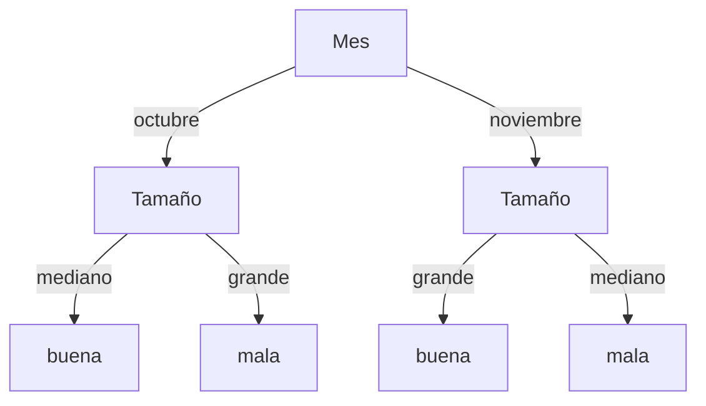

# Ejercicio 4: Extensiones de ID3 - Atributos Continuos, Valores Faltantes y Ruido

**Práctico 2: Árboles de Decisión**  
**Curso:** Aprendizaje Automático

---

## Enunciado

Se desea construir un algoritmo para clasificar automáticamente la calidad de la fruta, de acuerdo a ciertas variables: color, tamaño, peso y mes de cosecha, y le proveen del siguiente conjunto de ejemplos:

| # | Color | Tamaño | Peso | Mes | Calidad |
|:---:|:---:|:---:|:---:|:---:|:---:|
| 1 | rojo | mediano | 200 | octubre | buena |
| 2 | rojo | grande | 150 | octubre | mala |
| 3 | rojo | mediano | 200 | noviembre | mala |
| 4 | rojo | mediano | 200 | — | buena |
| 5 | amarillo | grande | 150 | noviembre | buena |
| 6 | amarillo | mediano | 220 | noviembre | mala |

Donde:
- $\text{color} \in \{\text{amarillo}, \text{rojo}\}$
- $\text{tamaño} \in \{\text{grande}, \text{mediano}, \text{pequeño}\}$
- $\text{peso} \in [150, 250]$ (numérico continuo)
- $\text{mes} \in \{\text{octubre}, \text{noviembre}\}$
- $\text{calidad} \in \{\text{buena}, \text{mala}\}$

- **a)** Explique por qué no puede aplicar el algoritmo ID3 básico. Dé una solución a cada uno de los problemas encontrados.
- **b)** Dé un árbol de decisión a partir de los ejemplos dados, explicando su construcción paso a paso.

---

## Solución Detallada

### Parte a) Limitaciones del Algoritmo ID3 Básico y Soluciones

El algoritmo ID3 estándar presentado por Tom Mitchell (1997) asume:
1. Todos los atributos toman valores categóricos discretos y predefinidos.
2. Todas las instancias disponen de valores conocidos para todos los atributos (sin datos faltantes).
3. Los datos están libres de ruido o inconsistencias que impidan particiones puras.

En este conjunto de datos se presentan **tres problemas fundamentales**:

---

#### 1. Atributo Numérico Continuo (`Peso`)
- **Problema:** El atributo `Peso` es numérico continuo en el rango $[150, 250]$. Si se tratara cada número real como un valor discreto independiente, el árbol se ramificaría en exceso (sobreajuste), memorizando los datos sin capacidad de generalización.
- **Solución (Discretización Dinámica):**
  1. Ordenar las instancias según los valores de `Peso`: $150, 150, 200, 200, 200, 220$.
  2. Identificar los puntos donde la clase objetivo cambia entre instancias consecutivas.
  3. Evaluar los puntos medios candidatos:
     - Entre $150$ y $200$: umbral $c_1 = \frac{150 + 200}{2} = \mathbf{175}$.
     - Entre $200$ y $220$: umbral $c_2 = \frac{200 + 220}{2} = \mathbf{210}$.
  4. Crear un atributo booleano de prueba (ej. $\text{Peso} \le 175$ vs $\text{Peso} > 175$) y calcular su ganancia de información como un atributo binario estándar.

---

#### 2. Valores Faltantes (`Mes` en la Instancia #4)
- **Problema:** La instancia #4 carece de valor para el atributo `Mes` (`—`), por lo que no se puede enviar directamente por ninguna de las ramas discretas (`octubre` o `noviembre`).
- **Soluciones:**
  1. **Imputación por Moda Global:** Asignar el valor más frecuente del atributo `Mes` en todo el conjunto de entrenamiento (en este caso `noviembre`, que aparece 3 veces vs 2 de `octubre`).
  2. **Imputación por Moda Condicional a la Clase:** Asignar el valor más frecuente de `Mes` entre los ejemplos de la misma clase ($\text{Calidad} = \text{buena}$). Entre las frutas buenas con mes conocido (#1 es octubre, #5 es noviembre), hay empate; se puede elegir `octubre`.
  3. **Ponderación Fraccional (C4.5 de Quinlan):** Asignar la instancia a todas las ramas del atributo faltante con pesos proporcionales a las frecuencias relativas ($w_{\text{octubre}} = 2/5$, $w_{\text{noviembre}} = 3/5$).

---

#### 3. Instancias con Idénticos Atributos y Distinta Clase (Inconsistencia / Ruido)
- **Problema:** Si se descarta el atributo `Mes` o si se imputa como `noviembre` en #4, las instancias #3 y #4 comparten exactamente la misma descripción $\langle \text{rojo}, \text{mediano}, 200, \text{noviembre} \rangle$, pero #3 tiene calidad **mala** y #4 tiene calidad **buena**.
- **Solución:** Cuando se agotan los atributos o no es posible subdividir más un nodo heterogéneo, ID3 se detiene y crea una **hoja con la clase mayoritaria** de los ejemplos que cayeron en dicho nodo (o asigna probabilidades empíricas $P(\text{buena}) = 0{,}5$, $P(\text{mala}) = 0{,}5$).

---

### Parte b) Construcción Paso a Paso del Árbol de Decisión

Asumiremos la imputación por la clase positiva en #4: $\text{Mes} = \text{octubre}$.

**Dataset Imputado ($|S| = 6$, $3$ buenas, $3$ malas $\implies \text{Entropía}(S) = 1{,}0$ bit):**

| # | Color | Tamaño | Peso | Mes | Calidad |
|:---:|:---:|:---:|:---:|:---:|:---:|
| 1 | rojo | mediano | 200 | octubre | buena |
| 2 | rojo | grande | 150 | octubre | mala |
| 3 | rojo | mediano | 200 | noviembre | mala |
| 4 | rojo | mediano | 200 | octubre | buena |
| 5 | amarillo | grande | 150 | noviembre | buena |
| 6 | amarillo | mediano | 220 | noviembre | mala |

---

#### Paso 1: Selección del Nodo Raíz

1. **Atributo `Color`:**
   - `rojo` (#1, #2, #3, #4): $2$ buenas, $2$ malas $\implies \text{Entropía} = 1{,}0$.
   - `amarillo` (#5, #6): $1$ buena, $1$ mala $\implies \text{Entropía} = 1{,}0$.
   - $\text{Ganancia}(S, \text{Color}) = 1{,}0 - 1{,}0 = \mathbf{0{,}0 \text{ bits}}$.

2. **Atributo `Tamaño`:**
   - `grande` (#2, #5): $1$ buena, $1$ mala $\implies \text{Entropía} = 1{,}0$.
   - `mediano` (#1, #3, #4, #6): $2$ buenas, $2$ malas $\implies \text{Entropía} = 1{,}0$.
   - $\text{Ganancia}(S, \text{Tamaño}) = 1{,}0 - 1{,}0 = \mathbf{0{,}0 \text{ bits}}$.

3. **Atributo `Mes`:**
   - `octubre` (#1, #2, #4): $2$ buenas, $1$ mala $\implies \text{Entropía} = 0{,}9183$.
   - `noviembre` (#3, #5, #6): $1$ buena, $2$ malas $\implies \text{Entropía} = 0{,}9183$.
   - $\text{Ganancia}(S, \text{Mes}) = 1{,}0 - 0{,}9183 = \mathbf{0{,}0817 \text{ bits}}$.

4. **Atributo Continuo `Peso` (Corte en $175$):**
   - $\text{Peso} \le 175$ (#2, #5): $1$ buena, $1$ mala $\implies \text{Entropía} = 1{,}0$.
   - $\text{Peso} > 175$ (#1, #3, #4, #6): $2$ buenas, $2$ malas $\implies \text{Entropía} = 1{,}0$.
   - $\text{Ganancia}(S, \text{Peso} \le 175) = \mathbf{0{,}0 \text{ bits}}$.

**Selección:** El atributo con mayor ganancia es **`Mes`** ($\text{Ganancia} = 0{,}0817$).

---

#### Paso 2: Desarrollo de las Ramas

- **Rama `Mes = octubre` (instancias 1, 2, 4):**
  - Ejemplos: $2$ buenas (#1, #4), $1$ mala (#2).
  - Evaluando `Tamaño`:
    - `Tamaño = grande` (#2) $\implies$ Hoja **mala**.
    - `Tamaño = mediano` (#1, #4) $\implies$ Hoja **buena**.
  - $\text{Ganancia}(\text{Tamaño}) = 0{,}9183 - 0 = 0{,}9183$ (Separa perfectamente).

- **Rama `Mes = noviembre` (instancias 3, 5, 6):**
  - Ejemplos: $1$ buena (#5), $2$ malas (#3, #6).
  - Evaluando `Tamaño`:
    - `Tamaño = grande` (#5) $\implies$ Hoja **buena**.
    - `Tamaño = mediano` (#3, #6) $\implies$ Hoja **mala**.
  - $\text{Ganancia}(\text{Tamaño}) = 0{,}9183 - 0 = 0{,}9183$ (Separa perfectamente).

---

### Árbol de Decisión Resultante:



```
          [ Mes ]
         /       \
octubre /         \ noviembre
       /           \
   [ Tamaño ]     [ Tamaño ]
    /      \       /      \
med/    gran\   med/   gran\
  /          \    /         \
[buena]    [mala] [mala]   [buena]
```
