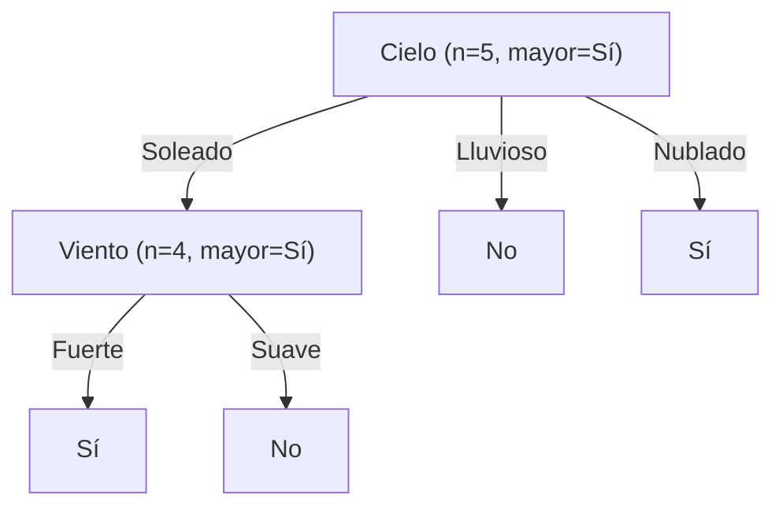
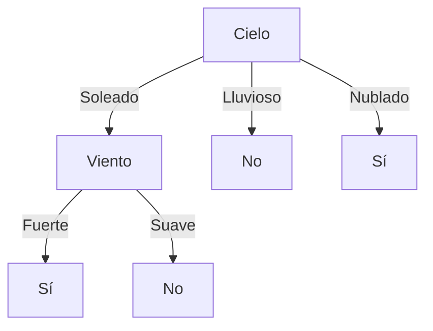

# Ejercicio 5: Poda de Árboles de Decisión Basada en Validación (*Reduced Error Pruning*)

**Práctico 2: Árboles de Decisión**  
**Curso:** Aprendizaje Automático

---

## Enunciado

Se decide evitar el sobreajuste del modelo generado, modificando al ID3 para que, luego de construido el árbol, aplique un procedimiento de poda. 

El procedimiento consiste en evaluar a los nodos interiores, desde la raíz a las hojas, con un conjunto de validación. Cuando el resultado sobre el conjunto de validación es peor que simplemente predecir el valor más común de los ejemplos de entrenamiento en ese nodo, se elimina completamente el subárbol y se lo sustituye con una hoja con ese valor. En caso contrario, se procede a evaluar recursivamente a los nodos hijos.

Dé el árbol resultante de aplicar este método con los siguientes conjuntos de datos, donde las instancias 1 al 5 son de entrenamiento y el resto de validación:

| # | Cielo | Temp | Humedad | Viento | Tmp. Agua | Tiempo | Juega | Rol |
|:---:|:---:|:---:|:---:|:---:|:---:|:---:|:---:|:---:|
| 1 | Soleado | Templado | Normal | Fuerte | Templada | Sin cambios | Sí | Entrenamiento |
| 2 | Soleado | Templado | Alta | Fuerte | Templada | Sin cambios | Sí | Entrenamiento |
| 3 | Lluvioso | Frío | Alta | Fuerte | Templada | Cambiante | No | Entrenamiento |
| 4 | Soleado | Templado | Alta | Fuerte | Fría | Cambiante | Sí | Entrenamiento |
| 5 | Soleado | Templado | Normal | Suave | Templada | Sin cambios | No | Entrenamiento |
| 6 | Soleado | Templado | Normal | Fuerte | Fría | Suave | Sí | Validación |
| 7 | Lluvioso | Frío | Normal | Suave | Templada | Sin cambios | No | Validación |

---

## Solución Detallada

### 💻 Código Ejecutable
Se incluye el script en Python que construye el árbol inicial y evalúa el procedimiento de poda:
* 🐍 [**`scripts/ejercicio_05_poda_arbol.py`**](./scripts/ejercicio_05_poda_arbol.py)

---

### Paso 1: Construcción del Árbol Completo sobre Entrenamiento (Instancias 1 a 5)

Utilizando el algoritmo ID3 sobre las instancias 1 a 5 (idéntico al Ejercicio 3b):
- **Nodo Raíz:** `Cielo` (clase mayoritaria global de entrenamiento: **Sí**, 3 de 5).
  - Rama `Lluvioso` $\implies$ Hoja **No** (instancia 3).
  - Rama `Nublado` $\implies$ Hoja **Sí** (mayoría).
  - Rama `Soleado` $\implies$ Nodo interior **`Viento`** (clase mayoritaria en esta rama: **Sí**, 3 de 4).
    - Rama `Fuerte` $\implies$ Hoja **Sí** (instancias 1, 2, 4).
    - Rama `Suave` $\implies$ Hoja **No** (instancia 5).



---

### Paso 2: Aplicación del Algoritmo de Poda Top-Down

El algoritmo evalúa los nodos interiores desde la raíz hacia las hojas contra el conjunto de validación ($D_{\text{val}} = \{\#6, \#7\}$):

#### 1. Evaluación del Nodo Raíz (`Cielo`):
- **Comportamiento del subárbol actual sobre $D_{\text{val}}$:**
  - Instancia #6 ($\langle \text{Soleado}, \dots, \text{Fuerte} \rangle$): El árbol predice **Sí**. *(Real: Sí $\implies$ Correcto ✅)*
  - Instancia #7 ($\langle \text{Lluvioso}, \dots \rangle$): El árbol predice **No**. *(Real: No $\implies$ Correcto ✅)*
  - **Acierto del subárbol completo:** $\frac{2}{2} = \mathbf{100\%}$ ($0$ errores).

- **Comportamiento si se poda la raíz (reemplazando por la clase mayoritaria de entrenamiento: `Sí`):**
  - Instancia #6: Predice **Sí**. *(Real: Sí $\implies$ Correcto ✅)*
  - Instancia #7: Predice **Sí**. *(Real: No $\implies$ Error ❌)*
  - **Acierto de la raíz podada:** $\frac{1}{2} = \mathbf{50\%}$ ($1$ error).

  ```mermaid
  graph TD
      Root["Sí (Hoja única podada, clase mayoritaria)"]
  ```

- **Decisión en la Raíz:** El resultado del subárbol ($100\%$) **no es peor** que podar ($50\%$). Por lo tanto, **la raíz NO se poda** y se procede a evaluar recursivamente a sus nodos hijos interiores.

---

#### 2. Evaluación del Nodo Interior Hijo (`Viento` bajo `Cielo = Soleado`):
- Instancias de validación que caen en esta rama: **Únicamente la instancia #6** ($\text{Cielo} = \text{Soleado}$).
- **Comportamiento del subárbol `Viento` sobre instancia #6:**
  - Instancia #6 tiene `Viento = Fuerte` $\implies$ predice **Sí**. *(Real: Sí $\implies$ Correcto ✅)*
  - **Acierto del subárbol:** $\frac{1}{1} = \mathbf{100\%}$.

- **Comportamiento si se poda el nodo `Viento` (reemplazando por el valor más común de entrenamiento en este nodo: `Sí`):**
  - Instancia #6: Predice **Sí**. *(Real: Sí $\implies$ Correcto ✅)*
  - **Acierto del nodo podado:** $\frac{1}{1} = \mathbf{100\%}$.

  ```mermaid
  graph TD
      C[Cielo] -->|Soleado| S2["Sí (Hoja podada de Viento)"]
      C -->|Lluvioso| N1[No]
      C -->|Nublado| S1[Sí]
  ```

- **Decisión en el Nodo `Viento`:** La regla del enunciado establece:
  > *"Cuando el resultado sobre el conjunto de validación es peor que simplemente predecir el valor más común... se elimina completamente el subárbol... En caso contrario, se procede a evaluar recursivamente a los nodos hijos."*

  Dado que el subárbol obtiene $100\%$ de acierto (no es peor que el $100\%$ de la poda), **el nodo `Viento` NO se poda**. Sus hijos ya son hojas terminales, por lo que el proceso finaliza.

---

### Árbol Resultante Final:

El árbol podado coincide con el árbol original inducido por ID3:


