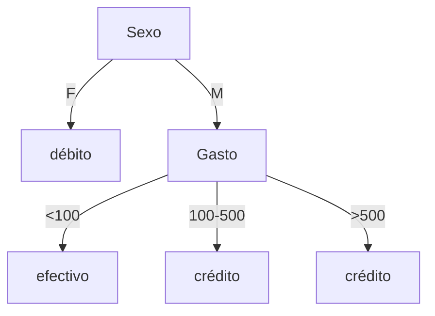

# Ejercicio 3: Inclusión Financiera - Tratamiento de Atributos, 3-NN, Naive Bayes e ID3

**Práctico 3: Aprendizaje Bayesiano, Aprendizaje por Casos y Metodología**  
**Curso:** Aprendizaje Automático

---

## Enunciado

A partir de la aplicación de la «ley de inclusión financiera», se decide monitorear cómo se comportan los consumidores respecto a los medios de pago. Se recaba el siguiente conjunto de ejemplos, siendo «Medio» el atributo objetivo:

| # | Edad | Medio | Gasto | Mercancía | Sexo |
|:---:|:---:|:---:|:---:|:---:|:---:|
| 1 | 18 | efectivo | 80 | 1ra. necesidad | M |
| 2 | 35 | débito | 12 | 1ra. necesidad | F |
| 3 | 55 | crédito | 180 | 1ra. necesidad | M |
| 4 | 73 | efectivo | 80 | cultura | ? |
| 5 | 45 | crédito | 540 | electrodomésticos | M |
| 6 | 27 | débito | 150 | electrodomésticos | F |

Los atributos numéricos son enteros, $\text{edad} \in [18, 80]$, $\text{gasto} \in [0, 1000]$, $\text{sexo} \in \{M, F\}$, $\text{medio} \in \{\text{efectivo}, \text{débito}, \text{crédito}\}$ y $\text{mercancía} \in \{\text{1ra. necesidad}, \text{electrodomésticos}, \text{cultura}\}$.

- **a)** Explique cómo se podrían tratar los atributos numéricos y los atributos faltantes según se apliquen los siguientes algoritmos: ID3, Naive Bayes y KNN.
- **b)** Defina lo necesario para aplicar 3-NN sobre el conjunto de ejemplos. Justifique.
- **c)** Aplique los algoritmos Naive Bayes e ID3 sobre el conjunto de datos, ahora preprocesados, en donde se consideran tres rangos de edades: `<30`, `30-60`, `>60`; y tres rangos para los gastos: `<100`, `100-500`, `>500`.
- **d)** Compare la solución por rangos utilizada en **(c)** con su solución en **(a)**.
- **e)** Clasifique a la siguiente instancia según sus tres clasificadores obtenidos en **(b)** y **(c)**:

| # | Edad | Medio | Gasto | Mercancía | Sexo |
|:---:|:---:|:---:|:---:|:---:|:---:|
| 7 | 38 | ? | 950 | electrodomésticos | M |

---

## Solución Detallada

### 💻 Código Ejecutable
Implementación completa de 3-NN, Naive Bayes (con y sin Laplace) y árbol ID3:
* 🐍 [**`scripts/ejercicio_03_medios_pago.py`**](./scripts/ejercicio_03_medios_pago.py)

---

### Parte a) Tratamiento de Atributos Continuos y Faltantes por Algoritmo

| Algoritmo | Tratamiento de Atributos Continuos (Edad, Gasto) | Tratamiento de Valores Faltantes (Sexo en inst. 4) |
| :--- | :--- | :--- |
| **ID3** | **1. Discretización previa:** Dividir el rango en intervalos fijos o cuantiles. **2. Umbrales dinámicos (C4.5):** Ordenar los valores continuos observados, evaluar puntos medios entre valores adyacentes de distintas clases y seleccionar el umbral $c$ que maximice la Ganancia de Información: $A \le c$ vs $A > c$. | **1. Imputación:** Asignar el valor más frecuente (moda) globalmente o condicionado a la clase objetivo (para `Medio = efectivo`, moda = $M$). **2. Asignación probabilística (C4.5):** Dividir la instancia fraccionalmente entre las ramas según la distribución de frecuencias de los valores conocidos. |
| **Naive Bayes** | **1. Discretización en bines:** Agrupar en categorías discretas y calcular frecuencias. **2. Densidad de Probabilidad Gaussiana:** Modelar cada variable continua como $X_i \mid C \sim \mathcal{N}(\mu_{i,c}, \sigma_{i,c}^2)$ estimando la media y varianza muestral por clase. | **1. Omitir el atributo:** En el cómputo del producto $\prod_i P(x_i \mid C)$, ignorar el factor correspondiente a la variable faltante para esa instancia específica. **2. Imputación:** Reemplazar por la moda / media de la clase. |
| **KNN** | **Normalización / Estandarización obligatoria:** Debido a que KNN se basa en distancias euclidianas, atributos con escalas grandes (Gasto $[0, 1000]$) dominarían completamente sobre escalas pequeñas (Edad $[18, 80]$). Se debe aplicar **Min-Max Scaling** ($x' = \frac{x - x_{\min}}{x_{\max} - x_{\min}}$) o **Z-Score Normalization**. | **1. Imputación:** Completar por la moda global o vecinos conocidos más cercanos. **2. Distancia modificada (HEOM / VDM):** Asignar distancia máxima ($1{,}0$) o distancia promedio esperada cuando falta el atributo al comparar dos instancias. |

---

### Parte b) Definición para Aplicar 3-NN

Para aplicar $K$-Nearest Neighbors con $K=3$:

1. **Preprocesamiento y Normalización de Variables Continuas:**
   Se aplica escalado Min-Max usando los dominios teóricos especificados:
   - $\text{Edad} \in [18, 80] \implies \text{Edad}' = \frac{\text{Edad} - 18}{80 - 18} = \frac{\text{Edad} - 18}{62}$
   - $\text{Gasto} \in [0, 1000] \implies \text{Gasto}' = \frac{\text{Gasto} - 0}{1000 - 0} = \frac{\text{Gasto}}{1000}$

2. **Métrica de Distancia Mixta (Heterogénea):**
   Para variables nominales (`Mercancía`, `Sexo`), usamos la distancia de coincidencia binaria (Hamming):
   $$d_{\text{cat}}(u, v) = \begin{cases} 0 & \text{si } u = v \\ 1 & \text{si } u \ne v \end{cases}$$
   Para el valor faltante en `Sexo` de la instancia 4, imputamos por la moda ($M$).
   
   La distancia total entre dos instancias $x$ e $y$ es la norma euclidiana:
   $$d(x, y) = \sqrt{ (\text{Edad}'_x - \text{Edad}'_y)^2 + (\text{Gasto}'_x - \text{Gasto}'_y)^2 + d_{\text{cat}}(\text{Merc}_x, \text{Merc}_y) + d_{\text{cat}}(\text{Sexo}_x, \text{Sexo}_y) }$$

3. **Regla de Decisión:** Votación mayoritaria simple de las clases de los 3 vecinos más cercanos.

---

### Parte c) Naive Bayes e ID3 con Datos Discretizados

#### Dataset Discretizado:
- **Edad:** `<30` (18, 27), `30-60` (35, 55, 45), `>60` (73).
- **Gasto:** `<100` (80, 12, 80), `100-500` (180, 150), `>500` (540).
- **Sexo faltante (#4):** Imputado como $M$.

| # | Edad_disc | Gasto_disc | Mercancía | Sexo | Medio (Target) |
|:---:|:---:|:---:|:---:|:---:|:---:|
| 1 | `<30` | `<100` | 1ra. necesidad | M | **efectivo** |
| 2 | `30-60` | `<100` | 1ra. necesidad | F | **débito** |
| 3 | `30-60` | `100-500` | 1ra. necesidad | M | **crédito** |
| 4 | `>60` | `<100` | cultura | M | **efectivo** |
| 5 | `30-60` | `>500` | electrodomésticos | M | **crédito** |
| 6 | `<30` | `100-500` | electrodomésticos | F | **débito** |

---

#### 1. Naive Bayes

- **Probabilidades a Priori:**
  $$P(\text{efectivo}) = \frac{2}{6} = \frac{1}{3}, \quad P(\text{débito}) = \frac{2}{6} = \frac{1}{3}, \quad P(\text{crédito}) = \frac{2}{6} = \frac{1}{3}$$

- **Tablas de Probabilidades Condicionales $P(A_i = v \mid C)$:**
  - **Clase efectivo ($N=2$, inst. 1 y 4):**
    - Edad: $P(<30)=1/2$, $P(30-60)=0/2$, $P(>60)=1/2$
    - Gasto: $P(<100)=2/2=1$, $P(100-500)=0/2$, $P(>500)=0/2$
    - Mercancía: $P(\text{1ra})=1/2$, $P(\text{cultura})=1/2$, $P(\text{electro})=0/2$
    - Sexo: $P(M)=2/2=1$, $P(F)=0/2$
  - **Clase débito ($N=2$, inst. 2 y 6):**
    - Edad: $P(<30)=1/2$, $P(30-60)=1/2$, $P(>60)=0/2$
    - Gasto: $P(<100)=1/2$, $P(100-500)=1/2$, $P(>500)=0/2$
    - Mercancía: $P(\text{1ra})=1/2$, $P(\text{electro})=1/2$, $P(\text{cultura})=0/2$
    - Sexo: $P(F)=2/2=1$, $P(M)=0/2$
  - **Clase crédito ($N=2$, inst. 3 y 5):**
    - Edad: $P(30-60)=2/2=1$, $P(<30)=0/2$, $P(>60)=0/2$
    - Gasto: $P(100-500)=1/2$, $P(>500)=1/2$, $P(<100)=0/2$
    - Mercancía: $P(\text{1ra})=1/2$, $P(\text{electro})=1/2$, $P(\text{cultura})=0/2$
    - Sexo: $P(M)=2/2=1$, $P(F)=0/2$

---

#### 2. Árbol de Decisión ID3

- **Entropía del conjunto total $S$ ($|S|=6$, 2 efectivo, 2 débito, 2 crédito):**
  $$H(S) = -\sum_{c} \frac{2}{6} \log_2\left(\frac{2}{6}\right) = \log_2(3) \approx 1{,}5850 \text{ bits}$$

- **Ganancias de Información en la Raíz:**
  - **Sexo:**
    - Rama $M$ (inst. 1, 3, 4, 5): 2 efectivo, 2 crédito $\implies H(S_M) = 1{,}0$ bit.
    - Rama $F$ (inst. 2, 6): 2 débito $\implies H(S_F) = 0{,}0$ (Pura $\to$ Hoja **débito**).
    - $\text{Gain}(S, \text{Sexo}) = 1{,}5850 - \left[ \frac{4}{6}(1{,}0) + \frac{2}{6}(0{,}0) \right] = 1{,}5850 - 0{,}6667 = \mathbf{0{,}9183 \text{ bits}}$ (Máxima).
  - **Gasto:** $\text{Gain}(S, \text{Gasto}) = 0{,}7925 \text{ bits}$.
  - **Edad:** $\text{Gain}(S, \text{Edad}) = 0{,}7925 \text{ bits}$.
  - **Mercancía:** $\text{Gain}(S, \text{Mercancía}) = 0{,}4591 \text{ bits}$.

Seleccionando **`Sexo`** en la raíz:
- Si $\text{Sexo} = F \implies$ **débito** (100% puro).
- Si $\text{Sexo} = M$, quedan las instancias $\{1, 3, 4, 5\}$ (2 efectivo, 2 crédito).
  - Evaluando el siguiente atributo bajo la rama $M$:
    - **Gasto:** `<100` tiene $\{1, 4\}$ (2 efectivo $\to$ puro), `100-500` tiene $\{3\}$ (1 crédito $\to$ puro), `>500` tiene $\{5\}$ (1 crédito $\to$ puro).
    - $\text{Gain}(S_M, \text{Gasto}) = 1{,}0 - 0 = 1{,}0 \text{ bit}$.

---

### Parte d) Comparación entre Solución por Rangos y Solución General

1. **Pérdida de Información:** La discretización por rangos estáticos prefijados (`<100`, `100-500`, `>500`) agrupa valores dispares (ej. 12 y 80 quedan en el mismo bin) y crea discontinuidades artificiales (un gasto de 99 y uno de 101 caen en categorías distintas).
2. **Umbrales Óptimos de ID3 (C4.5):** La solución general busca cortes guiados por la máxima ganancia de información según los datos observados, logrando particiones más compactas e informativas.
3. **Naive Bayes Continuo:** La modelación gaussiana no pierde la granularidad numérica, aunque introduce el supuesto paramétrico de normalidad.
4. **KNN:** Para KNN, los rangos discretizados destruyen la noción de métrica geométrica continua en $\mathbb{R}^d$, siendo muy superior el escalado continuo Min-Max.

---

### Parte e) Clasificación de la Instancia #7

Instancia #7: $\text{Edad} = 38$, $\text{Gasto} = 950$, $\text{Mercancía} = \text{electrodomésticos}$, $\text{Sexo} = M$.
Forma discretizada: $\langle \text{Edad}=\text{'30-60'}, \text{Gasto}=\text{'>500'}, \text{Mercancía}=\text{'electrodomésticos'}, \text{Sexo}=M \rangle$.

#### 1. Con 3-NN:
Normalización:
- $\text{Edad}' = (38 - 18)/62 = 20/62 \approx 0{,}3226$
- $\text{Gasto}' = 950/1000 = 0{,}9500$

Distancias euclidianas a cada instancia:
- **Instancia 5:** $\text{Edad}' = 27/62 \approx 0{,}4355$, $\text{Gasto}' = 0{,}540$, Merc: electro, Sexo: M.
  $$d(7, 5) = \sqrt{(0{,}3226 - 0{,}4355)^2 + (0{,}9500 - 0{,}5400)^2 + 0 + 0} = \sqrt{0{,}01275 + 0{,}1681} = \mathbf{0{,}4253} \quad (\text{crédito})$$
- **Instancia 3:** $d(7, 3) = \sqrt{(0{,}3226 - 0{,}5968)^2 + (0{,}9500 - 0{,}1800)^2 + 1 + 0} = \mathbf{1{,}2915} \quad (\text{crédito})$
- **Instancia 6:** $d(7, 6) = \sqrt{(0{,}3226 - 0{,}1452)^2 + (0{,}9500 - 0{,}1500)^2 + 0 + 1} = \mathbf{1{,}2929} \quad (\text{débito})$
- **Instancia 1:** $d(7, 1) = \mathbf{1{,}3642} \quad (\text{efectivo})$
- **Instancia 4:** $d(7, 4) = \mathbf{1{,}4407} \quad (\text{efectivo})$
- **Instancia 2:** $d(7, 2) = \mathbf{1{,}6977} \quad (\text{débito})$

Los 3 vecinos más cercanos son **#5 (crédito)**, **#3 (crédito)** y **#6 (débito)**.
Votación mayoritaria: 2 votos para crédito vs 1 para débito $\implies \mathbf{\text{3-NN predice: crédito}}$.

#### 2. Con Naive Bayes:
- **Clase crédito:**
  $$\text{Score}(\text{crédito}) = P(\text{créd}) \cdot P(\text{30-60}|\text{créd}) \cdot P(>500|\text{créd}) \cdot P(\text{electro}|\text{créd}) \cdot P(M|\text{créd})$$
  $$\text{Score}(\text{crédito}) = \frac{1}{3} \cdot 1 \cdot \frac{1}{2} \cdot \frac{1}{2} \cdot 1 = \frac{1}{12} \approx \mathbf{0{,}0833}$$
- **Clase débito:** $P(M|\text{débito}) = 0/2 = 0 \implies \text{Score}(\text{débito}) = 0{,}0$.
- **Clase efectivo:** $P(>500|\text{efectivo}) = 0/2 = 0 \implies \text{Score}(\text{efectivo}) = 0{,}0$.

$$\mathbf{\text{Naive Bayes predice: crédito (con } P = 1{,}0)}$$

#### 3. Con Árbol ID3:
- En la raíz evalúa `Sexo = M` $\to$ pasa al nodo `Gasto`.
- En el nodo `Gasto`, toma la rama `>500` $\to$ llega a la hoja **crédito**.
$$\mathbf{\text{ID3 predice: crédito}}$$

---

### Resumen de Predicciones para la Instancia #7:
| Clasificador | Predicción |
| :--- | :---: |
| **3-NN** | **crédito** |
| **Naive Bayes** | **crédito** |
| **ID3** | **crédito** |
