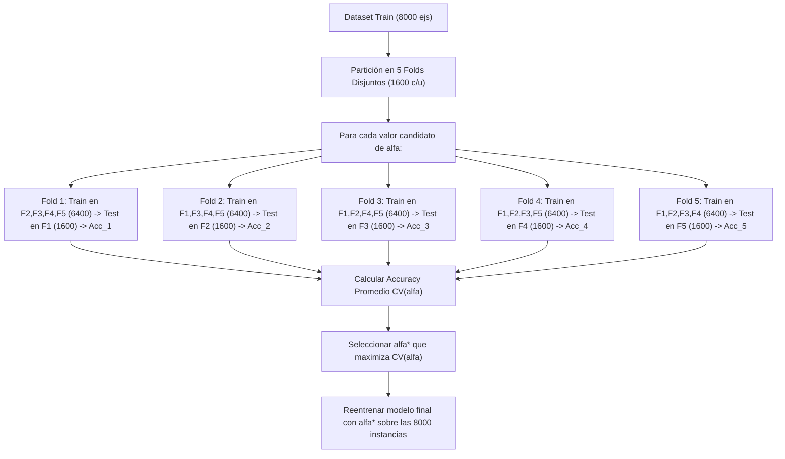

# Ejercicio 7: Metodología de Validación y Métricas Multiclase en Dataset Desbalanceado

**Práctico 3: Aprendizaje Bayesiano, Aprendizaje por Casos y Metodología**  
**Curso:** Aprendizaje Automático

---

## Enunciado

- **a)** Suponga que su conjunto de entrenamiento tiene 8000 instancias y se desea ajustar el hiperparámetro $\alpha$ de un cierto método de aprendizaje automático. Describa el proceso de validación cruzada con 5 folds y accuracy como medida de rendimiento.
- **b)** Si cuenta con un conjunto de datos con 9200 instancias, divididas en tres clases A, B y C con 8500, 500 y 200 instancias, respectivamente, y ordenadas por clase: ¿cómo dividiría a las instancias en los conjuntos de entrenamiento y evaluación? Justifique.

Se realiza la evaluación de un modelo y se obtiene la siguiente matriz de confusión (en las filas están los valores correctos de las instancias):

| | A | B | C |
|:---:|:---:|:---:|:---:|
| **A** | 910 | 5 | 5 |
| **B** | 5 | 20 | 20 |
| **C** | 6 | 4 | 15 |

- **i)** Calcule accuracy, precisión, recall y medida F1 para cada una de las clases.
- **ii)** Obtenga los valores de macro y micro average de las medidas. Analícelas.

---

## Solución Detallada

### 💻 Código Ejecutable
Se incluye el script en Python para reproducir todos los cálculos de la matriz multiclase y métricas macro/micro:
* 🐍 [**`scripts/ejercicio_07_metricas_multiclase.py`**](./scripts/ejercicio_07_metricas_multiclase.py)

---

### Parte a) Proceso de Validación Cruzada con 5 Folds para Ajustar $\alpha$

Con un conjunto de entrenamiento $D_{\text{train}}$ de $N = 8000$ instancias:

#### Paso a Paso Formal:
1. **Definir la grilla de búsqueda:** Se establece un conjunto discreto de valores candidatos para el hiperparámetro: $\mathcal{A} = \{\alpha_1, \alpha_2, \dots, \alpha_m\}$.
2. **Partición en 5 Folds:** Se divide el conjunto de 8000 instancias de forma aleatoria y estratificada en $K = 5$ bloques disjuntos $F_1, F_2, \dots, F_5$ de $1600$ instancias cada uno ($8000 / 5 = 1600$).
3. **Evaluación Cruzada:** Para cada candidato $\alpha \in \mathcal{A}$:
   - Para $k = 1, \dots, 5$:
     - Se entrena el algoritmo con el hiperparámetro $\alpha$ utilizando las $6400$ instancias de los $4$ folds restantes ($D_{\text{train}}^{(k)} = \bigcup_{j \ne k} F_j$).
     - Se evalúa sobre el fold de prueba $F_k$ ($1600$ instancias) y se calcula la tasa de acierto:
       $$\text{Acc}_k(\alpha) = \frac{\text{Aciertos en } F_k}{1600}$$
   - Se computa el rendimiento medio de validación cruzada:
     $$\overline{\text{Acc}}(\alpha) = \frac{1}{5} \sum_{k=1}^5 \text{Acc}_k(\alpha)$$
4. **Selección del Hiperparámetro Óptimo:** Se elige el mejor hiperparámetro:
   $$\alpha^* = \arg\max_{\alpha \in \mathcal{A}} \overline{\text{Acc}}(\alpha)$$
5. **Reentrenamiento Final:** Con $\alpha^*$ fijado, se reentrena el modelo sobre la **totalidad de las 8000 instancias** para generar el modelo de producción final.

---

### Parte b) División de un Dataset Altamente Desbalanceado y Ordenado

- Tamaño total: $N = 9200$ instancias.
- Distribución de clases:
  - Clase A: $8500$ ($92{,}39\%$)
  - Clase B: $500$ ($5{,}43\%$)
  - Clase C: $200$ ($2{,}17\%$)
- Los datos vienen **ordenados secuencialmente por clase**.

#### Estrategia Obligatoria: **Muestreo Aleatorio Estratificado (*Stratified Random Split*)**

#### Justificación Crítica:
1. **Peligro del ordenamiento secuencial:** Si se realiza un corte secuencial estándar (ej. los primeros $80\%$ para train y los últimos $20\%$ para test):
   - Train ($7360$ primeros ejemplos) contendría **únicamente instancias de la clase A**.
   - Test contendría las clases B, C y el resto de A.
   - El modelo nunca aprendería la existencia de B ni de C durante el entrenamiento, provocando un colapso total del aprendizaje.
2. **Estratificación obligatoria por desbalance extremo:** Al ser las clases B ($5{,}4\%$) y C ($2{,}2\%$) minoritarias, un muestreo aleatorio simple podría dejar a la partición de test o train con cero o muy pocas muestras de la clase C.
3. **Procedimiento:**
   - Se realiza un barajado aleatorio (*shuffle*) dentro de cada clase por separado.
   - Si se utiliza una división clásica $80/20$:
     - **Train (80%):** $6800$ de A, $400$ de B, $160$ de C (Total: $7360$).
     - **Test (20%):** $1700$ de A, $100$ de B, $40$ de C (Total: $1840$).
   - De este modo, ambos subconjuntos mantienen exactamente la proporción poblacional ($92{,}39\%$ A, $5{,}43\%$ B, $2{,}17\%$ C).

---

### Parte c) Análisis de la Matriz de Confusión Multiclase

Matriz de confusión proporcionada ($N = 990$ instancias):

| | Predicho **A** | Predicho **B** | Predicho **C** | **Total Real** |
|:---:|:---:|:---:|:---:|:---:|
| **Real A** | $910$ | $5$ | $5$ | **$920$** |
| **Real B** | $5$ | $20$ | $20$ | **$45$** |
| **Real C** | $6$ | $4$ | $15$ | **$25$** |
| **Total Predicho** | **$921$** | **$29$** | **$40$** | $\mathbf{990}$ |

---

### Parte i) Cálculo de Métricas por Clase (Esquema *One-vs-Rest*)

Desglosamos la matriz para cada clase $k$:
- $\text{TP}_k = M_{k,k}$ (elemento de la diagonal principal).
- $\text{FP}_k = \sum_{i \ne k} M_{i,k}$ (suma de la columna $k$ excluyendo la diagonal).
- $\text{FN}_k = \sum_{j \ne k} M_{k,j}$ (suma de la fila $k$ excluyendo la diagonal).
- $\text{TN}_k = N - (\text{TP}_k + \text{FP}_k + \text{FN}_k)$.

#### 1. Para la Clase A:
- $\text{TP}_A = 910$
- $\text{FP}_A = 5 + 6 = 11$
- $\text{FN}_A = 5 + 5 = 10$
- $\text{TN}_A = 990 - (910 + 11 + 10) = 59$
- $\text{Accuracy}_A = \frac{910 + 59}{990} = \frac{969}{990} \approx \mathbf{0{,}9788 \quad (97{,}88\%)}$
- $\text{Precision}_A = \frac{910}{910 + 11} = \frac{910}{921} \approx \mathbf{0{,}9881 \quad (98{,}81\%)}$
- $\text{Recall}_A = \frac{910}{910 + 10} = \frac{910}{920} \approx \mathbf{0{,}9891 \quad (98{,}91\%)}$
- $F_{1,A} = 2 \cdot \frac{0{,}9881 \cdot 0{,}9891}{0{,}9881 + 0{,}9891} \approx \mathbf{0{,}9886}$

---

#### 2. Para la Clase B:
- $\text{TP}_B = 20$
- $\text{FP}_B = 5 + 4 = 9$
- $\text{FN}_B = 5 + 20 = 25$
- $\text{TN}_B = 990 - (20 + 9 + 25) = 936$
- $\text{Accuracy}_B = \frac{20 + 936}{990} = \frac{956}{990} \approx \mathbf{0{,}9657 \quad (96{,}57\%)}$
- $\text{Precision}_B = \frac{20}{20 + 9} = \frac{20}{29} \approx \mathbf{0{,}6897 \quad (68{,}97\%)}$
- $\text{Recall}_B = \frac{20}{20 + 25} = \frac{20}{45} \approx \mathbf{0{,}4444 \quad (44{,}44\%)}$
- $F_{1,B} = 2 \cdot \frac{0{,}6897 \cdot 0{,}4444}{0{,}6897 + 0{,}4444} = \frac{0{,}6130}{1{,}1341} \approx \mathbf{0{,}5405}$

---

#### 3. Para la Clase C:
- $\text{TP}_C = 15$
- $\text{FP}_C = 5 + 20 = 25$
- $\text{FN}_C = 6 + 4 = 10$
- $\text{TN}_C = 990 - (15 + 25 + 10) = 940$
- $\text{Accuracy}_C = \frac{15 + 940}{990} = \frac{955}{990} \approx \mathbf{0{,}9646 \quad (96{,}46\%)}$
- $\text{Precision}_C = \frac{15}{15 + 25} = \frac{15}{40} = \mathbf{0{,}3750 \quad (37{,}50\%)}$
- $\text{Recall}_C = \frac{15}{15 + 10} = \frac{15}{25} = \mathbf{0{,}6000 \quad (60{,}00\%)}$
- $F_{1,C} = 2 \cdot \frac{0{,}3750 \cdot 0{,}6000}{0{,}3750 + 0{,}6000} = \frac{0{,}4500}{0{,}9750} \approx \mathbf{0{,}4615}$

---

### Tabla Resumen por Clase:

| Clase | Soporte Real | TP | FP | FN | TN | Accuracy | Precisión | Recall | F1-Score |
| :---: | :---: | :---: | :---: | :---: | :---: | :---: | :---: | :---: | :---: |
| **A** | $920$ | $910$ | $11$ | $10$ | $59$ | **$97{,}88\%$** | **$98{,}81\%$** | **$98{,}91\%$** | **$0{,}9886$** |
| **B** | $45$ | $20$ | $9$ | $25$ | $936$ | **$96{,}57\%$** | **$68{,}97\%$** | **$44{,}44\%$** | **$0{,}5405$** |
| **C** | $25$ | $15$ | $25$ | $10$ | $940$ | **$96{,}46\%$** | **$37{,}50\%$** | **$60{,}00\%$** | **$0{,}4615$** |

---

### Parte ii) Promedios Macro y Micro Average y Análisis Comparativo

#### 1. Macro Average (Promedio No Ponderado entre Clases):
Trata a todas las clases con el mismo peso ($1/3$), independientemente de su soporte:
- **Macro-Precision:**
  $$\overline{P}_{\text{macro}} = \frac{0{,}9881 + 0{,}6897 + 0{,}3750}{3} = \frac{2{,}0528}{3} \approx \mathbf{0{,}6842 \quad (68{,}42\%)}$$
- **Macro-Recall:**
  $$\overline{R}_{\text{macro}} = \frac{0{,}9891 + 0{,}4444 + 0{,}6000}{3} = \frac{2{,}0335}{3} \approx \mathbf{0{,}6779 \quad (67{,}79\%)}$$
- **Macro-F1:**
  $$\overline{F}_{1,\text{macro}} = \frac{0{,}9886 + 0{,}5405 + 0{,}4615}{3} \approx \mathbf{0{,}6636}$$

---

#### 2. Micro Average (Agregación Global):
Suma todos los aciertos de la diagonal frente al total de instancias:
- $\text{Total TP} = 910 + 20 + 15 = 945$
- $\text{Total FP} = 11 + 9 + 25 = 45$
- $\text{Total FN} = 10 + 25 + 10 = 45$
- **Micro-Precision = Micro-Recall = Micro-F1 = Global Accuracy:**
  $$\text{Micro-Precision} = \frac{945}{945 + 45} = \frac{945}{990} \approx \mathbf{0{,}9545 \quad (95{,}45\%)}$$
  $$\text{Global Accuracy} = \frac{\sum_i M_{i,i}}{N} = \frac{945}{990} = \mathbf{95{,}45\%}$$

---

#### 3. Análisis Crítico:
1. **La «Trampa» de la Accuracy y del Micro-Average:** 
   - El Micro-Average y la Accuracy global reportan un sobresaliente **$95{,}45\%$**. Sin embargo, esto es un espejismo estadístico ocasionado por el predominio masivo de la clase A ($920$ de $990$ instancias, donde acierta $910$).
2. **El Diagnóstico Real revelado por el Macro-Average:**
   - Las métricas Macro descienden a **$68{,}42\%$ (Precisión)** y **$67{,}79\%$ (Recall)**.
   - El modelo tiene dificultades severas distinguiendo entre las clases minoritarias B y C: de 45 instancias reales de B, confunde 20 con C (Recall de B = $44{,}44\%$); y de las 40 veces que predice C, 25 son falsas alarmas (Precisión de C = $37{,}50\%$).
3. **Conclusión Metodológica:** En conjuntos desbalanceados, el **Macro-Average** y las métricas individuales por clase son imprescindibles para evaluar con honestidad el desempeño del modelo sobre clases críticas minoritarias.
