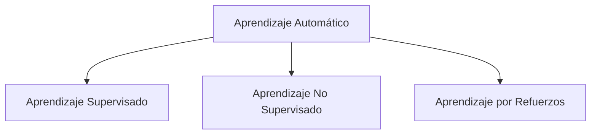

# Clase 1: ¿Qué es Aprender y Tipos de Aprendizaje?

---

## 1. ¿Aprender a partir de qué?

El aprendizaje automático parte de la base de tener datos / ejemplos de un problema:

* **Conjunto de instancias del problema:**
  * **Estructurados en atributos:** Tablas con columnas y filas bien definidas (ej. registros en bases de datos de compras, historias clínicas, datos de sensores).
  * **No estructurados:** Texto libre, imágenes, audio, video.
  * **Ingeniería de atributos (Feature Engineering):** Muchas veces es necesario procesar o calcular nuevos atributos a partir de los datos crudos.
  * **Generación activa de ejemplos:** En ciertos paradigmas, el propio sistema puede generar o solicitar nuevos ejemplos como parte del proceso de aprendizaje.

---

## 2. Tipos de Aprendizaje

Podemos dividir el aprendizaje automático en tres grandes paradigmas:

### 2.1. Aprendizaje Supervisado
* **Definición:** Se dispone de un conjunto de datos donde cada ejemplo ya cuenta con su etiqueta o clase objetivo conocida (Ground Truth).
* **Objetivo:** Encontrar una función/modelo a partir de los ejemplos de entrenamiento que sea capaz de generalizar y predecir correctamente la salida para **ejemplos nuevos (no vistos)**.
* **Ejemplo clásico (Clasificación binaria):**
  * Determinar si un punto en un plano es **rojo** o **azul** mediante una recta separadora (clasificador lineal).
  * **Proceso:**
    1. Entrada: Conjunto de datos clasificados $\{(x_1, y_1), (x_2, y_2), \dots\}$.
    2. Algoritmo: Ajusta los parámetros del modelo (la recta) minimizando el error cometido en los puntos conocidos.
    3. Salida: Un clasificador que evalúa un nuevo punto $x$ y predice si es rojo o azul.
* **Factores clave:**
  * La calidad de los datos (ruido, outliers, distribución de los datos).
  * La representación de las instancias (elección de variables/features). En algunos modelos modernos (Deep Learning), la representación misma es aprendida automáticamente.

### 2.2. Aprendizaje No Supervisado
* **Definición:** Se cuenta con instancias **sin clasificar** (sin etiquetas objetivo).
* **Objetivo:** Descubrir patrones ocultos, estructuras internas o agrupamientos naturales en los datos.
* **Técnica principal - Clustering:**
  * Agrupar elementos similares entre sí y diferentes a los de otros grupos (clústers).
* **Preguntas y desafíos fundamentales:**
  * ¿Qué significa matemáticamente que dos elementos sean "parecidos"? (Elección de la métrica de distancia o similitud: euclídea, manhattan, coseno, etc.).
  * ¿Cómo se determina el número óptimo de clústers ($k$)?

### 2.3. Aprendizaje por Refuerzos (Reinforcement Learning)
* **Definición:** Un **agente** aprende a tomar decisiones interactuando y explorando un **entorno/universo** dinámico.
* **Mecanismo:**
  * El agente realiza acciones en el entorno.
  * Las acciones modifican el estado del entorno y devuelven una retroalimentación en forma de **recompensas (premios)** o **penalizaciones (castigos)**.
  * El objetivo del agente es aprender una política de comportamiento que **maximice la recompensa acumulada** a lo largo del tiempo.
* **Ejemplo:** Entrenar una IA para jugar a *Flappy Bird*, ajedrez o videojuegos arcade.

---

## 3. ¿Qué es Aprender? (Definición Formal de Tom Mitchell)

> **Definición de Aprendizaje Automático (Tom Mitchell, 1997):**
>
> *"Se dice que un programa de computadora **aprende** de la experiencia **$E$** con respecto a alguna clase de tareas **$T$** y medida de desempeño **$P$**, si su desempeño en las tareas de **$T$**, medido por **$P$**, mejora con la experiencia **$E$**."*

### Desglose de la terna $(T, P, E)$:

| Componente | Significado | Ejemplo: Clasificador de Puntos (Rojos/Azules) |
| :--- | :--- | :--- |
| **$T$ (Tarea)** | La labor específica que el sistema debe realizar | Clasificar un punto nuevo como Rojo o Azul |
| **$P$ (Performance / Desempeño)** | Métrica cuantitativa para evaluar el éxito | Porcentaje de aciertos (Accuracy) |
| **$E$ (Experiencia)** | Los datos o interacciones disponibles para entrenar | Conjunto de puntos con sus colores ya etiquetados |

---

## 4. Preguntas Fundamentales al Diseñar un Sistema de Aprendizaje

Para construir un sistema de aprendizaje se debe responder:
1. **¿Qué se aprende exactamente?** (La función objetivo $f: X \to Y$).
2. **¿Cómo se representa lo aprendido?** (Árboles de decisión, redes neuronales, hiperplanos lineales, reglas lógicas).
3. **¿Qué tipo de experiencia/entrenamiento se utiliza?** (Directa vs. indirecta, supervisada vs. no supervisada).
4. **¿Cuál es el mecanismo/algoritmo de aprendizaje?** (Búsqueda en espacio de hipótesis, optimización por descenso de gradiente, etc.).
5. **Cuestiones teóricas:**
   * ¿Qué algoritmos garantizan aproximar correctamente las funciones?
   * ¿Cómo impactan el volumen de datos, el ruido y la complejidad del modelo en el error de generalización (trade-off sesgo/varianza)?
   * ¿Existen límites teóricos de lo que se puede aprender computacionalmente (Teoría PAC, dimensión VC)?
   * ¿Cómo influye el **conocimiento previo (sesgo inductivo)** para guiar el aprendizaje?
