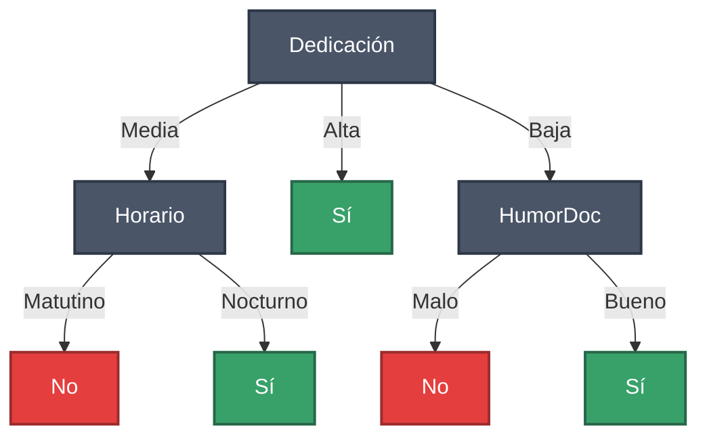
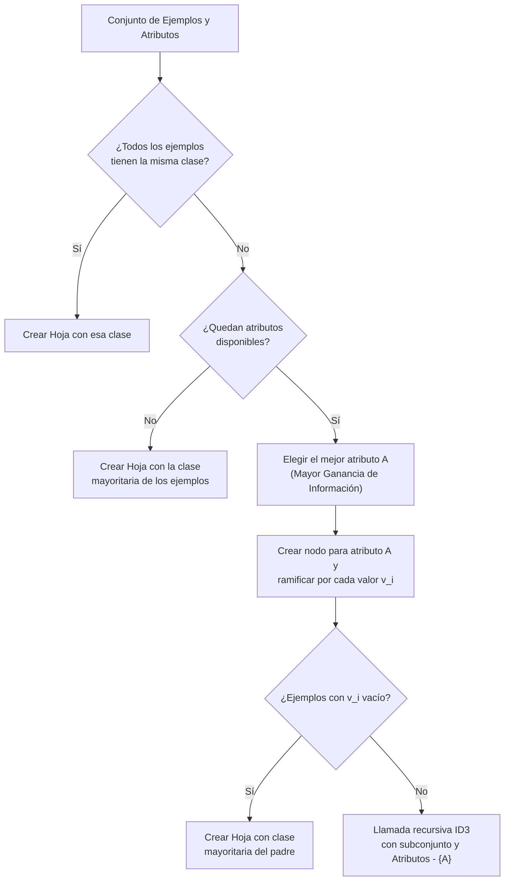
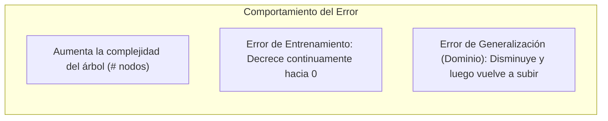
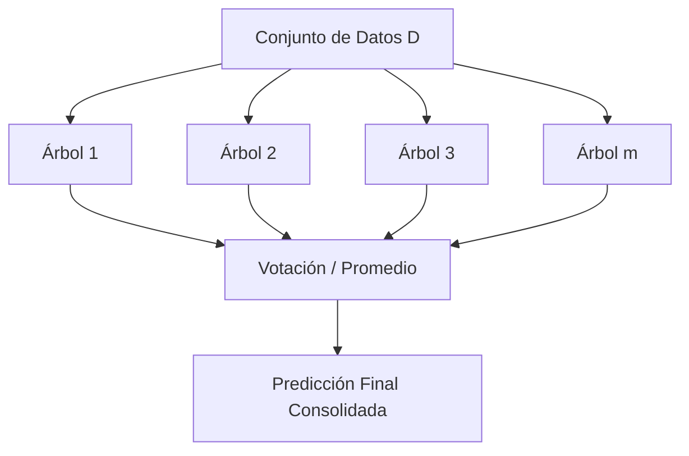

# Clase 3: Árboles de Decisión, Algoritmo ID3 y Ensambles

---

## 1. Introducción a los Árboles de Decisión

Los **árboles de decisión** son uno de los métodos de aprendizaje supervisado más intuitivos, efectivos y ampliamente utilizados para problemas de clasificación y regresión.



### 1.1. Estructura de un Árbol de Decisión
* **Nodos internos:** Cada nodo representa una prueba sobre un **atributo** específico del problema.
* **Ramas:** Salen de un nodo y corresponden a los posibles **valores** discretos que puede tomar dicho atributo.
* **Nodos hoja:** Representan la **clasificación final / predicción** (etiqueta de clase o valor numérico).

### 1.2. Procedimiento de Inferencia / Clasificación
Para clasificar una instancia nueva no vista $x$:
1. Se comienza en el **nodo raíz**.
2. Se evalúa el atributo indicado por el nodo en la instancia $x$.
3. Se desciende por la rama correspondiente al valor observado del atributo en $x$.
4. El proceso se repite recursivamente hasta alcanzar un **nodo hoja**, el cual otorga la clase predicha.

#### Ejemplo de clasificación con el árbol:
* **Instancia 1:** $[Ded = Media, Dif = Alta, Hor = Nocturno, Hum = Alta, HDoc = Malo]$
  * Raíz ($Dedicación$) $\to$ valor `Media`.
  * Nodo ($Horario$) $\to$ valor `Nocturno`.
  * Hoja alcanzada $\implies$ **SÍ** (Pedro salva el examen).
* **Instancia 2:** $[Ded = Baja, Dif = Alta, Hor = Nocturno, Hum = Alta, HDoc = Bueno]$
  * Raíz ($Dedicación$) $\to$ valor `Baja`.
  * Nodo ($HumorDoc$) $\to$ valor `Bueno`.
  * Hoja alcanzada $\implies$ **SÍ** (Pedro salva el examen).

---

## 2. Expresividad Lógica y Espacio de Hipótesis

### 2.1. Representación Lógica
Un árbol de decisión representa una función lógica en **Forma Normal Disyuntiva (DNF)**:
* **Cada rama** desde la raíz hasta una hoja positiva es una **conjunción ($\land$)** de restricciones sobre los atributos.
* **El árbol completo** es una **disyunción ($\lor$)** de todas las ramas que concluyen en la clase positiva.

Para el árbol del ejemplo anterior:
$$\begin{aligned}
\text{Salva}(x) \iff & (Dedicación = Media \land Horario = Nocturno) \\
& \lor (Dedicación = Alta) \\
& \lor (Dedicación = Baja \land HumorDoc = Bueno)
\end{aligned}$$

### 2.2. Tamaño del Espacio de Hipótesis ($|H|$)
Los árboles de decisión sobre atributos discretos son capaces de representar **cualquier función booleana discreta**. Por lo tanto, el espacio de hipótesis $H$ contiene todas las combinaciones posibles de asignaciones de verdad para el conjunto de instancias $X$:

$$|H| = 2^{|X|}$$

Si el conjunto de instancias contiene $|X| = 3 \times 3 \times 2 \times 3 \times 2 = 108$ instancias posibles:
$$|H| = 2^{108} \approx 3.24 \times 10^{32} \text{ hipótesis posibles}$$

> [!NOTE]
> Al ser $H$ completo ($|H| = 2^{|X|}$), el concepto objetivo $c$ siempre pertenece al espacio de hipótesis. Esto evita el problema de sesgo restrictivo que afectaba a representaciones puramente conjuntivas como las de Find-S o Candidate Elimination.

### 2.3. Características del Problema Adecuadas para Árboles de Decisión
* Las instancias se representan mediante pares **atributo-valor** (atributos nominales, categóricos o continuos).
* La función objetivo toma **valores discretos** (clasificación) o **continuos** (árboles de regresión).
* Se admiten hipótesis disyuntivas.
* Son tolerantes a **ruido y errores** en los datos de entrenamiento.
* Admiten instancias con **valores de atributos faltantes (incompletos)**.

---

## 3. El Algoritmo ID3

El algoritmo **ID3** (*Iterative Dichotomiser 3*, propuesto por Ross Quinlan) construye el árbol de decisión de forma descendente (*top-down*), siguiendo una estrategia codiciosa (*greedy*) basada en divide y vencerás.



### 3.1. Pseudocódigo de ID3

```text
Algoritmo ID3(Ejemplos, Atributos):
    Crear un nodo raíz

    1. Si todos los elementos de Ejemplos pertenecen a la misma clase C:
        Retornar nodo hoja etiquetado con la clase C

    2. Si Atributos == ∅:
        Retornar nodo hoja etiquetado con la clase más común en Ejemplos

    3. En caso contrario:
        A <- Atributo de Atributos que mejor clasifica a Ejemplos (Mayor Ganancia de Información)
        Etiquetar la raíz con el atributo A

        Para cada valor posible v_i del atributo A:
            Crear una nueva rama etiquetada con v_i
            Ejemplos_{v_i} <- { x ∈ Ejemplos | x[A] == v_i }

            Si Ejemplos_{v_i} == ∅:
                Crear nodo hoja hijo con la clase más común en Ejemplos
            En caso contrario:
                Crear subárbol hijo invocando ID3(Ejemplos_{v_i}, Atributos \ {A})

    Retornar nodo raíz
```

### 3.2. Propiedades de la Búsqueda con ID3
* **Espacio de hipótesis completo:** Como toda función discreta puede representarse con un árbol, el concepto objetivo garantizadamente pertenece a $H$.
* **Búsqueda guiada de lo simple a lo complejo:** Comienza con un árbol vacío y va añadiendo nodos según una heurística estadística.
* **Hipótesis única:** Mantiene solo una hipótesis actual; no almacena ni explora árboles alternativos equivalentes.
* **Sin backtracking:** Una vez seleccionado un atributo en un nodo, nunca se reconsidera la decisión. Puede quedar atrapado en **óptimos locales**.
* **Utiliza todos los ejemplos en cada paso:** Al basarse en estadísticas globales sobre toda la muestra disponible en el nodo, es mucho menos sensible a errores y ruido en instancias individuales que algoritmos basados en restricciones estrictas (como Candidate Elimination).

---

## 4. Selección de Atributos: Entropía y Ganancia de Información

Para decidir qué atributo $A$ debe colocarse en un nodo, ID3 utiliza métricas formales de la **Teoría de la Información**.

### 4.1. Entropía de Shannon
La **entropía** cuantifica la impureza, homogeneidad o incertidumbre de un conjunto de datos $S$. Corresponde al número promedio mínimo de bits requeridos para codificar la clase de un ejemplo en $S$.

Sea $S$ una colección de ejemplos donde la función objetivo toma valores en $\{v_1, v_2, \dots, v_n\}$:

$$\text{Entropía}(S) = - \sum_{i=1}^{n} p_i \log_2(p_i)$$

donde $p_i$ es la proporción de ejemplos en $S$ que pertenecen a la clase $v_i$.

#### Caso Binario (Clases $+$ y $-$):
$$\text{Entropía}(S) = - p_+ \log_2(p_+) - p_- \log_2(p_-)$$

> [!NOTE]
> Por definición, si $p_i = 0$, se adopta $0 \log_2(0) = 0$.

* **$\text{Entropía}(S) = 0$:** Todos los ejemplos pertenecen a la misma clase (máxima pureza/homogeneidad).
* **$\text{Entropía}(S) = 1$:** Existe la misma cantidad de ejemplos positivos y negativos ($p_+ = p_- = 0.5$, máxima incertidumbre).

```text
Entropía
 1.0 +                      (0.5, 1.0)
     |                          /\
 0.8 |                        /    \
     |                       /      \
 0.6 |                      /        \
     |                     /          \
 0.4 |                    /            \
     |                   /              \
 0.2 |                  /                \
     |                 /                  \
 0.0 +----------------+--------------------+-----> p+
   (0, 0)            0.5                 (1, 0)
```

#### Ejemplos de cálculo de Entropía:
1. $S = [9+, 0-] \implies \text{Entropía}(S) = -\frac{9}{9}\log_2(1) - 0 = 0$
2. $S = [9+, 9-] \implies \text{Entropía}(S) = -\frac{1}{2}\log_2\left(\frac{1}{2}\right) - \frac{1}{2}\log_2\left(\frac{1}{2}\right) = -(-0.5) - (-0.5) = 1$
3. $S = [9+, 5-] \implies \text{Entropía}(S) = -\frac{9}{14}\log_2\left(\frac{9}{14}\right) - \frac{5}{14}\log_2\left(\frac{5}{14}\right) \approx 0.940$

---

### 4.2. Ganancia de Información
La **Ganancia de Información** $\text{Ganancia}(S, A)$ mide la reducción esperada en la entropía al particionar el conjunto $S$ usando los valores del atributo $A$:

$$\text{Ganancia}(S, A) = \text{Entropía}(S) - \sum_{v \in \text{Valores}(A)} \frac{|S_v|}{|S|} \text{Entropía}(S_v)$$

donde $S_v$ es el subconjunto de $S$ en el cual el atributo $A$ toma el valor $v$ ($S_v = \{x \in S \mid x[A] = v\}$).

* **Interpretación:** Es la cantidad de información (en bits) que se gana respecto a la clase objetivo al conocer el valor del atributo $A$.
* **Criterio de decisión de ID3:** En cada nodo, se elige el atributo que **maximiza** $\text{Ganancia}(S, A)$.

---

## 5. Traza Completa del Algoritmo ID3 con el Ejemplo de Pedro

### 5.1. Datos de Entrenamiento ($S$)

| # | Dedicación | Dificultad | Horario | Humedad | HumorDoc | $c(x)$ (Salva) |
| :---: | :---: | :---: | :---: | :---: | :---: | :---: |
| **1** | Alta | Alta | Nocturno | Media | Bueno | **Sí** ($+$) |
| **2** | Baja | Media | Matutino | Alta | Malo | **No** ($-$) |
| **3** | Media | Alta | Nocturno | Media | Malo | **Sí** ($+$) |
| **4** | Media | Alta | Matutino | Alta | Bueno | **No** ($-$) |

El conjunto inicial cuenta con 2 instancias positivas y 2 negativas: $S = [2+, 2-]$.
$$\text{Entropía}(S) = -\frac{2}{4}\log_2\left(\frac{2}{4}\right) - \frac{2}{4}\log_2\left(\frac{2}{4}\right) = 1$$

---

### 5.2. Evaluación de Atributos para el Nodo Raíz

#### 1. Atributo: Dedicación (Valores: Alta, Media, Baja)
* $S_{\text{Alta}} = \{x_1\} \to [1+, 0-] \implies \text{Entropía}(S_{\text{Alta}}) = 0$
* $S_{\text{Media}} = \{x_3, x_4\} \to [1+, 1-] \implies \text{Entropía}(S_{\text{Media}}) = 1$
* $S_{\text{Baja}} = \{x_2\} \to [0+, 1-] \implies \text{Entropía}(S_{\text{Baja}}) = 0$

$$\begin{aligned}
\text{Ganancia}(S, \text{Dedicación}) &= \text{Entropía}(S) - \left[ \frac{1}{4}\text{Ent}(S_{\text{Alta}}) + \frac{2}{4}\text{Ent}(S_{\text{Media}}) + \frac{1}{4}\text{Ent}(S_{\text{Baja}}) \right] \\
&= 1 - \left[ \frac{1}{4}(0) + \frac{2}{4}(1) + \frac{1}{4}(0) \right] = 1 - 0.5 = \mathbf{0.5}
\end{aligned}$$

#### 2. Atributo: HumorDoc (Valores: Bueno, Malo)
* $S_{\text{Bueno}} = \{x_1, x_4\} \to [1+, 1-] \implies \text{Entropía}(S_{\text{Bueno}}) = 1$
* $S_{\text{Malo}} = \{x_2, x_3\} \to [1+, 1-] \implies \text{Entropía}(S_{\text{Malo}}) = 1$

$$\begin{aligned}
\text{Ganancia}(S, \text{HumorDoc}) &= 1 - \left[ \frac{2}{4}(1) + \frac{2}{4}(1) \right] = 1 - 1 = \mathbf{0.0}
\end{aligned}$$

#### 3. Atributo: Horario (Valores: Matutino, Nocturno)
* $S_{\text{Matutino}} = \{x_2, x_4\} \to [0+, 2-] \implies \text{Entropía}(S_{\text{Matutino}}) = 0$
* $S_{\text{Nocturno}} = \{x_1, x_3\} \to [2+, 0-] \implies \text{Entropía}(S_{\text{Nocturno}}) = 0$

$$\begin{aligned}
\text{Ganancia}(S, \text{Horario}) &= 1 - \left[ \frac{2}{4}(0) + \frac{2}{4}(0) \right] = 1 - 0 = \mathbf{1.0}
\end{aligned}$$

> [!TIP]
> Dado que $\text{Ganancia}(S, \text{Horario}) = 1.0 > \text{Ganancia}(S, \text{Dedicación}) = 0.5 > \text{Ganancia}(S, \text{HumorDoc}) = 0$, el atributo **Horario** es la elección óptima para la raíz, clasificando perfectamente todo el conjunto en un solo nivel.

---

### 5.3. Traza Si se Selecciona Dedicación en la Raíz
Si por heurística o decisión guiada se parte por `Dedicación`:
1. Rama `Alta`: Conjunto $\{x_1\} = [1+, 0-]$ (puro) $\implies$ Hoja **Sí**.
2. Rama `Baja`: Conjunto $\{x_2\} = [0+, 1-]$ (puro) $\implies$ Hoja **No**.
3. Rama `Media`: Conjunto $\{x_3, x_4\} = [1+, 1-]$ (impuro).
   * Se elimina `Dedicación` de los atributos disponibles.
   * Se evalúa el siguiente mejor atributo sobre $\{x_3, x_4\}$:
     * Para `Horario`: $x_4 (\text{Matutino}) \to \text{No}$, $x_3 (\text{Nocturno}) \to \text{Sí}$.
     * $\text{Ganancia}(\{x_3, x_4\}, \text{Horario}) = 1 - [0.5(0) + 0.5(0)] = 1.0$.
   * Se crean las ramas:
     * `Matutino` $\implies$ Hoja **No**.
     * `Nocturno` $\implies$ Hoja **Sí**.

#### ¿Qué ocurre si llega una instancia con un valor no visto (ej. $Horario = Vespertino$)?
Si durante la clasificación una instancia toma un valor para el cual la rama no contiene ejemplos de entrenamiento ($Ejemplos_{v} = \emptyset$), el algoritmo le asigna la **clase más común entre los ejemplos del nodo padre**.

---

## 6. Sesgo Inductivo en Árboles de Decisión

### 6.1. Definición del Sesgo de ID3
El sesgo inductivo de ID3 se define como:
1. **Preferencia por árboles de menor profundidad (árboles más cortos y simples)** frente a árboles más profundos.
2. **Preferencia por colocar atributos con mayor ganancia de información más cerca de la raíz**.

> [!IMPORTANT]
> El sesgo de ID3 está en la **estrategia de búsqueda del algoritmo** y no en una restricción del espacio de hipótesis.

### 6.2. Sesgo Preferencial vs. Sesgo Restrictivo

| Tipo de Sesgo | Definición | Ejemplo | Ventaja / Desventaja |
| :--- | :--- | :--- | :--- |
| **Sesgo Preferencial** (*Search Bias*) | El espacio de hipótesis $H$ es completo; el algoritmo prioriza ciertas hipótesis sobre otras mediante su heurística de búsqueda. | **ID3**, Redes Neuronales | **Ventaja:** El concepto objetivo seguro está en $H$. No hay riesgo de incompletitud. |
| **Sesgo Restrictivo** (*Language Bias*) | El espacio de hipótesis $H$ es incompleto; limita las formas de funciones que el modelo puede expresar. | **Find-S**, **Candidate Elimination** | **Riesgo:** Si el concepto real requiere disyunciones y el espacio es solo conjuntivo, el algoritmo nunca podrá aprenderlo. |

### 6.3. Principio de la Navaja de Ockham (Occam's Razor)
> *"Cuando se ofrecen dos o más explicaciones de un fenómeno, es preferible la explicación completa más simple; es decir, no deben multiplicarse las entidades sin necesidad."*
> — William de Ockham (S. XIV)

#### Justificación en Aprendizaje Automático:
Dado que existen muchas menos hipótesis simples que hipótesis complejas, es estadísticamente mucho menos probable que una hipótesis simple se ajuste a los datos por mera casualidad o ruido del entrenamiento.

---

## 7. Sobreajuste (Overfitting)

### 7.1. Definición Formal de Sobreajuste

Dada una hipótesis $h \in H$, se dice que $h$ **sobreajusta** a los datos de entrenamiento $S$ si existe otra hipótesis alternativa $h' \in H$ tal que:

$$\text{error}_S(h) < \text{error}_S(h')$$
$$\text{error}_D(h) > \text{error}_D(h')$$

donde $\text{error}_S(h)$ es el error sobre la muestra de entrenamiento $S$, y $\text{error}_D(h)$ es el error sobre la distribución real de todo el dominio $D$.



### 7.2. Causas Principales del Sobreajuste
1. **Ruido o errores en los datos de entrenamiento:** El árbol aprende excepciones que no son patrones reales del dominio.
2. **Conjunto de datos pequeño / Insuficiencia de datos:** Se capturan correlaciones espurias (ej. asociar el éxito en un examen al horario exacto cuando en realidad no influye).

---

### 7.3. Estrategias para Evitar el Sobreajuste

Existen dos enfoques principales:
1. **Detención Temprana (Pre-pruning):** Frenar el crecimiento del árbol antes de que ajuste completamente los datos (ej. fijar profundidad máxima, mínimo de muestras por hoja o umbral de ganancia).
2. **Poda Posterior (Post-pruning):** Permitir que el árbol crezca completamente hasta sobreajustar y luego podar ramas hacia arriba.

#### ¿Cómo evaluar el tamaño óptimo del árbol?
* **Conjunto de Validación (Holdout):** Evaluar el desempeño en datos independientes no vistos durante el entrenamiento.
* **Pruebas Estadísticas:** Usar tests de significancia estadística (ej. $\chi^2$) para validar si una división aporta mejora real.
* **Principio de Longitud de Descripción Mínima (MDL):** Minimizar el costo combinado de codificar el árbol más las excepciones/errores cometidos.

---

### 7.4. Métodos de Poda

#### 1. Poda por Reducción de Error (Reduced-Error Pruning)
* Se evalúa cada nodo interno no hoja.
* Se prueba reemplazar el subárbol del nodo por una hoja con la clase mayoritaria de sus ejemplos.
* Si el árbol podado mantiene o mejora la precisión sobre el **conjunto de validación**, el nodo se poda definitivamente.
* Se repite de abajo hacia arriba de forma codiciosa hasta que ninguna poda mejore el rendimiento.

#### 2. Poda por Reglas (Rule Post-Pruning / Algoritmo C4.5)
1. **Convertir el árbol en reglas:** Cada camino desde la raíz a una hoja se convierte en una regla `IF condición THEN clase`.
2. **Podar precondiciones de cada regla:** Se eliminan antecedentes individuales de cada regla si la eliminación no perjudica la precisión estimada en validación.
3. **Ordenar las reglas:** Se ordenan las reglas resultantes según su precisión estimada.
4. **Clasificación:** Las nuevas instancias se evalúan secuencialmente contra las reglas en ese orden.

> [!TIP]
> **Ventajas de la poda por reglas:**
> * Permite eliminar condiciones intermedias sin necesidad de eliminar ramas enteras del árbol.
> * Cada rama se optimiza independientemente.
> * Las reglas son directamente interpretables por seres humanos.

---

## 8. Variantes y Extensiones de los Árboles de Decisión

### 8.1. Atributos con Valores Continuos
Para un atributo continuo $A$ (ej. $Humedad \in [0\%, 100\%]$):
1. Se ordenan los valores observados en el conjunto de entrenamiento:
   $$\{50\%, 67\%, 71\%, 82\%, 93\%, 95\%, 99\%\}$$
2. Se identifican los puntos adyacentes donde la clase objetivo cambia (ej. entre $50\%$ [Sí] y $67\%$ [No] $\to$ punto medio $58.5\%$; entre $82\%$ [No] y $93\%$ [Sí] $\to$ punto medio $87.5\%$).
3. Se generan atributos booleanos candidatos:
   $$Humedad_{> 58.5} \quad \text{y} \quad Humedad_{> 87.5}$$
4. Estos atributos compiten con el resto de atributos discretos evaluando su ganancia de información.

### 8.2. Árboles de Regresión (CART)
Cuando la función objetivo $y$ es continua:
* La división en los nodos busca minimizar la varianza de los valores continuos en los subconjuntos.
* Las hojas asignan el **valor medio** de los ejemplos de entrenamiento que caen en ellas.

---

### 8.3. Métricas Alternativas de Selección de Atributos

#### Problema de la Ganancia de Información Estándar:
La ganancia estándar favorece fuertemente a los atributos con una **gran cantidad de valores distintos** (ej. número de documento, fecha, tarjeta de crédito), ya que particionan la muestra en subconjuntos diminutos y puros sin capacidad de generalización real.

#### 1. Split Information y Gain Ratio (Ratio de Ganancia - C4.5)
Penaliza atributos que generan particiones uniformes y numerosas:

$$\text{SplitInformation}(S, A) = - \sum_{v \in \text{Valores}(A)} \frac{|S_v|}{|S|} \log_2\left( \frac{|S_v|}{|S|} \right)$$

$$\text{GainRatio}(S, A) = \frac{\text{Ganancia}(S, A)}{\text{SplitInformation}(S, A)}$$

#### 2. Índice de Impureza de Gini (Algoritmo CART)
Mide la probabilidad de clasificar erróneamente un elemento elegido al azar si se le asignara una etiqueta según la distribución del subconjunto:

$$\text{Gini}(S) = 1 - \sum_{i=1}^{c} p_i^2 = 1 - p_+^2 - p_-^2$$

$$\text{ReducciónImpureza}(S, A) = \text{Gini}(S) - \sum_{v \in \text{Valores}(A)} \frac{|S_v|}{|S|} \text{Gini}(S_v)$$

* **Gini máximo (para 2 clases):** $0.5$ (cuando $p_+ = p_- = 0.5$).
* **Gini mínimo:** $0.0$ (cuando el nodo es completamente puro).

---

### 8.4. Atributos con Valores Incompletos (Faltantes)
Si a una instancia le falta el valor de un atributo $A$:
* **Enfoque 1:** Imputar el valor más frecuente del atributo $A$ en el nodo actual o en toda la muestra.
* **Enfoque 2 (Ponderación probabilística):** Distribuir la instancia entre todas las ramas del nodo asignándole a cada una un peso proporcional a $\frac{|S_v|}{|S|}$.

### 8.5. Otras Extensiones
* **Cortes oblicuos / Multivariados:** En lugar de probar un solo atributo por nodo ($x_i > c$), se evalúan combinaciones lineales $\sum w_i x_i > c$.
* **Clasificación Multiclase ($>2$ clases):** Manejo directo mediante particiones en hojas multiclase o mediante esquemas *One-vs-Rest* / *One-vs-One*.

---

## 9. Métodos de Ensamble (Ensemble Methods)

Los métodos de ensamble combinan múltiples modelos (árboles individuales poco correlacionados) para reducir la varianza, atenuar el sobreajuste y mejorar notablemente la precisión global.



---

### 9.1. Random Forest (Bosques Aleatorios)
Construye $m$ árboles de decisión independientes introduciendo dos fuentes de aleatoriedad:

1. **Bagging (Bootstrap Aggregating):**
   * A partir del conjunto original $D$ de $N$ ejemplos, se generan $m$ subconjuntos $D_1, D_2, \dots, D_m$ mediante **muestreo uniforme con reemplazo** de tamaño $k = |D|$.
   * Cada subconjunto contiene aproximadamente el $63.2\%$ de ejemplos únicos de $D$, dejando el resto como ejemplos fuera de la bolsa (*Out-Of-Bag* - OOB).

2. **Selección Aleatoria de Atributos:**
   * En cada división de cada nodo, no se evalúan todos los atributos disponibles, sino solo un subconjunto aleatorio de tamaño $p$.
   * **Valores típicos de $p$:** $p = \sqrt{|A|}$ (clasificación) o $p = \frac{|A|}{3}$ (regresión).

#### Hiperparámetros Clave:
* $m$: Cantidad total de árboles en el bosque (ej. $100, 500, 1000$).
* $k$: Cantidad de ejemplos por árbol ($k = |D|$).
* $p$: Cantidad de atributos candidatos en cada nodo ($p \approx \sqrt{|A|}$).

#### Estimación del Error Out-Of-Bag (OOB):
El error de generalización se puede estimar sin necesidad de un conjunto de test separado: cada ejemplo $x \in D$ se evalúa exclusivamente en aquellos árboles que **no** lo incluyeron en su muestra bootstrap.

---

### 9.2. Extra-Trees (Extremely Randomized Trees)
Variante de Random Forest con mayor aleatoriedad:
* Utiliza **todo el conjunto de entrenamiento** sin remuestreo bootstrap.
* En cada nodo selecciona $p$ atributos al azar y, para cada uno, elige un **punto de corte completamente al azar** (sin optimizar el corte por ganancia).
* Reduce aún más la varianza y acelera el tiempo de entrenamiento computacional.

---

### 9.3. AdaBoost (Adaptive Boosting)
Técnica de ensamble secuencial que combina **clasificadores débiles** (*Weak Learners*), habitualmente *Decision Stumps* (árboles de profundidad 1):

1. **Pesos en los ejemplos:** Todos los ejemplos inician con el mismo peso $w_i = \frac{1}{N}$.
2. **Entrenamiento secuencial:** Se entrena un clasificador débil sobre la distribución ponderada actual.
3. **Ajuste de pesos:** Se incrementa el peso de las instancias erróneamente clasificadas para obligar al siguiente clasificador a concentrarse en los casos más difíciles.
4. **Combinación ponderada:** La predicción final es una votación ponderada donde cada clasificador tiene un peso proporcional a su precisión:

$$\hat{y}(x) = \text{sign}\left( \sum_{t=1}^{T} \alpha_t h_t(x) \right)$$

---

## 10. Resumen Comparativo de Algoritmos y Conceptos Clave

| Concepto / Algoritmo | Descripción Principal | Características Destacadas |
| :--- | :--- | :--- |
| **Árbol de Decisión** | Modelo jerárquico de nodos (atributos), ramas (valores) y hojas (clases). | Interpretable, no paramétrico, representa funciones en DNF. |
| **Algoritmo ID3** | Construcción *top-down* voraz basada en Ganancia de Información. | Espacio $H$ completo, sesgo preferencial, sin backtracking. |
| **Entropía ($H(S)$)** | Medida de impureza/incertidumbre de un conjunto de datos. | $0$ (puro) a $1$ (máxima impureza en 2 clases). |
| **Ganancia de Información** | Reducción de entropía al particionar por un atributo. | Métrica de selección en ID3. |
| **C4.5 / Gain Ratio** | Extensión de ID3 que normaliza por `SplitInformation`. | Soporta atributos continuos, valores faltantes y poda por reglas. |
| **Índice de Gini** | Medida de impureza utilizada en el algoritmo CART. | Máximo en $0.5$ para 2 clases; computacionalmente eficiente. |
| **Poda (Pruning)** | Eliminación de nodos/reglas para evitar el sobreajuste. | Poda por reducción de error y poda por reglas. |
| **Random Forest** | Ensamble de árboles con Bagging y selección aleatoria de atributos. | Reduce drásticamente la varianza; estimación de error OOB. |
| **Extra-Trees** | Árboles con cortes aleatorios y sin bootstrap. | Mayor velocidad y menor varianza. |
| **AdaBoost** | Ensamble secuencial que pondera ejemplos difíciles y clasificadores. | Combina clasificadores débiles (*Decision Stumps*). |
