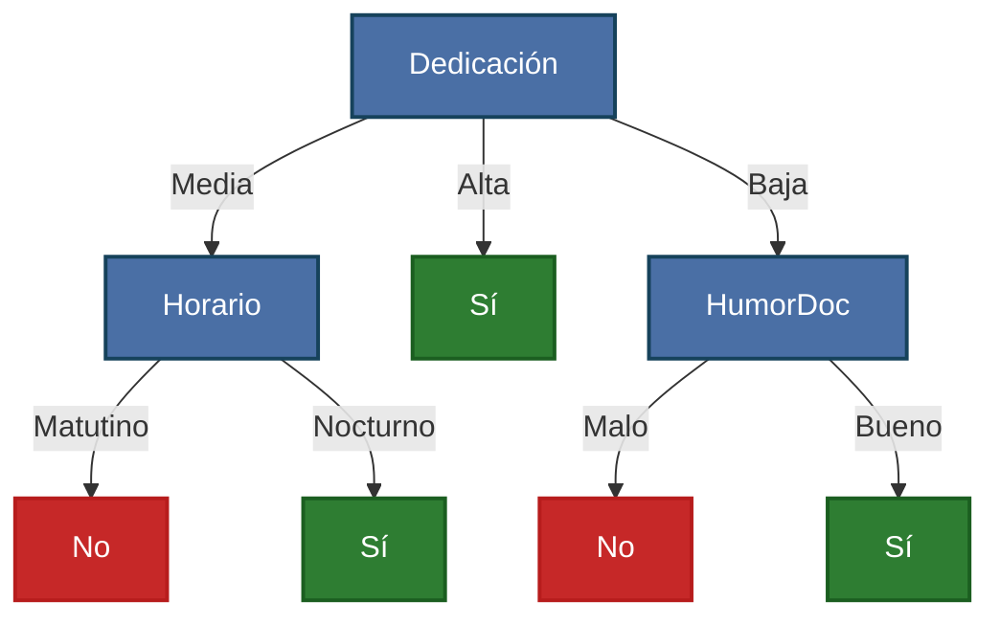
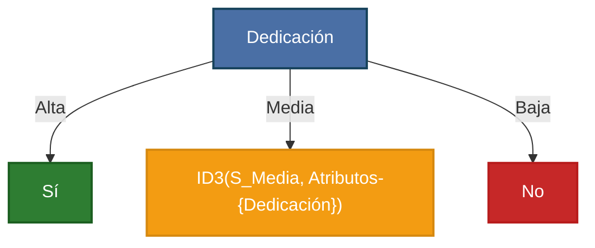
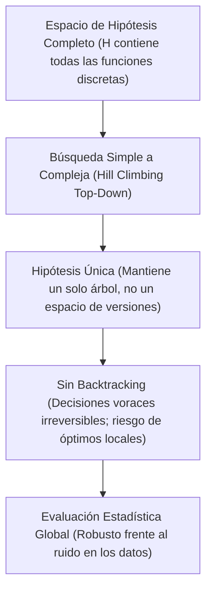
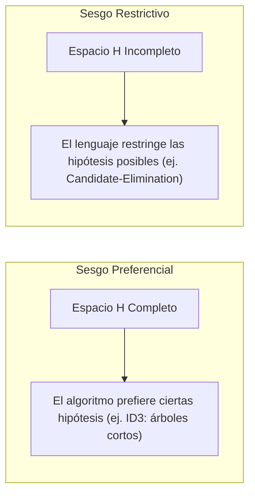

# Clase 3: Árboles de Decisión y Algoritmo ID3

---

## 1. Representación Mediante Árboles de Decisión

Un **árbol de decisión** es una estructura jerárquica de control utilizada para clasificar instancias describiendo reglas lógicas condicionales.



### Componentes del árbol:
* **Nodo raíz y nodos internos:** Cada nodo evalúa el valor de un atributo específico de la instancia.
* **Ramas:** Salen de un nodo y están etiquetadas con los posibles valores que puede tomar dicho atributo.
* **Hojas (nodos terminales):** Contienen la predicción final o etiqueta de clase asignada a la instancia.

### Proceso de Clasificación:
1. Se comienza en el **nodo raíz**.
2. Se evalúa el atributo correspondiente en la instancia a clasificar.
3. Se desciende por la **rama** que coincide con el valor del atributo en la instancia.
4. El proceso se repite sucesivamente en cada subárbol hasta alcanzar una **hoja**, donde se obtiene la clasificación final.

#### Ejemplo de clasificación de instancias con el árbol:
* **Instancia 1:** $[Ded = \text{Media}, Dif = \text{Alta}, Hor = \text{Nocturno}, Hum = \text{Alta}, HDoc = \text{Malo}]$
  * $Ded = \text{Media} \longrightarrow Horario \longrightarrow Hor = \text{Nocturno} \longrightarrow \mathbf{S\acute{\imath}}$
* **Instancia 2:** $[Ded = \text{Baja}, Dif = \text{Alta}, Hor = \text{Nocturno}, Hum = \text{Alta}, HDoc = \text{Bueno}]$
  * $Ded = \text{Baja} \longrightarrow HumorDoc \longrightarrow HDoc = \text{Bueno} \longrightarrow \mathbf{S\acute{\imath}}$

---

## 2. Expresividad Lógica y Espacio de Hipótesis ($H$)

### 2.1. Forma Normal Disyuntiva (DNF)
Los árboles de decisión representan reglas lógicas en **Forma Normal Disyuntiva (DNF)**:
* Cada camino desde la raíz hasta una hoja positiva representa una **conjunción** ($\land$) de restricciones sobre los atributos.
* El árbol completo equivale a una **disyunción** ($\lor$) de todas las ramas que concluyen en una clasificación positiva.

Para el árbol del ejemplo anterior:

$$\begin{aligned}
\text{Salva Examen} \iff & (Dedicaci\acute{o}n = \text{Media} \land Horario = \text{Nocturno}) \\
& \lor (Dedicaci\acute{o}n = \text{Alta}) \\
& \lor (Dedicaci\acute{o}n = \text{Baja} \land HumorDoc = \text{Bueno})
\end{aligned}$$

### 2.2. Tamaño del Espacio de Hipótesis ($|H|$)
Los árboles de decisión sobre atributos discretos pueden expresar **cualquier función booleana discreta**:
* Si el espacio de instancias contiene $|X|$ combinaciones posibles de atributos:
  $$|H| = 2^{|X|}$$
* Para $n$ atributos booleanos ($|X| = 2^n$ instancias):
  $$|H| = 2^{2^n}$$
* **En el caso del problema de Pedro:**
  $$|X| = 3 \times 3 \times 2 \times 3 \times 2 = 108 \text{ instancias posibles}$$
  $$|H| = 2^{108} \approx 3.24 \times 10^{32} \text{ hipótesis posibles}$$

> [!NOTE]
> Dado que $|H| = 2^{|X|}$, el espacio de hipótesis es **completo** (no restringe a priori ninguna función posible), lo que evita el problema de que el concepto objetivo $c$ sea inexpresable en el lenguaje de hipótesis.

---

## 3. Características y Aplicabilidad del Aprendizaje con Árboles

El aprendizaje mediante árboles de decisión es adecuado para problemas con las siguientes características:
* **Instancias descritas por pares atributo-valor:** Atributos discretos (o continuos mediante umbrales de partición).
* **Función objetivo discreta:** Problemas de clasificación con 2 o más clases posibles (extensible a regresión mediante árboles CART).
* **Tolerancia al ruido y errores:** Robusto frente a errores en las etiquetas o en los valores de los atributos de entrenamiento.
* **Manejo de datos incompletos:** Capacidad de clasificar instancias aun con valores de atributos faltantes.

---

## 4. Algoritmo ID3 (*Iterative Dichotomiser 3*)

El algoritmo **ID3** (Quinlan, 1986) construye un árbol de decisión de manera recursiva mediante una estrategia voraz (*greedy*) de arriba hacia abajo (*Top-Down* / *Divide and Conquer*).

### Pseudocódigo Formal:

```text
Algoritmo ID3(Ejemplos, Atributos):
    Crear un nodo raíz para el árbol
    
    1. Si todos los ejemplos en Ejemplos pertenecen a la misma clase C:
        Devolver el nodo hoja con etiqueta C
        
    2. Si Atributos == ∅:
        Devolver el nodo hoja con la clase más común en Ejemplos
        
    3. En caso contrario:
        a. Seleccionar el atributo A ∈ Atributos que mejor clasifica los Ejemplos 
           (aquel que maximiza la Ganancia de Información: Ganancia(Ejemplos, A))
        b. Asignar el atributo A como decisión en el nodo raíz actual
        c. Para cada valor posible v_i del atributo A:
            - Generar una nueva rama etiquetada con A = v_i
            - Sea Ejemplos_{v_i} el subconjunto de Ejemplos donde el atributo A toma el valor v_i:
                  Ejemplos_{v_i} = { x ∈ Ejemplos | x[A] = v_i }
            - Si Ejemplos_{v_i} está vacío (∅):
                  Agregar un nodo hoja etiquetado con la clase más común en Ejemplos (padre)
              Sino:
                  Agregar debajo de la rama el subárbol resultante de:
                  ID3(Ejemplos_{v_i}, Atributos - {A})
                  
    Devolver el nodo raíz
```

### Propiedades clave de ID3:
1. **Top-Down:** Comienza en la raíz dividiendo el conjunto completo de datos y desciende hacia las hojas.
2. **Sin Backtracking:** Una vez elegido un atributo en un nivel del árbol, la decisión es definitiva y nunca se reconsidera; busca óptimos locales en cada paso.
3. **Estadístico:** Emplea todos los ejemplos de entrenamiento disponibles en cada nodo para calcular las medidas de impureza, lo cual otorga alta tolerancia al ruido.

---

## 5. Medidas de Selección de Atributos

Para decidir qué atributo $A$ colocar en cada nodo, ID3 utiliza dos métricas de la teoría de la información: **Entropía** y **Ganancia de Información**.

### 5.1. Entropía de Shannon

La **entropía** mide el grado de impureza, incertidumbre o desorden de un conjunto de ejemplos $S$:

$$\text{Entropía}(S) = - \sum_{i=1}^{c} p_i \log_2(p_i)$$

donde:
* $c$ es la cantidad de clases objetivo.
* $p_i$ es la proporción de ejemplos en $S$ que pertenecen a la clase $i$.
* Convención matemática: Si $p_i = 0$, se define $0 \log_2(0) \equiv 0$.

#### Caso Binario (Clasificación $+/-$):
Si $p_+$ es la fracción de ejemplos positivos y $p_-$ la fracción de ejemplos negativos:

$$\text{Entropía}(S) = - p_+ \log_2(p_+) - p_- \log_2(p_-)$$

```text
Entropía(S)
  1.0 +-----------------------*(0.5, 1.0)-----------------------+
      |                     /           \                       |
  0.8 |                   /               \                     |
      |                 /                   \                   |
  0.6 |                /                     \                  |
      |               /                       \                 |
  0.4 |              /                         \                |
      |             /                           \               |
  0.2 |            /                             \              |
      |           /                               \             |
  0.0 *----------+---------------------------------+------------*
     (0.0, 0.0)                         p+        (1.0, 0.0)
     [Completamente puro]                       [Completamente puro]
```

* **Interpretación:** Cantidad mínima de bits que, en promedio, se requieren para codificar la clase de un elemento extraído al azar de $S$.
* **Ejemplos notables:**
  * Conjunto puro $[9+, 0-]$: $\text{Entropía} = -\frac{9}{9}\log_2(1) - 0 = \mathbf{0}$ *(Máxima certeza)*.
  * Conjunto balanceado $[9+, 9-]$: $\text{Entropía} = -\frac{1}{2}\log_2(\frac{1}{2}) - \frac{1}{2}\log_2(\frac{1}{2}) = \mathbf{1.0}$ *(Máxima incertidumbre)*.
  * Conjunto mixto $[9+, 5-]$ ($N=14$):
    $$\text{Entropía}([9+, 5-]) = - \frac{9}{14}\log_2\left(\frac{9}{14}\right) - \frac{5}{14}\log_2\left(\frac{5}{14}\right) \approx 0.940$$

---

### 5.2. Ganancia de Información (*Information Gain*)

La **Ganancia de Información** $\text{Ganancia}(S, A)$ mide la reducción esperada en la entropía de $S$ al particionar los datos según los valores del atributo $A$:

$$\text{Ganancia}(S, A) = \text{Entropía}(S) - \sum_{v \in Valores(A)} \frac{|S_v|}{|S|} \text{Entropía}(S_v)$$

donde:
* $Valores(A)$ es el conjunto de todos los valores posibles para el atributo $A$.
* $S_v = \{ x \in S \mid x[A] = v \}$ es el subconjunto de instancias de $S$ donde el atributo $A$ tiene el valor $v$.
* $\frac{|S_v|}{|S|}$ es el peso relativo o fracción de ejemplos que caen en la rama $v$.

> [!TIP]
> $\text{Ganancia}(S, A)$ representa la cantidad de información (en bits) que se gana sobre la clase objetivo al conocer el valor del atributo $A$. El algoritmo ID3 selecciona en cada paso el atributo que maximice esta ganancia.

---

## 6. Caso Práctico: ¿Cuándo salva Pedro un examen?

Analizamos el conjunto de entrenamiento $D$ con las 4 instancias:

| # | Dedicación | Dificultad | Horario | Humedad | HumorDoc | $c(x)$ (Salva) |
| :-: | :---: | :---: | :---: | :---: | :---: | :---: |
| **$x_1$** | Alta | Alta | Nocturno | Media | Bueno | **Sí** ($1$) |
| **$x_2$** | Baja | Media | Matutino | Alta | Malo | **No** ($0$) |
| **$x_3$** | Media | Alta | Nocturno | Media | Malo | **Sí** ($1$) |
| **$x_4$** | Media | Alta | Matutino | Alta | Bueno | **No** ($0$) |

El conjunto inicial $S$ cuenta con 4 ejemplos: 2 positivos ($x_1, x_3$) y 2 negativos ($x_2, x_4$) $\implies [2+, 2-]$.

### 6.1. Entropía del conjunto raíz:
$$\text{Entropía}(S) = - \frac{2}{4}\log_2\left(\frac{2}{4}\right) - \frac{2}{4}\log_2\left(\frac{2}{4}\right) = -\frac{1}{2}(-1) - \frac{1}{2}(-1) = \mathbf{1.0}$$

---

### 6.2. Evaluación de Atributos Candidatos para la Raíz

#### A) Atributo: `Dedicación`
Valores posibles: $\{\text{Alta}, \text{Media}, \text{Baja}\}$
* $S_{Ded=\text{Alta}} = \{x_1\} \implies [1+, 0-] \implies \text{Entropía}(S_{Ded=\text{Alta}}) = 0$
* $S_{Ded=\text{Media}} = \{x_3, x_4\} \implies [1+, 1-] \implies \text{Entropía}(S_{Ded=\text{Media}}) = 1$
* $S_{Ded=\text{Baja}} = \{x_2\} \implies [0+, 1-] \implies \text{Entropía}(S_{Ded=\text{Baja}}) = 0$

$$\begin{aligned}
\text{Ganancia}(S, Ded) &= \text{Entropía}(S) - \left[ \frac{1}{4}\text{Ent}(S_{\text{Alta}}) + \frac{2}{4}\text{Ent}(S_{\text{Media}}) + \frac{1}{4}\text{Ent}(S_{\text{Baja}}) \right] \\
&= 1.0 - \left[ \frac{1}{4}(0) + \frac{2}{4}(1) + \frac{1}{4}(0) \right] \\
&= 1.0 - 0.5 = \mathbf{0.5}
\end{aligned}$$

#### B) Atributo: `HumorDoc`
Valores posibles: $\{\text{Bueno}, \text{Malo}\}$
* $S_{HDoc=\text{Bueno}} = \{x_1, x_4\} \implies [1+, 1-] \implies \text{Entropía}(S_{HDoc=\text{Bueno}}) = 1$
* $S_{HDoc=\text{Malo}} = \{x_2, x_3\} \implies [1+, 1-] \implies \text{Entropía}(S_{HDoc=\text{Malo}}) = 1$

$$\begin{aligned}
\text{Ganancia}(S, HDoc) &= 1.0 - \left[ \frac{2}{4}\text{Ent}(S_{\text{Bueno}}) + \frac{2}{4}\text{Ent}(S_{\text{Malo}}) \right] \\
&= 1.0 - \left[ \frac{1}{2}(1) + \frac{1}{2}(1) \right] = 1.0 - 1.0 = \mathbf{0.0}
\end{aligned}$$
*(HumorDoc no aporta información para discriminar las clases).*

#### C) Atributo: `Horario`
Valores posibles: $\{\text{Matutino}, \text{Nocturno}\}$
* $S_{Hor=\text{Matutino}} = \{x_2, x_4\} \implies [0+, 2-] \implies \text{Entropía}(S_{Hor=\text{Matutino}}) = 0$
* $S_{Hor=\text{Nocturno}} = \{x_1, x_3\} \implies [2+, 0-] \implies \text{Entropía}(S_{Hor=\text{Nocturno}}) = 0$

$$\begin{aligned}
\text{Ganancia}(S, Hor) &= 1.0 - \left[ \frac{2}{4}\text{Ent}(S_{\text{Mat}}) + \frac{2}{4}\text{Ent}(S_{\text{Noc}}) \right] \\
&= 1.0 - \left[ \frac{1}{2}(0) + \frac{1}{2}(0) \right] = 1.0 - 0.0 = \mathbf{1.0}
\end{aligned}$$

> [!NOTE]
> El atributo `Horario` logra una ganancia máxima de $1.0$, separando de forma perfecta y pura las dos clases en un único nivel.

---

### 6.3. Construcción Paso a Paso si la Raíz fuese `Dedicación`

Si se decide ramificar por `Dedicación` ($\text{Ganancia} = 0.5$):



1. **Rama `Dedicación = Alta`:** Solo contiene a $x_1$ ($+$). Todos son positivos $\implies$ Se crea hoja **Sí**.
2. **Rama `Dedicación = Baja`:** Solo contiene a $x_2$ ($-$). Todos son negativos $\implies$ Se crea hoja **No**.
3. **Rama `Dedicación = Media`:** Contiene $S_{Media} = \{x_3, x_4\}$ con clases $[1+, 1-]$. Se elimina el atributo `Dedicación` y se evalúan los restantes:
   * Al evaluar `Horario` en $S_{Media}$:
     * $Horario = \text{Matutino} \implies \{x_4\}$ ($-$) $\implies$ Hoja **No**.
     * $Horario = \text{Nocturno} \implies \{x_3\}$ ($+$) $\implies$ Hoja **Sí**.

#### ¿Qué ocurre si un atributo tiene un valor sin ejemplos de entrenamiento?
Si el atributo `Horario` contase con un tercer valor (ej. `Vespertino`) para el cual no existe ningún ejemplo en $S_{Media}$, el algoritmo crea una hoja asignándole la **clase más común del conjunto en el nodo padre** ($S_{Media}$ tiene empate $\implies$ clase mayoritaria global de $S$, o asignación por convención).

---

## 7. Búsqueda en el Espacio de Hipótesis en ID3

Podemos caracterizar el proceso de aprendizaje de ID3 como una búsqueda en el espacio de hipótesis $H$:



### Comparación: ID3 vs. Candidate-Elimination

| Característica | Candidate-Elimination | ID3 (Árboles de Decisión) |
| :--- | :--- | :--- |
| **Espacio de hipótesis ($H$)** | Incompleto (solo conjunciones) | **Completo** (todas las funciones booleanas/discretas) |
| **Representación de hipótesis** | Conjunto acotado por fronteras ($S$ y $G$) | **Hipótesis única** (un solo árbol) |
| **Estrategia de búsqueda** | Exhaustiva en el espacio acotado | **Voraz / Gradiente (Hill Climbing)** |
| **Retroceso (*Backtracking*)** | No aplica (mantiene todas las consistentes) | **No realiza backtracking** (puede caer en óptimos locales) |
| **Sensibilidad al ruido** | Muy alta (un dato ruidoso vacía $VS$) | **Baja** (evaluaciones estadísticas sobre grupos) |
| **Criterio de parada** | Convergencia de fronteras ($S = G$) o fin de datos | Nodos puros, sin atributos o sin datos |

---

## 8. Sesgo Inductivo (*Inductive Bias*)

El sesgo inductivo de ID3 se fundamenta en su **estrategia de búsqueda** dentro de un espacio de hipótesis completo:

* **Características del sesgo de ID3:**
  1. Prefiere árboles **más cortos** (menor profundidad) por sobre árboles más profundos.
  2. Prefiere árboles que ubiquen los atributos con **mayor ganancia de información más cerca de la raíz**.
* **El sesgo radica en el algoritmo de búsqueda**, no en la restricción del lenguaje de hipótesis.



### 8.1. Sesgo Preferencial vs. Sesgo Restrictivo:
* **Sesgo Preferencial (*Preference / Search Bias*):** No impone límites a priori sobre qué funciones se pueden aprender ($H$ es completo), sino que define un orden de preferencia en la exploración (ej. ID3).
* **Sesgo Restrictivo (*Restriction / Language Bias*):** Limita estrictamente el conjunto de hipótesis que el modelo puede expresar ($H$ es incompleto), con el riesgo de que la verdadera función objetivo no pertenezca a $H$.

> [!NOTE]
> Es deseable contar con **sesgo preferencial** frente a restrictivo, ya que garantiza que el concepto objetivo $c$ siempre pertenece al espacio de búsqueda ($c \in H$).

---

## 9. Justificación Filosófica: La Navaja de Ockham

> **Principio de la Navaja de Ockham (William de Ockham, Siglo XIV):**
>
> *"Cuando se ofrecen dos o más explicaciones de un fenómeno, es preferible la explicación completa más simple; es decir, no deben multiplicarse las entidades sin necesidad."*
>
> **En Aprendizaje Automático:** *Prefiera la hipótesis más simple que se ajuste a los datos de entrenamiento.*

### ¿Por qué preferir hipótesis más simples?
1. **Argumento combinatorio:** Existen muchísimas menos hipótesis simples que hipótesis complejas en cualquier espacio representacional. Por ende, es mucho menos probable que una hipótesis simple se ajuste a los datos por mera coincidencia estadística ("porque sí").
2. **Prevención del sobreajuste (*Overfitting*):** Las hipótesis excesivamente complejas tienden a memorizar el ruido de la muestra en lugar de capturar la verdadera estructura subyacente.
3. **Justificación Bayesiana / MDL (*Minimum Description Length*):** Desde la teoría de la información y la inferencia bayesiana, las hipótesis con menor longitud de descripción asignan mayor probabilidad a priori $P(h)$ al modelo.

---

## 10. Referencias Bibliográficas

1. **Mitchell, Tom M. (1997).** *Machine Learning*. McGraw-Hill Science/Engineering/Math.  
   * **Capítulo 3:** *"Decision Tree Learning"* (pp. 52–78). Cubre la representación de árboles, el algoritmo ID3, entropía, ganancia de información, espacio de búsqueda, sesgo inductivo y extensiones (C4.5, poda, sobreajuste).
2. **Quinlan, J. Ross (1986).** *Induction of Decision Trees*. Machine Learning, 1(1), 81–106.  
   * Artículo original donde se introduce formalmente el algoritmo ID3 y la selección basada en teoría de la información.
3. **Shannon, Claude E. (1948).** *A Mathematical Theory of Communication*. Bell System Technical Journal, 27(3), 379–423 / 623–656.  
   * Trabajo fundacional donde se formula la definición matemática de la entropía de la información.
4. **Quinlan, J. Ross (1993).** *C4.5: Programs for Machine Learning*. Morgan Kaufmann Publishers.  
   * Extensión de ID3 que incorpora atributos continuos, manejo robusto de valores faltantes y poda de árboles (*post-pruning*).
5. **Breiman, Leo; Friedman, Jerome; Stone, Charles J.; Olshen, Richard A. (1984).** *Classification and Regression Trees (CART)*. Chapman and Hall/CRC.  
   * Texto de referencia para la construcción de árboles binarios de clasificación y regresión mediante el índice de impureza de Gini.
