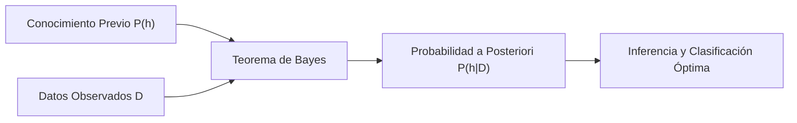
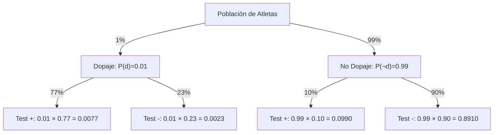
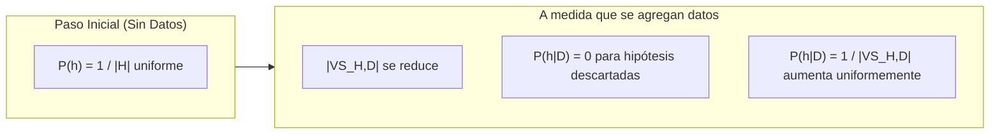
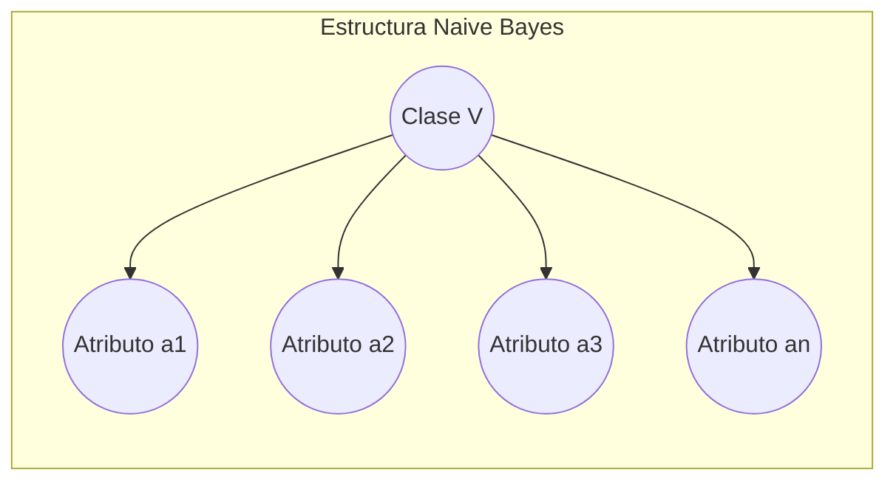
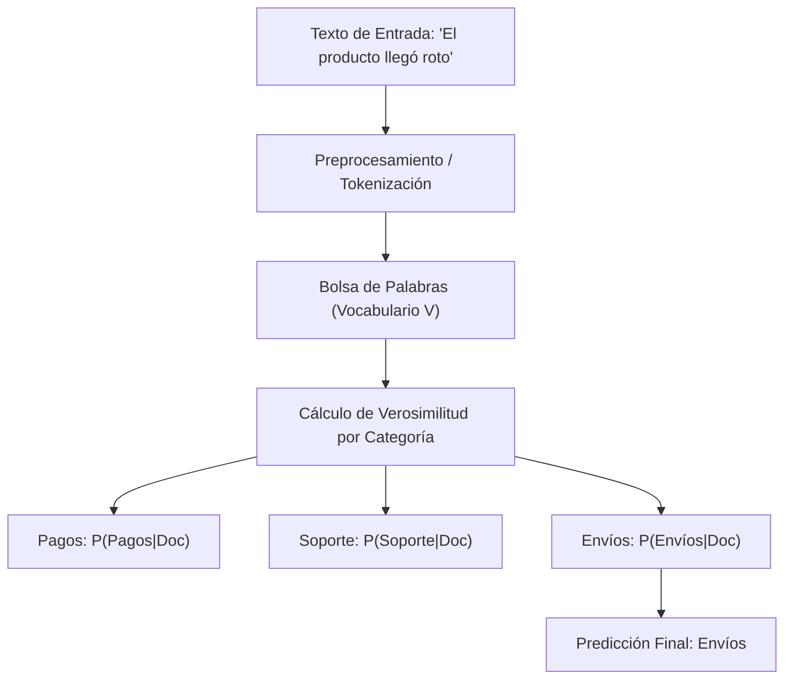
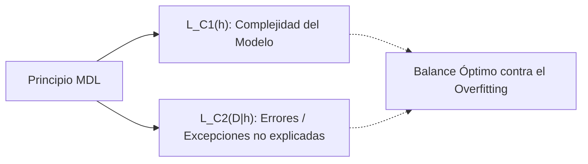

# Clase 4: Aprendizaje Bayesiano y Modelos Probabilísticos

El **Aprendizaje Bayesiano** es un paradigma fundamental del aprendizaje automático basado en la teoría de probabilidades. Proporciona tanto algoritmos prácticos de clasificación y regresión como un marco teórico riguroso (*Gold Standard*) para caracterizar, analizar y evaluar otros algoritmos de aprendizaje.

---

## 1. Introducción y Motivación

En algoritmos como los árboles de decisión o el aprendizaje conceptual, los modelos asumen que existe una única respuesta determinista para cada instancia y buscan una hipótesis discreta dentro del espacio $H$. Sin embargo, en muchos escenarios reales:
* Los datos contienen **ruido e incertidumbre**.
* Es deseable obtener **predicciones probabilísticas** (decisiones difusas) que cuantifiquen la certeza del modelo en lugar de una etiqueta rígida.
* Se dispone de **conocimiento previo** sobre el dominio que puede ser formalmente integrado al proceso de inferencia.

### Propiedades Clave del Aprendizaje Bayesiano:
1. **Actualización Incremental:** Cada ejemplo de entrenamiento incrementa o decrementa la probabilidad estimada de que una hipótesis sea correcta.
2. **Robustez ante el Ruido:** Tolera ejemplos mal etiquetados o atributos con valores corruptos gracias a la agregación probabilística.
3. **Ponderación de Hipótesis:** Permite clasificar nuevas instancias combinando las predicciones de múltiples hipótesis ponderadas por sus respectivas probabilidades.
4. **Marco de Referencia Teórico:** Permite caracterizar y justificar algoritmos no probabilísticos (como Find-S o Candidate-Elimination), revelando los supuestos implícitos bajo los cuales resultan óptimos.

---

## 2. Fundamentos del Teorema de Bayes

### 2.1. Regla del Producto y Formulación General
A partir de la definición de probabilidad condicional:

$$P(A \cap B) = P(A|B) \cdot P(B) = P(B|A) \cdot P(A)$$

Despejando, se obtiene el **Teorema de Bayes**:

$$P(h|D) = \frac{P(D|h) \cdot P(h)}{P(D)}$$

Donde:
* **$P(h)$ (Probabilidad *a priori* o *Prior*):** Refleja el conocimiento o creencia inicial sobre la veracidad de la hipótesis $h$, antes de haber observado los datos de entrenamiento $D$.
* **$P(D)$ (Probabilidad marginal de la evidencia):** Probabilidad de observar el conjunto de datos $D$ bajo cualquier hipótesis. Se calcula mediante la ley de probabilidad total:
  $$P(D) = \sum_{h' \in H} P(D|h') \cdot P(h')$$
* **$P(D|h)$ (Verosimilitud o *Likelihood*):** Probabilidad de que se observen los datos $D$ dado que la hipótesis $h$ es verdadera.
* **$P(h|D)$ (Probabilidad *a posteriori* o *Posterior*):** Probabilidad de que la hipótesis $h$ sea verdadera luego de haber observado la evidencia $D$.

---

### 2.2. Hipótesis MAP (*Maximum A Posteriori*)
En aprendizaje automático, el objetivo típico es encontrar la hipótesis $h \in H$ más probable dado el conjunto de entrenamiento $D$:

$$h_{MAP} = \arg\max_{h \in H} P(h|D) = \arg\max_{h \in H} \frac{P(D|h) \cdot P(h)}{P(D)}$$

Dado que $P(D)$ es una constante independiente de $h$, no afecta la ubicación del máximo:

$$h_{MAP} = \arg\max_{h \in H} P(D|h) \cdot P(h)$$

---

### 2.3. Hipótesis ML (*Maximum Likelihood* / Máxima Verosimilitud)
Si no disponemos de conocimiento previo sobre las hipótesis y asumimos que todas son **equiprobables *a priori*** ($P(h_i) = P(h_j), \forall h_i, h_j \in H$), el término $P(h)$ es constante:

$$h_{ML} = \arg\max_{h \in H} P(D|h)$$

---

## 3. Ejemplo Numérico: Diagnóstico Médico / Test de Dopaje

Consideremos un problema clásico de razonamiento bayesiano:
* Un test antidopaje arroja resultado **positivo en el $77\%$ de los casos** cuando el deportista consumió drogas ($P(\text{test}+ | \text{dopaje}) = 0.77$).
* El test arroja un **falso positivo en el $10\%$ de los casos** cuando el deportista no consumió drogas ($P(\text{test}+ | \neg\text{dopaje}) = 0.10$).
* En la población general de atletas, **1 de cada 100** recurre a sustancias prohibidas ($P(\text{dopaje}) = 0.01$).

### Cálculo de Probabilidades:
Si un deportista da **positivo** ($\text{test}+$): ¿cuál es la probabilidad real de que esté dopado?

1. **Numeradores de Bayes:**
   $$P(\text{test}+ | \text{dopaje}) \cdot P(\text{dopaje}) = 0.77 \times 0.01 = 0.0077$$
   $$P(\text{test}+ | \neg\text{dopaje}) \cdot P(\neg\text{dopaje}) = 0.10 \times 0.99 = 0.0990$$

2. **Probabilidad Total de Test Positivo $P(\text{test}+)$:**
   $$P(\text{test}+) = 0.0077 + 0.0990 = 0.1067$$

3. **Probabilidad a Posteriori:**
   $$P(\text{dopaje} | \text{test}+) = \frac{0.0077}{0.1067} \approx 0.0721 \quad (7.2\%)$$
   $$P(\neg\text{dopaje} | \text{test}+) = \frac{0.0990}{0.1067} \approx 0.9279 \quad (92.8\% \approx 93\%)$$

> [!IMPORTANT]
> **Paradoja de la Tasa Base (*Base Rate Fallacy*):** A pesar de que el test parece muy sensible ($77\%$), un resultado positivo indica que el atleta tiene un **$93\%$ de probabilidad de NO estar dopado**. Esto ocurre porque la probabilidad a priori de dopaje es extremadamente baja ($1\%$) frente a la tasa de falsos positivos ($10\%$).

---

## 4. Algoritmos MAP y Aprendizaje Conceptual

El marco bayesiano permite analizar teóricamente algoritmos deterministas como **Find-S** y **Candidate-Elimination** (*Version Spaces*).

### 4.1. Algoritmo *List-Then-Eliminate* en Versión Bayesiana
Consideremos los siguientes supuestos:
1. El concepto objetivo pertenece al espacio de hipótesis ($c \in H$).
2. Las hipótesis son **equiprobables *a priori***:
   $$P(h) = \frac{1}{|H|}, \quad \forall h \in H$$
3. El conjunto de entrenamiento $D = \{\langle x_1, d_1 \rangle, \dots, \langle x_m, d_m \rangle\}$ **no contiene ruido**:
   $$P(D|h) = \begin{cases} 1 & \text{si } d_i = h(x_i), \forall d_i \in D \quad (h \text{ es consistente con } D) \\ 0 & \text{en caso contrario} \end{cases}$$

---

### 4.2. Estimación de $P(D)$ y Probabilidades a Posteriori
Bajo estos supuestos, la probabilidad de observar $D$ es:

$$P(D) = \sum_{h \in H} P(D|h) \cdot P(h) = \sum_{h \in VS_{H,D}} 1 \cdot \frac{1}{|H|} + \sum_{h \notin VS_{H,D}} 0 \cdot \frac{1}{|H|} = \frac{|VS_{H,D}|}{|H|}$$

Calculando la probabilidad a posteriori para cualquier hipótesis $h$:
* **Si $h$ es inconsistente ($h \notin VS_{H,D}$):**
  $$P(h|D) = \frac{0 \cdot P(h)}{P(D)} = 0$$
* **Si $h$ es consistente ($h \in VS_{H,D}$):**
  $$P(h|D) = \frac{1 \cdot |H|^{-1}}{\frac{|VS_{H,D}|}{|H|}} = \frac{1}{|VS_{H,D}|}$$

### 4.3. Teorema de Equivalencia MAP
> [!NOTE]
> **Conclusión Teórica:** Todo algoritmo consistente (incluyendo *Find-S* y *Candidate-Elimination*) produce una **hipótesis MAP** siempre que se asuma una distribución a priori uniforme sobre $H$ y ausencia de ruido.
> 
> Si la distribución a priori asigna mayor probabilidad a las hipótesis más específicas, *Find-S* continúa siendo un algoritmo MAP.

---

## 5. Clasificador Bayesiano Óptimo (CBO)

Una pregunta central en el aprendizaje bayesiano es:
> *¿Es la hipótesis más probable ($h_{MAP}$) la que siempre produce la clasificación más probable para una nueva instancia $x$?*

**La respuesta es NO.**

### 5.1. Contraejemplo Ilustrativo
Supongamos un espacio con tres hipótesis $H = \{h_1, h_2, h_3\}$ con las siguientes probabilidades a posteriori tras observar $D$, y sus clasificaciones para una nueva instancia $x$:

| Hipótesis | $P(h_i|D)$ | Clasificación $h_i(x)$ |
| :--- | :---: | :---: |
| $h_1$ | **$0.4$** | $\oplus$ (Positivo) |
| $h_2$ | $0.3$ | $\ominus$ (Negativo) |
| $h_3$ | $0.3$ | $\ominus$ (Negativo) |

1. **Predicción con la hipótesis MAP:**
   $$h_{MAP} = \arg\max_{h} P(h|D) = h_1 \implies h_{MAP}(x) = \oplus$$
2. **Probabilidad total de cada clase combinando todas las hipótesis:**
   $$P(\oplus | D) = P(\oplus|h_1)P(h_1|D) + P(\oplus|h_2)P(h_2|D) + P(\oplus|h_3)P(h_3|D) = 1 \cdot 0.4 + 0 \cdot 0.3 + 0 \cdot 0.3 = \mathbf{0.4}$$
   $$P(\ominus | D) = P(\ominus|h_1)P(h_1|D) + P(\ominus|h_2)P(h_2|D) + P(\ominus|h_3)P(h_3|D) = 0 \cdot 0.4 + 1 \cdot 0.3 + 1 \cdot 0.3 = \mathbf{0.6}$$

$$\arg\max_{v \in \{\oplus, \ominus\}} P(v|D) = \mathbf{\ominus}$$

La predicción más probable es $\ominus$ ($60\%$), contradiciendo la predicción de la hipótesis MAP ($\oplus$, $40\%$).

---

### 5.2. Definición Formal del Clasificador Bayesiano Óptimo
El **Clasificador Bayesiano Óptimo (CBO)** clasifica combinando las predicciones de todas las hipótesis ponderadas por su probabilidad posterior:

$$v_{CBO} = \arg\max_{v_j \in V} \sum_{h_i \in H} P(v_j | h_i) \cdot P(h_i | D)$$

### Propiedades del CBO:
* **Optimalidad Demostrada:** Ningún otro clasificador que utilice el mismo espacio de hipótesis $H$ y el mismo conocimiento previo puede superar el rendimiento esperado del CBO.
* **Expansión del Espacio de Hipótesis:** La función de clasificación resultante puede no pertenecer al espacio $H$ original (se comporta como un ensamble probabilístico).
* **Limitación Computacional:** Calcular $P(h_i|D)$ para cada $h_i \in H$ es prohibitivamente costoso cuando $|H|$ es grande o infinito.

---

### 5.3. Clasificador de Gibbs
Para evitar la suma sobre todo $H$, el clasificador de Gibbs ofrece una aproximación estocástica:
1. Muestrea una hipótesis $h \in H$ aleatoriamente según la distribución posterior $P(h|D)$.
2. Utiliza la hipótesis seleccionada para clasificar la nueva instancia $x$.
* **Propiedad teórica:** Si el concepto objetivo se extrae según $P(h)$, el error esperado del clasificador de Gibbs es a lo sumo el **doble del error del CBO**:
  $$E[\text{error}_{Gibbs}] \le 2 \cdot E[\text{error}_{CBO}]$$

---

## 6. Clasificador Naive Bayes (Bayes Ingenuo)

Para instancias descritas por una tupla de atributos $x = \langle a_1, a_2, \dots, a_n \rangle$, la predicción MAP busca:

$$v_{MAP} = \arg\max_{v_j \in V} P(v_j | a_1, a_2, \dots, a_n) = \arg\max_{v_j \in V} P(a_1, a_2, \dots, a_n | v_j) \cdot P(v_j)$$

Estimar la distribución conjunta $P(a_1, \dots, a_n | v_j)$ requeriría una cantidad exponencial de datos de entrenamiento.

### 6.1. El Supuesto de Independencia Condicional
**Naive Bayes** introduce la hipótesis simplificadora de que los atributos son **condicionalmente independientes** dada la clase objetivo $v_j$:

$$P(a_1, a_2, \dots, a_n | v_j) = \prod_{i=1}^n P(a_i | v_j)$$

Sustituyendo en la ecuación MAP:

$$v_{NB} = \arg\max_{v_j \in V} P(v_j) \prod_{i=1}^n P(a_i | v_j)$$

---

## 7. Traza de Cálculo Paso a Paso: Dataset *PlayTennis*

A continuación se desarrolla el ejemplo completo presentado en clase sobre el dataset de decisión de 14 días:

### Conjunto de Entrenamiento:
| # | Tiempo | Temperatura | Humedad | Viento | Juega |
| :-: | :--- | :--- | :--- | :--- | :---: |
| 1 | Soleado | Caluroso | Alta | Suave | **No** |
| 2 | Soleado | Caluroso | Alta | Fuerte | **No** |
| 3 | Nuboso | Caluroso | Alta | Suave | **Sí** |
| 4 | Lluvioso | Templado | Alta | Suave | **Sí** |
| 5 | Lluvioso | Frío | Normal | Suave | **Sí** |
| 6 | Lluvioso | Frío | Normal | Fuerte | **No** |
| 7 | Nuboso | Frío | Normal | Fuerte | **Sí** |
| 8 | Soleado | Templado | Alta | Suave | **No** |
| 9 | Soleado | Frío | Normal | Suave | **Sí** |
| 10 | Lluvioso | Templado | Normal | Suave | **Sí** |
| 11 | Soleado | Templado | Normal | Fuerte | **Sí** |
| 12 | Nuboso | Templado | Alta | Fuerte | **Sí** |
| 13 | Nuboso | Caluroso | Normal | Suave | **Sí** |
| 14 | Lluvioso | Templado | Alta | Fuerte | **No** |

**Totales por Clase:**
* $P(\text{Juega} = \text{Sí}) = \frac{9}{14}$
* $P(\text{Juega} = \text{No}) = \frac{5}{14}$

---

### Nueva Instancia a Clasificar:
$$x = \langle \text{Tiempo}=\text{Soleado}, \text{Temp}=\text{Frío}, \text{Humedad}=\text{Alta}, \text{Viento}=\text{Fuerte} \rangle$$

#### 1. Cálculo de Probabilidades Condicionales para $\text{Juega} = \text{Sí}$ ($n = 9$):
* $P(\text{Soleado} | \text{Sí}) = \frac{2}{9}$
* $P(\text{Frío} | \text{Sí}) = \frac{3}{9}$
* $P(\text{Alta} | \text{Sí}) = \frac{3}{9}$
* $P(\text{Fuerte} | \text{Sí}) = \frac{3}{9}$

$$P(\text{Sí}) \prod_{i} P(a_i | \text{Sí}) = \frac{9}{14} \times \frac{2}{9} \times \frac{3}{9} \times \frac{3}{9} \times \frac{3}{9} = \frac{9}{14} \times \frac{54}{6561} \approx \mathbf{0.005291}$$

#### 2. Cálculo de Probabilidades Condicionales para $\text{Juega} = \text{No}$ ($n = 5$):
* $P(\text{Soleado} | \text{No}) = \frac{3}{5}$
* $P(\text{Frío} | \text{No}) = \frac{1}{5}$
* $P(\text{Alta} | \text{No}) = \frac{4}{5}$
* $P(\text{Fuerte} | \text{No}) = \frac{3}{5}$

$$P(\text{No}) \prod_{i} P(a_i | \text{No}) = \frac{5}{14} \times \frac{3}{5} \times \frac{1}{5} \times \frac{4}{5} \times \frac{3}{5} = \frac{5}{14} \times \frac{36}{625} \approx \mathbf{0.020571}$$

#### 3. Normalización y Decisión Final:
$$P(\text{Sí} | x) = \frac{0.005291}{0.005291 + 0.020571} \approx 0.2046 \quad (20.5\%)$$
$$P(\text{No} | x) = \frac{0.020571}{0.005291 + 0.020571} \approx 0.7954 \quad (79.5\%)$$

$$\mathbf{v_{NB} = \text{No Juega}} \quad (\text{con un } 79.5\% \text{ de certeza})$$

---

## 8. El Problema de Frecuencia Cero y el $m$-estimador

### 8.1. El Problema de la Probabilidad Cero
Si deseamos clasificar una instancia con $\text{Tiempo} = \text{Nuboso}$ y calculamos:
$$P(\text{Tiempo} = \text{Nuboso} | \text{Juega} = \text{No}) = \frac{0}{5} = 0$$

Dado que Naive Bayes multiplica las probabilidades, este único término **anula toda la productoria**, haciendo imposible que el modelo prediga dicha clase, sin importar la evidencia de los demás atributos.

---

### 8.2. Formulación del $m$-estimador
Para suavizar las estimaciones y evitar probabilidades cero, se utiliza el **$m$-estimador**:

$$P(a_i | v_j) = \frac{n_c + m \cdot p}{n + m}$$

Donde:
* $n$: Cantidad total de ejemplos de entrenamiento con clase $v_j$.
* $n_c$: Cantidad de ejemplos de la clase $v_j$ que poseen el valor de atributo $a_i$.
* $p$: Estimación *a priori* de la probabilidad (en ausencia de conocimiento previo, distribución uniforme $p = \frac{1}{k}$, siendo $k$ la cantidad de valores posibles del atributo).
* $m$: **Tamaño de muestra equivalente** (hiperparámetro que regula el peso del prior frente a los datos observados).

> [!TIP]
> Si $p = \frac{1}{k}$ y $m = k$, la fórmula se convierte en el clásico **Suavizado de Laplace** (*Laplace Smoothing*):
> $$P(a_i | v_j) = \frac{n_c + 1}{n + k}$$

---

### 8.3. Ejemplo del $m$-estimador sobre *Tiempo* dado $\text{Juega} = \text{No}$
Para el atributo $\text{Tiempo}$ (3 valores posibles: Soleado, Nuboso, Lluvioso $\implies p = \frac{1}{3}$) y $n = 5$:

$$P(\text{Nuboso} | \text{No}) = \frac{0 + m \cdot \frac{1}{3}}{5 + m}$$

| Valor | $n_c$ | Estimador Directo ($e$) | $m = 1$ | $m = 2$ | $m = 3$ |
| :--- | :---: | :---: | :---: | :---: | :---: |
| **Soleado** | 3 | $3/5 = 0.600$ | $\frac{3 + 1/3}{6} \approx 0.556$ | $\frac{3 + 2/3}{7} \approx 0.524$ | $\frac{3 + 1}{8} = 0.467$ |
| **Nuboso** | 0 | $0/5 = 0.000$ | $\frac{0 + 1/3}{6} \approx 0.056$ | $\frac{0 + 2/3}{7} \approx 0.095$ | $\frac{0 + 1}{8} = 0.167$ |
| **Lluvioso** | 2 | $2/5 = 0.400$ | $\frac{2 + 1/3}{6} \approx 0.389$ | $\frac{2 + 2/3}{7} \approx 0.381$ | $\frac{2 + 1}{8} = 0.367$ |

---

## 9. Extensiones y Aspectos Prácticos de Naive Bayes

### 9.1. Atributos Continuos (Gaussian Naive Bayes)
Cuando los atributos son continuos, existen dos enfoques:
1. **Discretización:** Crear intervalos (*bins*) continuos y tratarlos como categorías discretas.
2. **Densidad de Probabilidad Gaussiana:** Asumir que los valores siguen una distribución normal para cada clase $v_j$:

$$P(x_i | v_j) = \frac{1}{\sqrt{2\pi\sigma_{i, j}^2}} \exp\left( -\frac{(x_i - \mu_{i, j})^2}{2\sigma_{i, j}^2} \right)$$

Donde $\mu_{i, j}$ y $\sigma_{i, j}^2$ son la media y varianza muestrales del atributo $i$ calculadas sobre los ejemplos de clase $v_j$.

---

### 9.2. Estabilidad Numérica: Espacio Logarítmico
La multiplicación de muchas probabilidades pequeñas genera problemas de **subdesbordamiento numérico (*underflow*)**. Para evitarlo, se aplica la función logaritmo natural:

$$\ln\left( P(v_j) \prod_{i=1}^n P(a_i | v_j) \right) = \ln P(v_j) + \sum_{i=1}^n \ln P(a_i | v_j)$$

Dado que la función logaritmo es estrictamente creciente, preserva el orden de las probabilidades:

$$v_{NB} = \arg\max_{v_j \in V} \left[ \ln P(v_j) + \sum_{i=1}^n \ln P(a_i | v_j) \right]$$

---

## 10. Clasificador Bayesiano de Texto (Multinomial Naive Bayes)

La clasificación de documentos de texto (detección de spam, categorización de soporte técnico, análisis de sentimientos) es una de las aplicaciones más exitosas de Naive Bayes.

### 10.1. Suposición de Independencia de Posición (*Bag of Words*)
Para un texto compuesto por una secuencia de palabras $t_1, t_2, \dots, t_L$:
* Si cada posición dependiera de su posición en la frase, con un vocabulario de $|V| = 50\,000$ palabras, textos de hasta $L = 40$ palabras y $3$ categorías, se requerirían:
  $$3 \times 40 \times 50\,000 = 6\,000\,000 \text{ parámetros}$$
* **Suposición Bag of Words:** La probabilidad de aparición de una palabra $w_k$ es independiente de la posición que ocupa en el mensaje:
  $$P(t_j = w_k | c_i) = P(w_k | c_i), \quad \forall j$$
* La cantidad de parámetros se reduce drásticamente a:
  $$|V| \times |C| = 50\,000 \times 3 = 150\,000 \text{ parámetros}$$

---

### 10.2. Estimación de Parámetros con Suavizado de Laplace:
* **Probabilidad a priori de la categoría $c_j$:**
  $$P(c_j) = \frac{|\text{Documentos}_{c_j}|}{|\text{Documentos Total}|}$$
* **Probabilidad de la palabra $w_k$ dada la categoría $c_j$:**
  $$P(w_k | c_j) = \frac{n_{w_k, c_j} + 1}{n_{c_j} + |\text{Vocabulario}|}$$
  * $n_{c_j}$: Total de palabras en todos los textos de la categoría $c_j$.
  * $n_{w_k, c_j}$: Cantidad de ocurrencias de la palabra $w_k$ en la categoría $c_j$.
  * $|\text{Vocabulario}|$: Cantidad total de palabras únicas conocidas en el vocabulario.

### 10.3. Regla de Clasificación de un Nuevo Documento:
$$v_{NB} = \arg\max_{c_j \in C} \left[ P(c_j) \prod_{w \in (\text{Entrada} \cap \text{Vocabulario})} P(w | c_j) \right]$$

---

## 11. Principio de Longitud Mínima de Descripción (MDL)

El **Principio MDL (*Minimum Description Length*)** conecta formalmente la inferencia bayesiana con la **Teoría de la Información de Shannon** y proporciona una justificación matemática para la **Navaja de Ockham**.

### 11.1. Derivación a partir de la Hipótesis MAP
Partiendo de la definición de $h_{MAP}$:

$$h_{MAP} = \arg\max_{h \in H} P(D|h) \cdot P(h)$$

Aplicando $-\log_2$ (que invierte la maximización a minimización):

$$h_{MAP} = \arg\min_{h \in H} \left[ -\log_2 P(h) - \log_2 P(D|h) \right]$$

Según la teoría de codificación óptima de Shannon:
* $-\log_2 P(h)$ representa la **longitud en bits del código óptimo** para transmitir la hipótesis $h$ bajo la codificación $C_1$: $L_{C_1}(h)$.
* $-\log_2 P(D|h)$ representa la **longitud en bits del código óptimo** para transmitir los datos $D$ dado que se conoce la hipótesis $h$ bajo la codificación $C_2$: $L_{C_2}(D|h)$.

---

### 11.2. Formulación General de MDL
$$h_{MDL} = \arg\min_{h \in H} \left[ L_{C_1}(h) + L_{C_2}(D|h) \right]$$

---

### 11.3. Aplicación de MDL en Árboles de Decisión
* **$L_{C_1}(h)$ (Costo del árbol):** Longitud en bits para codificar la estructura del árbol (cantidad de nodos, condiciones de división y hojas).
* **$L_{C_2}(D|h)$ (Costo de las excepciones):** Si emisor y receptor conocen los atributos $x_1, \dots, x_n$ y el árbol $h$, solo es necesario transmitir los errores de clasificación:
  * Si el árbol clasifica perfectamente el conjunto de entrenamiento, $L_{C_2}(D|h) = 0$, pero el árbol será muy grande y complejo ($L_{C_1}(h)$ alto).
  * Si el árbol es pequeño ($L_{C_1}(h)$ bajo), cometerá algunos errores y habrá que transmitir explícitamente cuáles ejemplos fallaron y sus etiquetas reales ($L_{C_2}(D|h) > 0$).

> [!NOTE]
> **¿Demuestra MDL que la Navaja de Ockham es una ley absoluta?**
> **No.** La equivalencia matemática entre MDL y MAP es válida únicamente si las codificaciones utilizadas son las **óptimas**, lo que requiere conocer de antemano las verdaderas distribuciones $P(h)$ y $P(D|h)$. En la práctica, las codificaciones son elecciones subjetivas de diseño.

---

## 12. Cuadro Comparativo de Modelos Bayesianos

| Método | Principio de Decisión | Complejidad Computacional | Supuestos Principales | Comportamiento frente a Ruido |
| :--- | :--- | :--- | :--- | :--- |
| **Hipótesis MAP** | $\arg\max_h P(D\|h)P(h)$ | Moderada a Alta (según $\|H\|$) | Requiere conocer o estimar el prior $P(h)$ | Robusto |
| **Máxima Verosimilitud (ML)** | $\arg\max_h P(D\|h)$ | Moderada | Priors equiprobables ($P(h)$ constante) | Sensible si la muestra es chica |
| **Clasificador Bayesiano Óptimo (CBO)** | $\arg\max_v \sum_h P(v\|h)P(h\|D)$ | Muy Alta / Intratable | Acceso a todo el espacio $H$ y sus posteriors | Teóricamente óptimo (error mínimo) |
| **Clasificador de Gibbs** | Muestreo $h \sim P(h\|D)$ | Moderada | Hipótesis muestreada según posterior | Error esperado $\le 2 \times \text{Error}_{CBO}$ |
| **Naive Bayes (NB)** | $\arg\max_v P(v) \prod_i P(a_i\|v)$ | Muy Baja (Lineal en atributos) | Independencia condicional de atributos dada la clase | Muy robusto en la práctica |
| **Principio MDL** | $\arg\min_h [L(h) + L(D\|h)]$ | Depende de la codificación | Codificaciones aproximan distribuciones óptimas | Previene naturalmente el sobreajuste |
