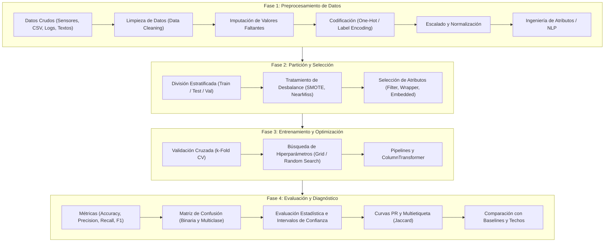
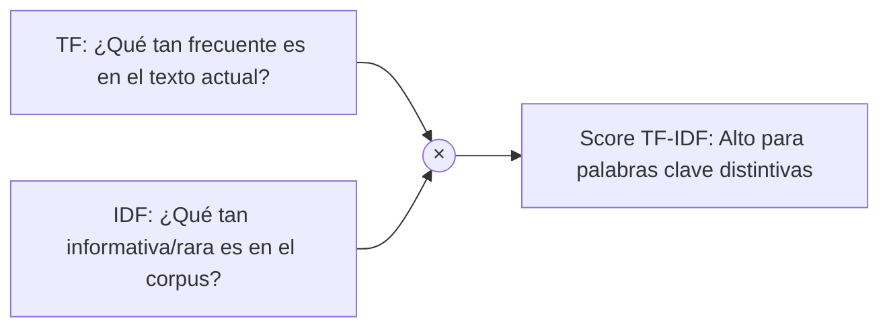
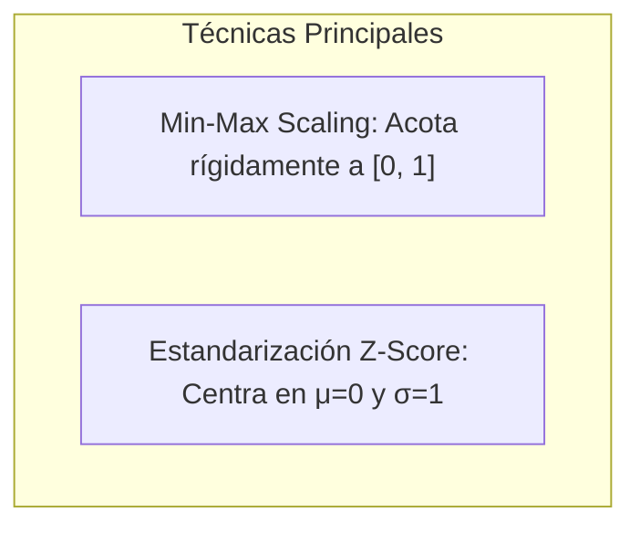
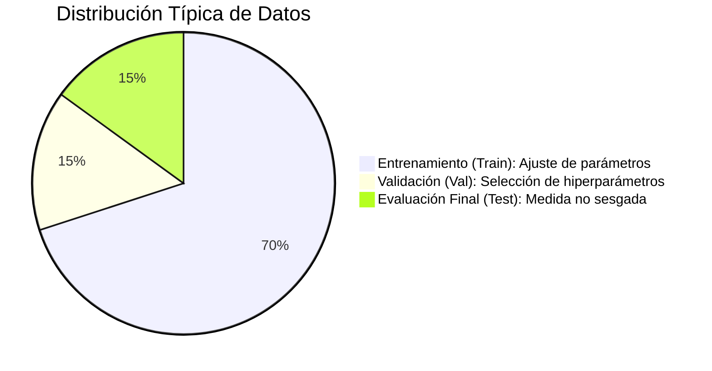
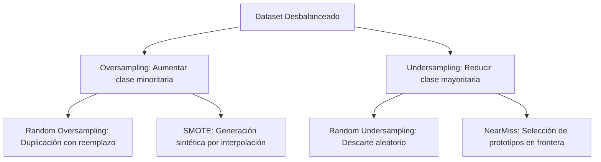
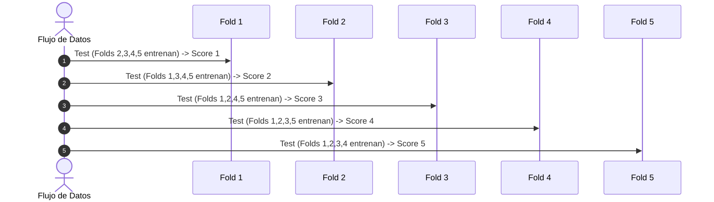
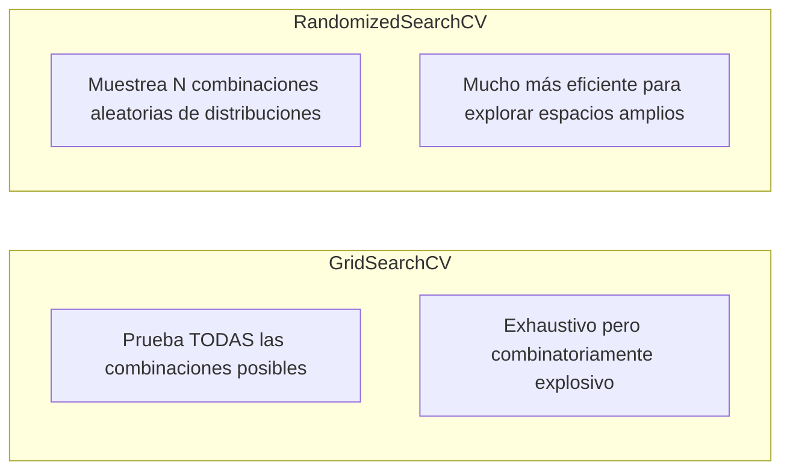
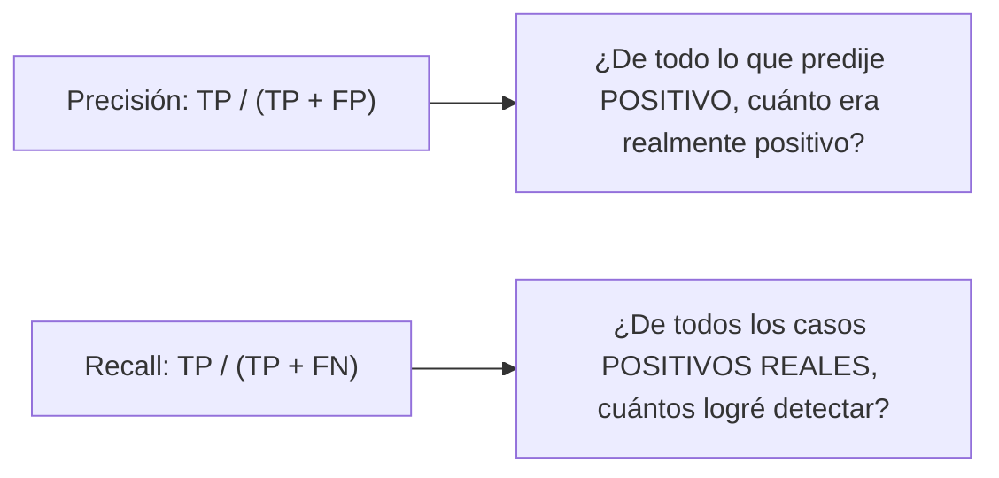
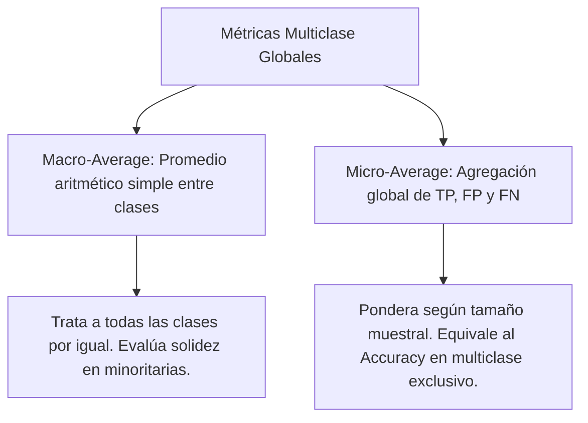

# Clase 5: Metodología para Clasificación y Evaluación de Modelos

Independientemente del algoritmo de aprendizaje utilizado (árboles de decisión, clasificadores bayesianos, redes neuronales, etc.), existen etapas comunes y un estándar metodológico riguroso para abordar problemas de **aprendizaje supervisado**, en particular tareas de **clasificación**.

> **Definición de la Tarea:**  
> Dado un conjunto $D$ de instancias independientes e idénticamente distribuidas (i.i.d.) según una distribución de probabilidad desconocida $\mathcal{D}$, donde cada instancia posee un vector de atributos $x$ y una clase asociada $y$, el objetivo consiste en inducir una función de clasificación (hipótesis) $h: X \to Y$ tal que, ante una nueva instancia no observada $x \sim \mathcal{D}$, prediga con la mayor certeza y menor error posible su clase verdadera $y$.

---

## Ciclo Metodológico del Aprendizaje Automático

El proceso de desarrollo, entrenamiento y validación de un clasificador se estructura en cuatro fases principales interconectadas:



---

## 1. Fase 1: Preprocesamiento de Datos (*Data Preprocessing*)

En aplicaciones del mundo real, los datos rara vez se encuentran en un formato tabular limpio y listo para el entrenamiento. Los datos pueden provenir de múltiples fuentes heterogéneas, contener errores de medición, registrar campos ausentes o consistir en texto libre.

Las cuatro operaciones cardinales del preprocesamiento son:
1. **Limpieza de Datos (*Data Cleaning*):** Corrección o eliminación de registros corruptos, ruidosos o anómalos.
2. **Transformación de Datos (*Data Transformation*):** Conversión de variables categóricas, fechas y texto a representaciones numéricas matriciales compatibles con los estimadores.
3. **Integración de Datos (*Data Integration*):** Fusión y alineación de conjuntos de datos provenientes de diversas tablas, sensores o servicios.
4. **Reducción de Datos (*Data Reduction*):** Agrupamiento o eliminación de instancias o atributos irrelevantes buscando maximizar la eficiencia computacional sin perder información esencial.

---

### 1.1. Caso de Estudio Práctico: El Dataset del Titanic
A lo largo de la metodología se utiliza de forma didáctica el conjunto de datos de pasajeros del **Titanic**, cuyo objetivo es predecir la supervivencia binaria:
* **Target ($y$):** `survived` ($1 = \text{Sobrevivió}$, $0 = \text{Falleció}$).
* **Atributos ($X$):** Clase del billete (`pclass`), género (`sex`), edad (`age`), familiares a bordo, tarifa (`fare`), puerto de embarque (`embarked`), camarote (`room`), bote de rescate (`boat`), etc.

```python
import pandas as pd
import numpy as np

# Carga de datos
titanic = pd.read_csv('https://raw.githubusercontent.com/pln-fing-udelar/curso_aa/master/data/titanic.csv')

# Separación de características predictoras (X) y variable objetivo (y)
titanic_X = titanic.drop(['survived'], axis=1)
titanic_y = titanic[['survived']]
```

---

### 1.2. Tratamiento de Valores Faltantes (*Missing Values*)

Si en alguna instancia un atributo carece de valor registrado (registrado como `NaN` o `null`), se presentan las siguientes alternativas metodológicas:

1. **Eliminar instancias completas:** Descartar las filas que posean valores nulos.
   * *Desventaja:* Puede reducir drásticamente el tamaño del dataset de entrenamiento y sesgar la muestra si los datos no faltan de manera completamente aleatoria (*MCAR*).
2. **Asignar un valor especial distintivo:** Utilizar un identificador centinela (ej. `UNK`, `-1`, `"Desconocido"`).
   * *Ventaja:* Permite que el modelo aprenda que el hecho de que el dato falte posee un significado predictivo propio.
3. **Imputación estadística (Media, Mediana, Moda):** Reemplazar los valores ausentes por la media o mediana (para atributos continuos) o la moda/valor más frecuente (para atributos categóricos).
4. **Imputación basada en el modelo:** Métodos algorítmicos (como k-NN imputation, árboles de decisión o asignaciones probabilísticas vistas en ID3).

> [!IMPORTANT]
> **Regla de Oro contra la Fuga de Información (*Data Leakage*):**  
> Cualquier estadístico utilizado para transformar o imputar datos (media, mediana, desvío, categorías más frecuentes) **debe calcularse estrictamente sobre el conjunto de entrenamiento**. Dicho valor se propaga posteriormente a los conjuntos de validación y testeo. Si se calcula la media global sobre todo el dataset, la evaluación de generalización quedará irremediablemente viciada.

```python
from sklearn.model_selection import train_test_split

# Partición inicial
X_train, X_test, y_train, y_test = train_test_split(
    titanic_X, titanic_y, test_size=0.25, random_state=33
)

# Imputación de edad calculada ÚNICAMENTE sobre entrenamiento
mean_age = X_train['age'].mean()

X_train.loc[X_train['age'].isna(), 'age'] = mean_age
X_test.loc[X_test['age'].isna(), 'age'] = mean_age
```

---

### 1.3. Codificación de Atributos Categóricos

Los atributos categóricos representan valores discretos y finitos. Para que un algoritmo numérico pueda procesarlos se requiere su codificación formal:

#### A. Codificación Ordinal / Label Encoding
Asigna a cada categoría un número entero entre $0$ y $k-1$.
* **Limitación crítica:** Induce un orden artificial y una relación de distancia métrica entre categorías no ordenadas ($0 < 1 < 2$). Esto resulta apropiado para variables que poseen un orden intrínseco (ej. nivel educativo: *Primario < Secundario < Universitario*), pero nocivo para variables nominales puras (ej. colores o puertos de embarque).

```python
from sklearn.preprocessing import LabelEncoder

le = LabelEncoder()
le.fit(X_train['sex'])
X_train['sex'] = le.transform(X_train['sex'])
X_test['sex'] = le.transform(X_test['sex'])
```

#### B. Codificación One-Hot (*One-Hot Encoding*)
Para una variable nominal con $k$ categorías distintas, se generan $k$ nuevos atributos binarios (columnas *dummy*). Para cada instancia, el atributo correspondiente a su categoría toma el valor $1$, y el resto $0$.

```python
from sklearn.preprocessing import OneHotEncoder

ohe = OneHotEncoder(sparse_output=False, handle_unknown='ignore')
new_train = ohe.fit_transform(X_train[['pclass']])
new_test = ohe.transform(X_test[['pclass']])

for idx, cat_name in enumerate(ohe.categories_[0]):
    X_train[f'class_{cat_name}'] = new_train[:, idx]
    X_test[f'class_{cat_name}'] = new_test[:, idx]
```

> [!TIP]
> En regresiones lineales suele descartarse una columna (`drop='first'`) para evitar multicolinealidad perfecta (*trampa de la variable ficticia*). En árboles de decisión y métodos basados en particiones suele conservarse la representación completa.

---

### 1.4. Ingeniería de Atributos en Texto (*Text Feature Engineering*)

El texto libre carece de dimensionalidad fija. Para transformarlo en un vector numérico estructurado se emplean los siguientes paradigmas:

#### A. Bag of Words (BoW - Bolsa de Palabras)
A partir de un vocabulario de tamaño $V$, cada texto se representa mediante un vector de dimensión $V$:
* **Representación Binaria ($1/0$):** $1$ indica presencia del término; $0$ ausencia.
* **Frecuencia de Término bruta ($count$):** Cantidad de ocurrencias de la palabra en el texto.
* **Frecuencia relativa normalizada:** $\frac{count}{\text{total}}$, donde $\text{total}$ es la longitud total del documento en palabras.

#### B. TF-IDF (*Term Frequency - Inverse Document Frequency*)
Pondera la relevancia de cada palabra combinando su importancia local dentro del documento con su rareza global a lo largo de todo el corpus:

$$\text{tf}(w, d) = \frac{\text{count}(w, d)}{\text{total}(d)}$$

$$\text{idf}(w, D) = \log \left( \frac{N}{n_w} \right)$$

$$\text{tf-idf}(w, d, D) = \text{tf}(w, d) \cdot \text{idf}(w, D)$$

Donde:
* $\text{count}(w, d)$: Ocurrencias de la palabra $w$ en el documento $d$.
* $\text{total}(d)$: Total de palabras en el documento $d$.
* $N$: Número total de documentos (instancias) en el corpus $D$.
* $n_w$: Número de documentos en los que aparece la palabra $w$.



---

#### 📝 Ejercicio Numérico Resuelto: Cálculo de Representaciones de Texto

**Enunciado:**  
Se tiene una colección de $N = 100$ documentos.
* La palabra `"the"` aparece en $98$ de los $100$ documentos, y en el documento de prueba aparece $9$ veces.
* La palabra `"computer"` aparece en $8$ de los $100$ documentos, y en el documento de prueba aparece $3$ veces.
* El documento de prueba posee una extensión de $\text{total} = 200$ palabras.

**Resolución analítica para `"the"`:**
* **Binario ($1/0$):** $1$ (aparece en el documento).
* **Conteo bruto:** $9$.
* **Conteo normalizado:** $\frac{9}{200} = 0.045$.
* **TF-IDF:**
  $$\text{tf} = \frac{9}{200} = 0.045$$
  $$\text{idf} = \ln\left(\frac{100}{98}\right) \approx 0.0202$$
  $$\text{tf-idf} = 0.045 \cdot \ln\left(\frac{100}{98}\right) \approx 9.09 \times 10^{-4}$$

**Resolución analítica para `"computer"`:**
* **Binario ($1/0$):** $1$ (aparece en el documento).
* **Conteo bruto:** $3$.
* **Conteo normalizado:** $\frac{3}{200} = 0.015$.
* **TF-IDF:**
  $$\text{tf} = \frac{3}{200} = 0.015$$
  $$\text{idf} = \ln\left(\frac{100}{8}\right) \approx 2.5257$$
  $$\text{tf-idf} = 0.015 \cdot \ln\left(\frac{100}{8}\right) \approx 0.0379$$

> **Conclusión Conceptual:**  
> Aunque `"the"` aparece el triple de veces que `"computer"` en el documento, su score TF-IDF es casi $40$ veces menor. TF-IDF penaliza las palabras comunes y resalta los términos con alto poder discriminatorio.

#### Técnicas complementarias en procesamiento de texto:
* **Tokenización:** Segmentación del flujo textual en unidades atómicas (palabras o subpalabras).
* **Eliminación de palabras vacías (*Stop Words*):** Descarte de términos ultra-frecuentes sin valor semántico discriminativo (*de, el, y, the, is*).
* **Lematización y Stemming:** Reducción a la raíz léxica o lema canónico (*corriendo $\to$ correr*).
* **Bolsa de N-gramas (*Bag-of-Ngrams*):** Captura secuencias locales contiguas de $n$ palabras (ej. bi-gramas: `"redes neuronales"`, `"no funciona"`), atenuando la pérdida de orden del BoW clásico.
* **Word Embeddings (Vectores Densos):** Los métodos modernos (Word2Vec, GloVe, Transformers) sustituyen los vectores *one-hot* dispersos de dimensión $\sim 50.000$ por vectores continuos densos de baja dimensión ($50$ a $300$), donde la proximidad angular (similitud coseno) codifica relaciones semánticas.

---

### 1.5. Estandarización y Escalado de Atributos Continuos

Muchos algoritmos de Machine Learning son sumamente sensibles a la escala de las características:
1. **Modelos basados en distancias (k-NN, K-Means, SVM con kernel RBF):** La distancia euclidiana entre dos puntos se ve dominada por aquellos atributos con rangos numéricos mayores (ej. un ingreso salarial de $\$50.000$ dominará totalmente sobre una edad de $30$ años).
2. **Modelos optimizados mediante Descenso por Gradiente (Regresión Logística, Redes Neuronales):** Las diferencias de magnitud generan superficies de costo elípticas alargadas que enlentecen o desestabilizan la convergencia.
3. **Reducción de dimensionalidad (PCA):** Los componentes principales priorizan la dirección de mayor varianza absoluta independientemente de su relevancia real.

> [!NOTE]
> Los **árboles de decisión** y ensambles basados en árboles (Random Forest, Gradient Boosting) son **invariantes** a transformaciones monótonas de escala, ya que operan mediante comparaciones de orden ($x_i \le \theta$). Sin embargo, si forman parte de un pipeline heterogéneo, la estandarización resulta una práctica estándar.



#### A. Min-Max Scaling (Escalado en Rango $[0, 1]$)
$$x_s = \frac{x - x_{\min}}{x_{\max} - x_{\min}}$$
Donde $x_{\min}$ y $x_{\max}$ son los valores extremos de la característica en la muestra de entrenamiento.

#### B. Estandarización / Normalización Z-Score
$$x_{\text{norm}} = \frac{x - \mu}{\sigma}$$
Transforma los datos de modo que la nueva distribución posea media $\mu = 0$ y desviación estándar $\sigma = 1$.

---

#### 📝 Ejercicio Numérico Resuelto: Escalado y Estandarización

**Datos observados:**  
$$V = \{85, 35, 42, 8, 15, 22\}$$
* Tamaño muestral: $N = 6$
* Mínimo: $x_{\min} = 8$
* Máximo: $x_{\max} = 85 \implies \text{Rango} = 85 - 8 = 77$

**Cálculo de Parámetros Estadísticos:**
$$\mu = \frac{85 + 35 + 42 + 8 + 15 + 22}{6} = \frac{207}{6} = 34.50$$

$$\sigma = \sqrt{\frac{\sum_{i=1}^6 (x_i - \mu)^2}{6}} = \sqrt{\frac{(85-34.5)^2 + (35-34.5)^2 + (42-34.5)^2 + (8-34.5)^2 + (15-34.5)^2 + (22-34.5)^2}{6}}$$

$$\sigma = \sqrt{\frac{2550.25 + 0.25 + 56.25 + 702.25 + 380.25 + 156.25}{6}} = \sqrt{\frac{3845.5}{6}} \approx 25.32$$

**Tabla de Resultados:**

| Valor Original ($x$) | Min-Max Scaled ($x_s = \frac{x - 8}{77}$) | Estandarizado Z-Score ($x_{\text{norm}} = \frac{x - 34.50}{25.32}$) |
| :---: | :---: | :---: |
| **85** | $\frac{77}{77} = \mathbf{1.00}$ | $\frac{50.50}{25.32} = \mathbf{+1.99}$ |
| **35** | $\frac{27}{77} \approx \mathbf{0.35}$ | $\frac{0.50}{25.32} = \mathbf{+0.02}$ |
| **42** | $\frac{34}{77} \approx \mathbf{0.44}$ | $\frac{7.50}{25.32} = \mathbf{+0.30}$ |
| **8** | $\frac{0}{77} = \mathbf{0.00}$ | $\frac{-26.50}{25.32} = \mathbf{-1.05}$ |
| **15** | $\frac{7}{77} \approx \mathbf{0.09}$ | $\frac{-19.50}{25.32} = \mathbf{-0.77}$ |
| **22** | $\frac{14}{77} \approx \mathbf{0.18}$ | $\frac{-12.50}{25.32} = \mathbf{-0.49}$ |

---

## 2. Fase 2: Partición del Dataset y Selección de Atributos

---

### 2.1. Partición de Datos: Entrenamiento, Testeo y Validación

El objetivo primario de cualquier modelo inductivo es la **generalización** ante datos nunca antes observados.
* **Sobreajuste (*Overfitting*):** El modelo memoriza el ruido y las particularidades del conjunto de entrenamiento, obteniendo un error nulo o muy bajo en *train*, pero fallando drásticamente ante nuevos ejemplos.
* **El peligro metodológico capital:** Si evaluamos la performance de un modelo sobre los mismos datos utilizados para ajustarlo, es imposible distinguir si el modelo aprendió una regla general o si simplemente memorizó la muestra.



#### Compromiso (*Trade-off*) en el tamaño de las particiones:
* A mayor cantidad de instancias dedicadas a **entrenamiento**, mayor riqueza de información para aprender mejores hipótesis (menor sesgo de estimación del modelo).
* A mayor cantidad de instancias dedicadas a **evaluación**, mayor precisión estadística y **menor varianza** tendrá la estimación de la métrica de desempeño obtenida.

---

### 2.2. Muestreo Estratificado (*Stratified Sampling*)

Al partir los datos de forma aleatoria, se corre el riesgo de que la distribución de clases en el conjunto de entrenamiento sea sustancialmente diferente a la del conjunto de prueba.
* La **estratificación** fuerza que cada partición contenga exactamente la misma proporción porcentual de cada una de las clases que el dataset original.
* Resulta indispensable cuando se trabaja con clases desbalanceadas (ej. detección de fraudes donde sólo el $1\%$ de los casos es positivo).

```python
from sklearn.model_selection import StratifiedKFold, train_test_split

X_train, X_test, y_train, y_test = train_test_split(
    X, y, test_size=0.20, stratify=y, random_state=42
)
```

---

### 2.3. Tratamiento de Conjuntos de Datos Desbalanceados

Cuando una clase supera abrumadoramente en frecuencia a las demás, los clasificadores tienden a optimizar la métrica global prediciendo sistemáticamente la clase mayoritaria.



#### A. Técnicas de Sobremuestreo (*Oversampling*):
1. **Random Oversampling:** Duplica aleatoriamente instancias existentes de la clase minoritaria mediante remuestreo con reemplazo. *Riesgo:* propicia el sobreajuste.
2. **SMOTE (*Synthetic Minority Over-sampling Technique*):** Genera nuevas instancias sintéticas plausibles interpolando en el espacio de características entre vecinos cercanos:
   * Para cada instancia $x_i$ de la clase minoritaria, busca sus $k$ vecinos más cercanos de la misma clase.
   * Selecciona aleatoriamente uno de ellos ($x_{zi}$) y calcula un nuevo punto intermedio:
     $$x_{\text{new}} = x_i + \lambda \cdot (x_{zi} - x_i) \quad \text{con } \lambda \in [0, 1]$$
3. **Borderline-SMOTE:** Variante refinada que aplica generación sintética únicamente sobre aquellas instancias minoritarias consideradas "en peligro" (aquellas donde la mitad o más de sus $k$ vecinos pertenecen a la clase mayoritaria).

#### B. Técnicas de Submuestreo (*Undersampling*):
1. **Random Undersampling:** Descarta aleatoriamente ejemplos de la clase mayoritaria hasta equiparar el balance. *Riesgo:* pérdida irreversible de información valiosa.
2. **NearMiss (Selección de Prototipos):** Utiliza distancias k-NN para conservar las instancias de la clase mayoritaria más cercanas a la frontera de decisión con la clase minoritaria, descartando los ejemplos redundantes del interior de la distribución.

---

### 2.4. Selección de Atributos (*Feature Selection*)

Identificar y conservar el subconjunto óptimo de atributos que maximice la capacidad predictiva y evite la maldición de la dimensionalidad. Se eliminan dos clases de variables:
* **Atributos Irrelevantes:** Variables sin relación causal o estadística con la clase objetivo (ej. `row.names`, números de ticket o atributos con varianza nula).
* **Atributos Redundantes:** Variables que aportan la misma información que otra variable ya presente (correlación perfecta).

| Familia de Métodos | Mecanismo de Selección | Ventajas | Desventajas |
| :--- | :--- | :--- | :--- |
| **Métodos de Filtrado (*Filter*)** | Evalúan cada atributo individualmente mediante pruebas estadísticas previas e independientes del modelo. | Computacionalmente muy rápidos; independientes del algoritmo de aprendizaje. | Ignoran las interacciones y dependencias conjuntas entre atributos. |
| **Métodos Envolventes (*Wrappers*)** | Entrenan un modelo de aprendizaje para evaluar sucesivas combinaciones de subconjuntos de atributos (ej. RFE). | Consideran interacciones complejas entre variables; optimizados para el modelo específico. | Computacionalmente muy costosos; alto riesgo de sobreajustar en datasets pequeños. |
| **Métodos Embebidos (*Embedded*)** | La selección de características se ejecuta de manera nativa e intrínseca durante el ajuste del algoritmo. | Balance ideal entre costo computacional e interacción entre variables. | Específicos de cada algoritmo particular. |

#### Pruebas habituales en Métodos de Filtrado:
* **Umbral de Varianza (*Variance Threshold*):** Elimina atributos cuyos valores no varíen o varíen por debajo de un umbral prefijado (no utiliza la etiqueta $y$).
* **Test Chi-Cuadrado ($\chi^2$):** Evalúa la independencia estadística entre variables categóricas y la clase objetivo: a mayor valor de $\chi^2$, mayor dependencia y mejor poder discriminatorio.
* **Ganancia de Información / Información Mutua ($I(X; Y)$):** Basada en la teoría de Shannon, cuantifica la reducción de incertidumbre de la clase $Y$ al conocer el valor del atributo $X$:
  $$I(X; Y) = 0 \iff X \text{ e } Y \text{ son estadísticamente independientes.}$$

#### Ejemplo de Método Wrapper: Eliminación Recursiva de Atributos (RFE)
Parte con el conjunto total de atributos, entrena un estimador base (ej. árbol de decisión), calcula la importancia de cada atributo, descarta el o los atributos menos relevantes y repite el proceso iterativamente hasta alcanzar la cantidad objetivo deseada.

---

## 3. Fase 3: Entrenamiento y Optimización de Hiperparámetros

---

### 3.1. Validación Cruzada $k$-Fold (*$k$-Fold Cross Validation*)

Para aprovechar al máximo los datos de entrenamiento disponibles sin comprometer el conjunto de prueba final, se recurre a la **validación cruzada**:



1. El conjunto de entrenamiento se divide aleatoriamente en $k$ particiones o *folds* disjuntos de tamaño similar (típicamente $k = 5$ o $k = 10$).
2. En cada una de las $k$ iteraciones, se toman $k-1$ folds para entrenar el modelo y el fold restante actúa como conjunto de validación.
3. Se calcula el desempeño en cada partición y se reporta la **media** y la **desviación estándar o error estándar** ($\text{Score}_{\text{medio}} \pm \text{sem}$):
   $$\text{Score}_{\text{CV}} = \frac{1}{k} \sum_{i=1}^k \text{Score}_i$$

---

### 3.2. Estrategias de Búsqueda de Hiperparámetros

Los hiperparámetros son configuraciones externas que gobiernan el proceso de aprendizaje (ej. la profundidad máxima `max_depth` o el criterio de división `criterion` en un árbol) y no son aprendidos por los datos.



---

### 3.3. Pipelines y ColumnTransformer: Arquitectura sin Fugas

La mejor práctica de ingeniería de software en Scikit-Learn consiste en integrar el preprocesamiento heterogéneo y el modelo en un **Pipeline unificado**. Esto garantiza que en cada partición de la validación cruzada, el preprocesamiento se ajuste exclusivamente sobre el subconjunto de entrenamiento de esa iteración.

```python
from sklearn.compose import ColumnTransformer
from sklearn.pipeline import Pipeline
from sklearn.impute import SimpleImputer
from sklearn.preprocessing import OneHotEncoder, StandardScaler
from sklearn.tree import DecisionTreeClassifier
from sklearn.model_selection import GridSearchCV, StratifiedKFold

# 1. Definición de tipos de características
numeric_features = ['age', 'fare']
categorical_features = ['pclass', 'sex', 'embarked']

# 2. Sub-pipeline para columnas numéricas
numeric_pipeline = Pipeline([
    ('imputer', SimpleImputer(strategy='median')),
    ('scaler', StandardScaler())
])

# 3. Sub-pipeline para columnas categóricas
categorical_pipeline = Pipeline([
    ('imputer', SimpleImputer(strategy='most_frequent')),
    ('onehot', OneHotEncoder(handle_unknown='ignore', drop=None))
])

# 4. Ensamble de transformaciones por columna
preprocessing = ColumnTransformer([
    ('numeric', numeric_pipeline, numeric_features),
    ('categorical', categorical_pipeline, categorical_features)
])

# 5. Pipeline integral completo (Preprocesamiento + Clasificador)
full_pipeline = Pipeline([
    ('prep', preprocessing),
    ('model', DecisionTreeClassifier(random_state=42))
])

# 6. Definición del espacio de búsqueda en grilla
param_grid = {
    'prep__numeric__imputer__strategy': ['mean', 'median'],
    'model__max_depth': [2, 3, 5, 10, None],
    'model__min_samples_leaf': [1, 5, 10],
    'model__criterion': ['gini', 'entropy']
}

# 7. Búsqueda con Validación Cruzada Estratificada
cv = StratifiedKFold(n_splits=5, shuffle=True, random_state=42)
grid_search = GridSearchCV(
    estimator=full_pipeline,
    param_grid=param_grid,
    scoring='accuracy',
    cv=cv,
    n_jobs=-1,
    refit=True
)

# Ajuste global
grid_search.fit(X_train, y_train)

print("Mejores Hiperparámetros:", grid_search.best_params_)
print(f"Mejor Accuracy en CV: {grid_search.best_score_:.4f}")

# Evaluación final en conjunto de test
mejor_modelo = grid_search.best_estimator_
test_acc = mejor_modelo.score(X_test, y_test)
print(f"Accuracy en Test no observado: {test_acc:.4f}")
```

---

## 4. Fase 4: Evaluación Rigurosa y Métricas de Clasificación

---

### 4.1. Clasificación Binaria y la Matriz de Confusión

Consideremos una tarea de clasificación binaria con etiquetas $\{1, 0\}$, donde $1$ representa la clase de interés (positiva) y $0$ la clase negativa.

$$\begin{array}{c|c|c|c}
& \mathbf{h(x) = 1 \text{ (Pred. Positivo)}} & \mathbf{h(x) = 0 \text{ (Pred. Negativo)}} & \mathbf{\text{Total Real}} \\
\hline
\mathbf{y = 1 \text{ (Real Positivo)}} & \text{Verdadero Positivo } (TP) & \text{Falso Negativo } (FN) & P = TP + FN \\
\hline
\mathbf{y = 0 \text{ (Real Negativo)}} & \text{Falso Positivo } (FP) & \text{Verdadero Negativo } (TN) & N = FP + TN \\
\hline
\mathbf{\text{Total Predicho}} & TP + FP & FN + TN & \text{Total} = n
\end{array}$$

#### Acierto (*Accuracy*)
Proporción global de instancias clasificadas correctamente por la hipótesis $h$:
$$\text{Accuracy} = \frac{TP + TN}{TP + TN + FP + FN} = \frac{TP + TN}{n}$$

---

### 4.2. Fundamento Estadístico y Teoría de Evaluación (Tom Mitchell, Cap. 5)

¿Hasta qué punto el error observado sobre una muestra finita representa el error real del clasificador en el mundo real?

#### Definiciones Formales:
* **Error en la Muestra ($error_S(h)$):** Frecuencia empírica de fallos de la hipótesis $h$ sobre el conjunto muestral $S$ de tamaño $n$:
  $$error_S(h) \equiv \frac{1}{n} \sum_{x \in S} \delta(y, h(x)) \quad \text{donde } \delta(y, h(x)) = \begin{cases} 1 & \text{si } y \ne h(x) \\ 0 & \text{si } y = h(x) \end{cases}$$
* **Error Real / de Generalización ($error_D(h)$):** Probabilidad de que $h$ clasifique erróneamente una nueva instancia aleatoria extraída de la distribución $\mathcal{D}$:
  $$error_D(h) \equiv P_{x \sim \mathcal{D}}(y \ne h(x))$$

```mermaid
graph TD
    Sample["Muestra de Testeo S (n instancias)"] --> ErrS["Error Muestral: error_S(h) = r/n"]
    Pop["Distribución Poblacional Real D"] --> ErrD["Error Real Desconocido: error_D(h) = p"]
    ErrS -.->|Estimador Insesgado E[error_S] = p| ErrD
    ErrS --> ConfInt["Intervalo de Confianza al 95%: error_S ± 1.96 × σ_error"]
    ConfInt -.->|Contiene con 95% de certeza| ErrD
```

#### Derivación Probabilística:
Evaluar $n$ instancias independientes para registrar si la hipótesis acierta o falla es equivalente a realizar **$n$ ensayos de Bernoulli independientes** (como arrojar una moneda sesgada con probabilidad de error $p = error_D(h)$).
* El número total de errores $r$ sigue una **Distribución Binomial**: $r \sim \text{Binomial}(n, p)$.
  $$E[r] = n \cdot p, \qquad \text{Var}(r) = n \cdot p \cdot (1 - p)$$
* El error de muestra es $error_S(h) = \frac{r}{n}$. Por lo tanto:
  $$E[error_S(h)] = E\left[\frac{r}{n}\right] = \frac{n \cdot p}{n} = p = error_D(h)$$
  > **Propiedad Fundamental:** El error de muestra es un **estimador insesgado** del error real.

* La desviación estándar del estimador es:
  $$\sigma_{error_S(h)} = \sqrt{\text{Var}\left(\frac{r}{n}\right)} = \sqrt{\frac{1}{n^2} \text{Var}(r)} = \sqrt{\frac{n \cdot p \cdot (1 - p)}{n^2}} = \sqrt{\frac{p(1 - p)}{n}}$$
  Sustituyendo el parámetro desconocido $p$ por su estimador insesgado $error_S(h)$:
  $$\sigma_{error_S(h)} \approx \sqrt{\frac{error_S(h)(1 - error_S(h))}{n}}$$

#### Condiciones para la Aproximación Normal (Teorema Central del Límite):
Cuando se cumplen las siguientes condiciones:
1. Las hipótesis toman valores discretos.
2. Las instancias de evaluación son i.i.d. e independientes del modelo.
3. Tamaño muestral suficiente: $n \ge 30$.
4. El error no se encuentra excesivamente próximo a los extremos $0$ o $1$, cumpliendo la regla empírica:
   $$n \cdot error_S(h) \cdot (1 - error_S(h)) \ge 5$$

La distribución binomial puede aproximarse con alta fidelidad mediante una **Distribución Normal** $\mathcal{N}(\mu, \sigma^2)$.

#### Intervalo de Confianza al 95%:
En una distribución normal, el $95\%$ del área bajo la curva se concentra a $\pm 1.96$ desviaciones estándar de la media:
$$error_D(h) \in \left[ error_S(h) - 1.96 \sqrt{\frac{error_S(h)(1 - error_S(h))}{n}}, \; error_S(h) + 1.96 \sqrt{\frac{error_S(h)(1 - error_S(h))}{n}} \right]$$

---

#### 📝 Ejemplos Numéricos de Intervalos de Confianza:

* **Caso 1 ($n = 40$ instancias, $12$ errores):**
  $$error_S(h) = \frac{12}{40} = 0.30$$
  Verificación de aproximación normal: $40 \cdot 0.30 \cdot 0.70 = 8.4 \ge 5$ (Válida).
  $$\text{Margen de error} = 1.96 \sqrt{\frac{0.30 \cdot 0.70}{40}} = 1.96 \sqrt{\frac{0.21}{40}} = 1.96 \times 0.07246 \approx \mathbf{0.142}$$
  $$\mathbf{IC_{95\%} = 0.30 \pm 0.14} \implies [0.16, \; 0.44]$$

* **Caso 2 ($n = 4000$ instancias, $1200$ errores):**
  $$error_S(h) = \frac{1200}{4000} = 0.30$$
  $$\text{Margen de error} = 1.96 \sqrt{\frac{0.30 \cdot 0.70}{4000}} = 1.96 \sqrt{0.0000525} = 1.96 \times 0.007246 \approx \mathbf{0.014}$$
  $$\mathbf{IC_{95\%} = 0.30 \pm 0.014} \implies [0.286, \; 0.314]$$

> **Lección Clave:**  
> En ambos casos el error muestral puntual fue exactamente idéntico ($30\%$). Sin embargo, con $n = 40$ la incertidumbre es enorme ($\pm 14.2\%$), mientras que con $n = 4000$ el error real queda confinado con un $95\%$ de seguridad dentro de un estrecho margen de $\pm 1.4\%$.

---

### 4.3. Precisión (*Precision*), Exhaustividad (*Recall*) y Medida-F

El *Accuracy* es deficiente ante datos desbalanceados: si el $99\%$ de las muestras son de clase $0$, un clasificador trivial que prediga siempre $0$ tendrá un $99\%$ de exactitud, sin haber aprendido a identificar ningún caso positivo.



#### Fórmulas Básicas:
$$\text{Precision} = \frac{TP}{TP + FP}$$

$$\text{Recall} = \frac{TP}{TP + FN}$$

#### Medida $F_\beta$ y Medida $F_1$:
La medida $F$ integra la media armónica ponderada entre Precisión y Recall:
$$F_\beta = \frac{(1 + \beta^2) \cdot \text{Precision} \cdot \text{Recall}}{\beta^2 \cdot \text{Precision} + \text{Recall}}$$

* Si $\beta = 1$, ambas métricas tienen el mismo peso, originando el conocido **$F_1\text{-score}$**:
  $$F_1 = 2 \cdot \frac{\text{Precision} \cdot \text{Recall}}{\text{Precision} + \text{Recall}} = \frac{2 \cdot TP}{2 \cdot TP + FP + FN}$$
* $\beta > 1$ otorga mayor prioridad al **Recall** (vital en diagnósticos médicos donde un falso negativo es crítico).
* $\beta < 1$ prioriza la **Precisión** (vital en filtros de spam donde un falso positivo descarta un correo legítimo).

---

#### 📝 Ejercicio Resuelto: Matriz de Confusión Binaria

Se evalúan $n = 100$ instancias ($60$ positivas y $40$ negativas) con la siguiente matriz:

$$\begin{array}{c|c|c|c}
& \mathbf{h(x) = 1} & \mathbf{h(x) = 0} & \mathbf{\text{Total}} \\
\hline
\mathbf{y = 1} & 48_{TP} & 12_{FN} & 60 \\
\hline
\mathbf{y = 0} & 5_{FP} & 35_{TN} & 40 \\
\hline
\mathbf{\text{Total}} & 53 & 47 & 100
\end{array}$$

* **Accuracy:** $\frac{TP + TN}{\text{Total}} = \frac{48 + 35}{100} = \mathbf{0.83}$
* **Precision (para clase 1):** $\frac{TP}{TP + FP} = \frac{48}{53} \approx \mathbf{0.91}$
* **Recall (para clase 1):** $\frac{TP}{TP + FN} = \frac{48}{60} = \mathbf{0.80}$
* **$F_1$-score:** $2 \cdot \frac{0.91 \times 0.80}{0.91 + 0.80} = \frac{1.456}{1.71} \approx \mathbf{0.85}$

#### ¿Qué ocurre si invertimos la clase de referencia positiva y elegimos a $0$ como clase positiva?
Los roles de filas y columnas cambian:
* **Nuevo $TP$:** $35$ (casos $y=0$ predichos como $0$).
* **Nuevo $FP$:** $12$ (casos $y=1$ predichos como $0$).
* **Nuevo $FN$:** $5$ (casos $y=0$ predichos como $1$).
* **Nuevo $TN$:** $48$.
* **Accuracy:** $\frac{35 + 48}{100} = \mathbf{0.83}$ (invariante).
* **Precision (para clase 0):** $\frac{35}{35 + 12} = \frac{35}{47} \approx \mathbf{0.74}$.
* **Recall (para clase 0):** $\frac{35}{35 + 5} = \frac{35}{40} = \mathbf{0.875} \approx \mathbf{0.88}$.

> **Observación:** El Accuracy es simétrico y global, mientras que Precision, Recall y F1 dependen intrínsecamente de la clase definida como positiva.

---

#### 📝 Ejercicio Resuelto: Comparación de Clasificadores con Datos Desbalanceados ($100.000$ instancias)

Total de casos reales positivos: $150$. Total de casos reales negativos: $99.850$.

| Clasificador | $TP$ | $FP$ | $FN$ | $TN$ | Precision | Recall | $F_1$-Score | Accuracy |
| :---: | :---: | :---: | :---: | :---: | :---: | :---: | :---: | :---: |
| **C1** | $25$ | $0$ | $125$ | $99.850$ | $\frac{25}{25} = \mathbf{1.00}$ | $\frac{25}{150} \approx \mathbf{0.17}$ | $\mathbf{0.29}$ | $\mathbf{0.999}$ |
| **C2** | $50$ | $100$ | $100$ | $99.750$ | $\frac{50}{150} \approx \mathbf{0.33}$ | $\frac{50}{150} \approx \mathbf{0.33}$ | $\mathbf{0.33}$ | $\mathbf{0.999}$ |
| **C3** | $75$ | $150$ | $75$ | $99.700$ | $\frac{75}{225} \approx \mathbf{0.33}$ | $\frac{75}{150} = \mathbf{0.50}$ | $\mathbf{0.40}$ | $\mathbf{0.998}$ |
| **C4** | $100$ | $50$ | $50$ | $99.800$ | $\frac{100}{150} \approx \mathbf{0.67}$ | $\frac{100}{150} \approx \mathbf{0.67}$ | $\mathbf{0.67}$ | $\mathbf{0.999}$ |
| **C5** | $150$ | $100$ | $0$ | $99.750$ | $\frac{150}{250} = \mathbf{0.60}$ | $\frac{150}{150} = \mathbf{1.00}$ | $\mathbf{0.75}$ | $\mathbf{0.999}$ |

**Análisis Crítico:**
* Todos los clasificadores registran un Accuracy aparentemente excelente ($\ge 99.8\%$). El Accuracy es ciego a la calidad del clasificador en este escenario.
* Si el objetivo es **cero falsos positivos** (alta pureza), **C1** es el preferido ($P = 1.00$).
* Si el objetivo es **cero falsos negativos** (detección total, ej. medicina o detección de ataques cibernéticos), **C5** es óptimo ($R = 1.00, F_1 = 0.75$).
* El balance armónico más sólido lo ofrece **C5** ($F_1 = 0.75$) seguido por **C4** ($F_1 = 0.67$).

---

### 4.4. Problemas Multiclase (*Multi-class*) y Agregaciones

Cuando existen $K > 2$ clases mutuamente excluyentes ($a, b, c$):
* Se construye una **matriz de confusión de $K \times K$**.
* Se aplican las métricas bajo la estrategia **One-versus-All (OvA)**: para cada clase $k$, sus instancias son positivas y todas las demás clases se agrupan como negativas.

#### Matriz de Confusión $3 \times 3$ de Ejemplo:
$$\begin{array}{c|c|c|c|c}
& \mathbf{h(x) = a} & \mathbf{h(x) = b} & \mathbf{h(x) = c} & \mathbf{\text{Total Real}} \\
\hline
\mathbf{y = a} & \mathbf{20}_{TP_a} & 10 & 10 & 30 \\
\hline
\mathbf{y = b} & 3 & \mathbf{21}_{TP_b} & 6 & 30 \\
\hline
\mathbf{y = c} & 0 & 1 & \mathbf{30}_{TP_c} & 40 \\
\hline
\mathbf{\text{Total Predicho}} & 23 & 41 & 46 & \mathbf{100}
\end{array}$$

$$\text{Accuracy Global} = \frac{TP_a + TP_b + TP_c}{\text{Total}} = \frac{20 + 21 + 30}{100} = \mathbf{0.71}$$

#### Métricas Individuales por Clase:
* **Clase $a$:**
  $$P_a = \frac{20}{23} \approx 0.87, \qquad R_a = \frac{20}{30} \approx 0.67$$
* **Clase $b$:**
  $$P_b = \frac{21}{41} \approx 0.51, \qquad R_b = \frac{21}{30} = 0.70$$
* **Clase $c$:**
  $$P_c = \frac{30}{46} \approx 0.65, \qquad R_c = \frac{30}{40} = 0.75$$

---

#### Resumen Global: Macro-Average vs Micro-Average



1. **Macro-Average:**
   Calcula la métrica para cada clase de forma aislada y luego promedia aritméticamente los resultados:
   $$\text{Macro-Precision} = \frac{P_a + P_b + P_c}{3} = \frac{0.87 + 0.51 + 0.65}{3} = \frac{2.03}{3} \approx \mathbf{0.67}$$
   $$\text{Macro-Recall} = \frac{R_a + R_b + R_c}{3} = \frac{0.67 + 0.70 + 0.75}{3} = \frac{2.12}{3} \approx \mathbf{0.71}$$

2. **Micro-Average:**
   Suma primero todos los $TP$, todos los $FP$ y todos los $FN$ globales sobre el total del dataset antes de computar el ratio:
   $$\text{Micro-Precision} = \frac{TP_a + TP_b + TP_c}{(TP_a + FP_a) + (TP_b + FP_b) + (TP_c + FP_c)} = \frac{20 + 21 + 30}{23 + 41 + 46} = \frac{71}{100} = \mathbf{0.71}$$

> [!NOTE]
> En problemas multiclase donde cada instancia pertenece a exactamente una única clase (partición exhaustiva y disjunta), **el Micro-Precision, el Micro-Recall y el Micro-F1 coinciden matemáticamente de manera exacta con el Accuracy**.

---

### 4.5. Curvas Precision-Recall (Curvas PR)

Muchos clasificadores (probabilísticos, funciones discriminantes continuas, redes) asignan a cada instancia un score o probabilidad $P(y=1|x)$. Una instancia se predice como positiva si su probabilidad supera un **umbral de decisión** $\theta$ (por defecto $\theta = 0.5$).

* Al **variar el umbral $\theta$** entre $0$ y $1$:
  * Aumentar $\theta$: El modelo es más estricto para emitir positivos $\implies$ **Aumenta la Precisión**, pero disminuye el Recall.
  * Reducir $\theta$: El modelo clasifica más ejemplos como positivos $\implies$ **Aumenta el Recall**, pero se cometen más falsos positivos (cae la Precisión).
* **Curva Precision-Recall (PR):** Grafica la Precisión (eje vertical) en función del Recall (eje horizontal) para todo el espectro continuo de posibles umbrales.
* **Average Precision (AP):** Corresponde al área bajo la curva Precision-Recall (PR AUC). Un clasificador perfecto posee $\text{AP} = 1.0$.

---

### 4.6. Problemas Multietiqueta (*Multi-label*) e Índice de Jaccard

En clasificación multietiqueta, cada instancia puede pertenecer simultáneamente a más de una clase (ej. un artículo periodístico puede catalogarse a la vez en *"Economía"*, *"Tecnología"* y *"Mercosur"*).

Para evaluar este escenario por instancia, se utiliza el **Índice de Jaccard** (también llamado *Intersection over Union* - IoU):

$$IJ(A, B) = \frac{|A \cap B|}{|A \cup B|}$$

Donde:
* $A$: Conjunto de etiquetas verdaderas (*Ground Truth*).
* $B$: Conjunto de etiquetas predichas por el modelo.

#### 📝 Ejercicio Resuelto de Clasificación Multietiqueta:

$$\begin{array}{c|c|c|c|c}
\mathbf{\text{Instancia}} & \mathbf{\text{Clase Real } (A)} & \mathbf{\text{Predicción } (B)} & \mathbf{A \cap B} & \mathbf{A \cup B} & \mathbf{\text{Jaccard } IJ(A, B)} \\
\hline
\mathbf{1} & \{A, B\} & \{B, C\} & \{B\} \implies 1 & \{A, B, C\} \implies 3 & \frac{1}{3} \approx 0.333 \\
\hline
\mathbf{2} & \{A, B, C\} & \{A, C, D\} & \{A, C\} \implies 2 & \{A, B, C, D\} \implies 4 & \frac{2}{4} = 0.500 \\
\hline
\mathbf{3} & \{A, B\} & \{A, B\} & \{A, B\} \implies 2 & \{A, B\} \implies 2 & \frac{2}{2} = 1.000
\end{array}$$

$$\text{Jaccard Promedio} = \frac{\frac{1}{3} + \frac{1}{2} + 1}{3} = \frac{0.333 + 0.500 + 1.000}{3} = \frac{1.833}{3} \approx \mathbf{0.611}$$

---

### 4.7. Línea Base (*Baseline*) y Techo Máximo (*Upper Bound*)

¿Cómo determinar si un rendimiento (ej. $82\%$ de accuracy) es competitivo, mediocre o excelente? Se requieren marcos de referencia comparativos:

1. **Líneas Base (*Baselines*):** Representan el desempeño mínimo que cualquier modelo útil debe superar con holgura:
   * **Clasificador Mayoritario (*Zero-Rule*):** Predice siempre la clase más frecuente observada en el conjunto de entrenamiento.
   * **Clasificador Aleatorio Proporcional:** Asigna clases al azar respetando la distribución marginal *a priori*.
   * **Modelo simple previo:** Una heurística manual, un modelo lineal básico o una regla experta tradicional.
2. **Líneas de Tope (*Ceiling / Gold Standard*):** Representan el límite superior teórico o práctico alcanzable:
   * **Desempeño Humano (*Human Performance*):** Precisión obtenida por expertos humanos evaluando las mismas instancias.
   * **Error de Bayes:** Error irreductible inherente a la naturaleza ruidosa de los datos o solapamiento probabilístico entre clases.

---

## 5. Cuadro Sinóptico General: Fases y Técnicas Metodológicas

| Fase | Etapa / Desafío | Herramientas / Técnicas Clave | Criterio Metodológico / Regla de Oro |
| :--- | :--- | :--- | :--- |
| **Fase 1: Preprocesamiento** | Valores Faltantes | Imputación (media, mediana, moda, k-NN) | Los estadísticos deben ajustarse **exclusivamente sobre Train**. |
| | Atributos Categóricos | One-Hot Encoding, Ordinal Encoding | Evitar inducir orden espurio en variables nominales puras. |
| | Texto Libre | TF-IDF, N-gramas, Word Embeddings | Ponderar frecuencia local e informativa global ($tf \times idf$). |
| | Atributos Numéricos | Estandarización Z-Score, Min-Max Scaling | Imprescindible en algoritmos sensibles a distancias y gradiente. |
| **Fase 2: Partición y Datos** | Prevención de Overfitting | Partición Train / Val / Test | **Nunca evaluar ni ajustar hiperparámetros sobre Test**. |
| | Clases Desbalanceadas | Muestreo Estratificado, SMOTE, NearMiss | Preservar proporciones de clase; evitar métricas ciegas. |
| | Selección de Atributos | Filtros ($\chi^2$, Ganancia de Info), RFE, L1 | Eliminar variables irrelevantes y redundantes. |
| **Fase 3: Entrenamiento** | Selección de Modelos | Validación Cruzada $k$-Fold | Estimar media y varianza ($\mu \pm \text{sem}$) del desempeño. |
| | Optimización de Parámetros | GridSearchCV, RandomizedSearchCV | Búsqueda exhaustiva o probabilística sobre espacio discreto. |
| | Arquitectura Limpia | `Pipeline` y `ColumnTransformer` | Encapsular transformaciones para evitar fugas de información. |
| **Fase 4: Evaluación** | Desempeño Binario | Matriz de Confusión, Precisión, Recall, $F_1$ | Ajustar métrica al costo relativo de Falsos Positivos vs Falsos Negativos. |
| | Solidez Estadística | Intervalos de Confianza al $95\%$ (Mitchell) | $\text{IC} = error_S \pm 1.96 \sqrt{\frac{error_S(1-error_S)}{n}}$. |
| | Problemas Multiclase | Macro-Average vs Micro-Average | Macro evalúa equilibrio entre clases; Micro pondera por volumen. |
| | Problemas Multietiqueta | Índice de Jaccard / IoU | Evaluar solapamiento de conjuntos: $\frac{\|A \cap B\|}{\|A \cup B\|}$. |
| | Marco Comparativo | Línea Base (*Baseline*) y Techo Humano | Contextualizar la ganancia respecto a reglas triviales. |

---

## 6. Referencias y Bibliografía Recomendada

* **Mitchell, Tom M.** (1997). *Machine Learning*. McGraw-Hill.
  * **Capítulo 5:** *Evaluating Hypotheses* (Secciones 5.1 a 5.6: Estimadores insesgados, intervalos de confianza basados en la distribución binomial y normal, comparación de algoritmos).
* **Raschka, Sebastian; Liu, Yuxi; Mirjalili, Vahid** (2022). *Machine Learning with PyTorch and Scikit-Learn*. Packt Publishing.
  * **Capítulo 6:** *Learning Best Practices for Model Evaluation and Hyperparameter Tuning*.
* **Scikit-Learn Documentation**:
  * [Model Selection and Evaluation](https://scikit-learn.org/stable/model_selection.html)
  * [Pipelines and Composite Estimators](https://scikit-learn.org/stable/modules/compose.html)
