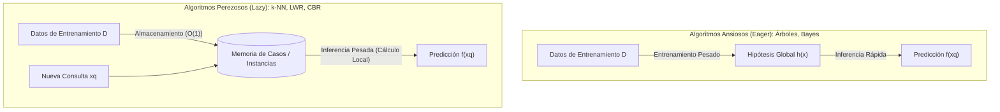
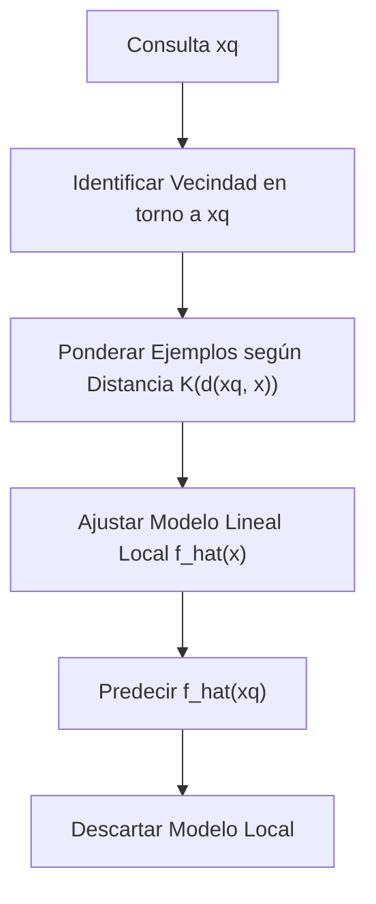
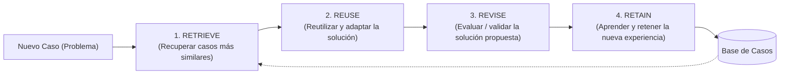

# Clase 6: Aprendizaje Basado en Casos e Instancias

El **Aprendizaje Basado en Instancias** (*Instance-Based Learning*) y el **Razonamiento Basado en Casos** (*Case-Based Reasoning - CBR*) constituyen una familia de métodos de aprendizaje supervisado con una filosofía radicalmente distinta a la de modelos como los Árboles de Decisión o Naïve Bayes: en lugar de construir una hipótesis explícita y global durante el entrenamiento, difieren la generalización hasta el momento exacto en que llega una nueva consulta (*Lazy Learning* o Aprendizaje Perezoso).

---

## 1. Introducción y Filosofía del Aprendizaje Perezoso

En los algoritmos estudiados previamente (ID3, Naïve Bayes), el entrenamiento consiste en procesar todo el conjunto de datos para inducir una función o estructura global $h \in H$ que resume la experiencia previa. Una vez construida esa hipótesis, los datos de entrenamiento pueden descartarse.

En cambio, los **algoritmos basados en instancias** simplemente almacenan los ejemplos de entrenamiento en memoria. Cuando se presenta una nueva instancia de consulta $x_q$, el sistema busca en su base de datos aquellas instancias conocidas que más se le parecen y construye una **aproximación local** de la función objetivo únicamente para clasificar a $x_q$.

### Ventajas:
1. **Aproximaciones Locales Flexibles:** En lugar de forzar una única función global sobre todo el espacio, el modelo puede ajustar una aproximación diferente adaptada a la vecindad de cada consulta individual.
2. **Capacidad de Representación Ilimitada:** La función objetivo puede ser sumamente compleja y no lineal a nivel global, pero sencilla y suave en vecindades locales.
3. **Estructuras Complejas:** La representación de las instancias no se limita a vectores numéricos en $\mathbb{R}^n$; pueden ser grafos, planes o casos simbólicos enriquecidos.
4. **Entrenamiento Instantáneo:** Agregar nuevos ejemplos a la base de conocimiento tiene costo $O(1)$.

### Desventajas:
1. **Alto Costo de Inferencia (Clasificación):** La carga computacional se traslada al momento de predecir. Evaluar una consulta requiere comparar contra muchas (o todas) las instancias almacenadas.
2. **Sensibilidad a Atributos Irrelevantes:** Al calcular distancias entre puntos, los atributos que no aportan información introducen ruido y distorsionan la noción de cercanía (*Maldición de la Dimensionalidad*).
3. **Alto Requerimiento de Memoria:** Es necesario mantener la base de datos de entrenamiento en memoria.

---

## 2. El Algoritmo $k$-Nearest Neighbor ($k$-NN)

El clasificador de **los $k$ vecinos más cercanos** ($k$-NN) asume que todas las instancias corresponden a puntos en el espacio euclídeo $n$-dimensional $\mathbb{R}^n$.

Dada una instancia arbitraria $x$, su descripción viene dada por el vector de atributos:
$$x = \langle a_1(x), a_2(x), \dots, a_n(x) \rangle$$

La distancia entre dos instancias $x_i$ y $x_j$ se calcula comúnmente mediante la **distancia euclidiana**:
$$d(x_i, x_j) = \sqrt{\sum_{r=1}^n \left( a_r(x_i) - a_r(x_j) \right)^2}$$

---

### 2.1. Clasificación de Funciones Discretas (Voto Mayoritario)
Sea $V = \{v_1, v_2, \dots, v_m\}$ el conjunto finito de clases posibles. Para clasificar una nueva consulta $x_q$, se identifican las $k$ instancias más cercanas a $x_q$ en el conjunto de entrenamiento y se asigna la clase más frecuente entre ellas:

$$\hat{f}(x_q) = \arg\max_{v \in V} \sum_{i=1}^k \delta(v, f(x_i))$$

Donde $\delta(a, b)$ es la función delta de Kronecker:
$$\delta(a, b) = \begin{cases} 1 & \text{si } a = b \\ 0 & \text{en otro caso} \end{cases}$$

---

### 2.2. Regresión: Aproximación de Funciones Reales
Si la variable objetivo es continua ($f: \mathbb{R}^n \to \mathbb{R}$), la predicción para $x_q$ se calcula como el promedio aritmético simple de los valores de los $k$ vecinos más cercanos:

$$\hat{f}(x_q) = \frac{1}{k} \sum_{i=1}^k f(x_i)$$

---

## 3. $k$-NN Ponderado por Distancia (Método de Shepard)

Un refinamiento fundamental consiste en dar **mayor peso a los vecinos más cercanos** a $x_q$ que a los que se encuentran más alejados.

Se define el peso $w_i$ del vecino $x_i$ como el inverso del cuadrado de su distancia:
$$w_i = \frac{1}{d(x_q, x_i)^2}$$

*(En la práctica se suma una constante infinitesimal $\epsilon > 0$ en el denominador para evitar división por cero si $x_q = x_i$).*

### Formulación para Clasificación Discreta:
$$\hat{f}(x_q) = \arg\max_{v \in V} \sum_{i=1}^k w_i \cdot \delta(v, f(x_i))$$

### Formulación para Regresión Continua:
$$\hat{f}(x_q) = \frac{\sum_{i=1}^k w_i \cdot f(x_i)}{\sum_{i=1}^k w_i}$$

> [!NOTE]
> **Extensión Global (Método de Shepard):** 
> Al ponderar por el inverso de la distancia, el peso de los puntos muy lejanos tiende asintóticamente a cero. Esto permite extender la sumatoria a **todas las instancias del conjunto de entrenamiento $D$** (haciendo $k = |D|$):
> $$\hat{f}(x_q) = \frac{\sum_{x \in D} w(x) \cdot f(x)}{\sum_{x \in D} w(x)}$$
> Sin embargo, evaluar todas las instancias aumenta el costo computacional a $O(|D|)$ por consulta.

---

## 4. Selección del Hiperparámetro $k$

El valor de $k$ controla el compromiso entre sesgo y varianza (*Bias-Variance Tradeoff*):

| Valor de $k$ | Comportamiento del Modelo | Riesgo Principal |
| :---: | :--- | :--- |
| **$k$ muy bajo ($k = 1$)** | Fronteras de decisión extremadamente complejas y locales (diagramas de Voronoi). Ajusta perfectamente al conjunto de entrenamiento. | **Muy sensible al ruido** y a datos atípicos (*Overfitting*). |
| **$k$ moderado ($k = 3, 5$)** | Suaviza las fronteras promediando la evidencia local. | Buen equilibrio general en la mayoría de problemas. |
| **$k$ muy alto ($k \to |D|$)** | Fronteras casi globales y suaves. Las regiones con alta densidad de ejemplos dominan sobre las zonas dispersas. | **Subajuste (*Underfitting*)**; pierde la capacidad de capturar particularidades locales. |

### Criterios Prácticos para Elegir $k$:
1. **$k$ Impar en Clasificación Binaria:** Se eligen valores impares ($k \in \{1, 3, 5, 7\}$) para evitar situaciones de empate en la votación.
2. **Validación Cruzada (*Leave-One-Out Cross-Validation* - LOOCV):** 
   En $k$-NN, LOOCV es sumamente eficiente: se predice cada instancia $x_i$ usando como vecinos a los restantes $|D| - 1$ ejemplos (sin necesidad de reentrenar ningún modelo). Se elige el $k$ que minimiza el error de validación.

---

## 5. Desafíos Prácticos y Soluciones en $k$-NN

### 5.1. La Maldición de la Dimensionalidad (*Curse of Dimensionality*)
A diferencia de los árboles de decisión (que seleccionan un atributo a la vez y descartan los que no aportan ganancia), **la distancia euclidiana incluye absolutamente todas las dimensiones del espacio**.

* **El Problema:** Si un problema tiene 20 atributos, pero solo 2 son relevantes para la tarea y los otros 18 son puro ruido aleatorio, la distancia euclidiana entre dos puntos estará dominada en un $90\%$ por las dimensiones ruidosas. Dos instancias con etiquetas idénticas parecerán muy lejanas en el espacio $\mathbb{R}^{20}$.
* **Solución 1: Ponderación de Atributos:** Asignar un peso $z_r \ge 0$ a cada dimensión al calcular la distancia:
  $$d(x_i, x_j) = \sqrt{\sum_{r=1}^n z_r \left( a_r(x_i) - a_r(x_j) \right)^2}$$
  Geométricamente, esto equivale a **alargar o acortar los ejes del espacio**: estirar los ejes informativos y comprimir (o colapsar a cero) los irrelevantes.
* **¿Cómo determinar los pesos $z_r$?**
  - Penalizando atributos cuya distribución sea uniforme dentro de cada clase (baja capacidad discriminativa).
  - Optimizando los pesos mediante validación cruzada.
  - Aplicando técnicas previas de selección de atributos (*Feature Selection*).

---

### 5.2. Atributos con Distintas Escalas y Magnitudes
Si el atributo $A_1$ mide ingresos en pesos uruguayos ($0 \text{ a } 500.000$) y el atributo $A_2$ mide edad en años ($0 \text{ a } 100$):
$$\Delta A_1^2 \approx 10^{10} \gg \Delta A_2^2 \approx 10^4$$
El atributo con mayor escala dominará por completo la distancia euclidiana, anulando el efecto de la edad.

**Soluciones Obligatorias en el Preprocesamiento:**
1. **Estandarización ($Z$-Score):** Transforma el atributo para que tenga media $\mu = 0$ y desviación estándar $\sigma = 1$:
   $$a'_r(x) = \frac{a_r(x) - \mu_r}{\sigma_r}$$
2. **Reescalamiento Min-Max:** Lleva todos los atributos al rango acotado $[0, 1]$:
   $$a'_r(x) = \frac{a_r(x) - \min(A_r)}{\max(A_r) - \min(A_r)}$$

---

### 5.3. Costo Computacional e Indexación Espacial
Clasificar una consulta contra una base de $N$ ejemplos en $\mathbb{R}^d$ tiene una complejidad lineal $O(N \cdot d)$ si se realiza una búsqueda exhaustiva. Con millones de instancias, la predicción en tiempo real resulta inviable.

* **Solución:** Indexar previamente el espacio de instancias mediante estructuras de datos geométricas avanzadas:
  * **$k\text{-d trees}$ ($k$-dimensional trees):** Árboles binarios de partición del espacio que reducen la búsqueda del vecino más cercano a $O(\log N)$ en dimensiones bajas a moderadas ($d < 20$).
  * **Ball Trees:** Estructuras métricas basadas en hiperesferas, más eficientes cuando la dimensionalidad $d$ es elevada.

---

### 5.4. Sesgo Inductivo de $k$-NN
El sesgo inductivo formal de $k$-NN es:
> **"Cercanía en el espacio euclídeo implica similitud en la función objetivo."**
> La clasificación de una instancia no vista será similar a la de sus vecinos geométricamente más próximos (supuesto de suavidad local de la función objetivo).

---

## 6. Regresión Local Ponderada (*Locally Weighted Regression* - LWR)

La **Regresión Local Ponderada (RLP / LWR)** generaliza $k$-NN: en lugar de predecir simplemente el promedio de los vecinos, **construye explícitamente una función matemática local $\hat{f}(x)$** ajustada a los puntos cercanos a la consulta $x_q$.

Para cada nueva consulta $x_q$:
1. Se define un modelo funcional local (comúnmente lineal o cuadrático):
   $$\hat{f}(x) = w_0 + w_1 a_1(x) + \dots + w_n a_n(x) = w^T x$$
2. Se calculan los coeficientes $w$ que minimizan una función de error local centrada en $x_q$.
3. Se predice el valor para la consulta: $\hat{f}(x_q)$.
4. **Se descarta la función $\hat{f}$:** no se conserva ningún modelo global; la siguiente consulta $x_{q'}$ generará una nueva aproximación local completamente diferente.

### Funciones de Error Locales Consideradas:

1. **Sobre los $k$ vecinos más cercanos (sin ponderar distancia):**
   $$E_1(x_q) = \frac{1}{2} \sum_{x \in k\text{-vecinos}} \left( f(x) - \hat{f}(x) \right)^2$$

2. **Ponderando a todo el conjunto de entrenamiento:**
   $$E_2(x_q) = \frac{1}{2} \sum_{x \in D} \left( f(x) - \hat{f}(x) \right)^2 \cdot K(d(x_q, x))$$
   Donde $K(d)$ es una función núcleo (*kernel*) monótona decreciente, comúnmente una función gaussiana:
   $$K(d(x_q, x)) = \exp\left( - \frac{d(x_q, x)^2}{2 \sigma^2} \right)$$

3. **Ponderando a los $k$ vecinos más cercanos (combinación óptima):**
   $$E_3(x_q) = \frac{1}{2} \sum_{x \in k\text{-vecinos}} \left( f(x) - \hat{f}(x) \right)^2 \cdot K(d(x_q, x))$$
   Reduce drásticamente el costo computacional respecto a $E_2$ al ignorar puntos cuya contribución al error sería despreciable.

---

## 7. Razonamiento Basado en Casos (*Case-Based Reasoning* - CBR)

¿Qué sucede cuando las instancias **no pueden ser descritas por un simple vector numérico en $\mathbb{R}^n$**?

En muchos dominios reales (diagnóstico médico, sentencias jurídicas, soporte técnico, diseño de ingeniería), los problemas se representan mediante **estructuras ricas y heterogéneas** (registros jerárquicos, árboles sintácticos, esquemas de bases de datos o grafos).

### Principio de CBR:
Resolver nuevos problemas recuperando experiencias pasadas similares almacenadas en una **base de casos**, adaptando sus soluciones e incorporando el nuevo resultado a la memoria.

### El Ciclo de las 4R en CBR:
1. **Retrieve (Recuperar):** Buscar en la base de casos el o los casos resueltos más similares a la consulta mediante métricas de distancia simbólica o semántica dependientes del dominio.
2. **Reuse (Reutilizar / Adaptar):** Mapear la solución del caso recuperado al problema actual, aplicando reglas de transformación o heurísticas de adaptación.
3. **Revise (Revisar / Evaluar):** Poner a prueba la solución generada en el mundo real o mediante simulaciones; corregir posibles discrepancias.
4. **Retain (Retener / Aprender):** Almacenar el nuevo caso resuelto con su resultado en la base de conocimiento para enriquecer futuras decisiones.

---

## 8. Algoritmos Perezosos (*Lazy*) vs. Algoritmos Ansiosos (*Eager*)

La distinción entre aprendizaje perezoso y ansioso es una de las clasificaciones taxonómicas más profundas del aprendizaje automático:

| Criterio | Algoritmos Perezosos (*Lazy*) | Algoritmos Ansiosos (*Eager*) |
| :--- | :--- | :--- |
| **Modelos Representativos** | $k$-NN, Regresión Local Ponderada, CBR. | Árboles de Decisión (ID3, C4.5), Naïve Bayes, Redes Neuronales, SVM. |
| **Momento de Generalización** | **Diferido:** Al momento de recibir la consulta $x_q$. | **Inmediato:** Durante el entrenamiento sobre el conjunto $D$. |
| **Construcción de Hipótesis** | Construye **múltiples aproximaciones locales**, una por cada consulta. | Construye **una única hipótesis global** $h \in H$ para todo el espacio. |
| **Costo de Entrenamiento** | Prácticamente nulo: $O(1)$ (solo almacenar datos). | Alto: Procesa y ajusta parámetros sobre todo $D$. |
| **Costo de Inferencia (Test)** | **Alto:** Requiere calcular distancias y buscar vecinos para cada consulta. | **Bajo:** La hipótesis ya está compilada (recorrer un árbol o evaluar una fórmula). |
| **Poder de Adaptación** | **Muy alto:** Puede ajustarse localmente a comportamientos complejos y no lineales de la función objetivo. | **Rígido:** Limitado a la expresividad de la hipótesis global aprendida. |
| **Requerimiento de Memoria** | Alto: Debe retener todo el conjunto de entrenamiento en memoria para predecir. | Bajo: Solo necesita almacenar la hipótesis final (las hojas del árbol o los pesos). |

---

## 9. Resumen y Puntos Clave para Examen

1. **$k$-NN** aproxima conceptos a partir de los $k$ ejemplos más cercanos en distancia euclidiana. Con $k=1$ las fronteras son diagramas de Voronoi altamente sensibles al ruido; con $k$ grande las fronteras son suaves pero pueden sufrir de subajuste.
2. En **$k$-NN ponderado por distancia (Shepard)**, los vecinos pesan $w_i = 1/d(x_q, x_i)^2$, permitiendo incluso utilizar todo el conjunto de datos como vecindario.
3. La **Maldición de la Dimensionalidad** afecta severamente a $k$-NN cuando existen atributos irrelevantes, ya que la distancia euclidiana considera todas las dimensiones por igual. Se combate ponderando ejes o mediante selección previa de atributos.
4. Es **estrictamente obligatorio escalar o estandarizar** los atributos numéricos antes de aplicar $k$-NN para evitar que variables con escalas grandes dominen artificialmente la distancia.
5. **Regresión Local Ponderada (LWR)** ajusta una función local (lineal/cuadrática) minimizando el error cuadrático ponderado por un kernel gaussiano $K(d)$ alrededor de la consulta, y descarta la hipótesis tras responder.
6. **Razonamiento Basado en Casos (CBR)** traslada el paradigma a instancias complejas y estructuradas no numéricas, operando bajo el ciclo de las 4R (*Retrieve, Reuse, Revise, Retain*).
7. Los **algoritmos perezosos (*Lazy*)** no entrenan previamente y construyen aproximaciones locales en tiempo de inferencia; los **ansiosos (*Eager*)** compilan una hipótesis global durante el entrenamiento facilitando predicciones veloces.

---

## 📚 Bibliografía de Referencia
* **Mitchell, Tom M.** (1997). *Machine Learning*. McGraw-Hill Science/Engineering/Math.
  * **Capítulo 8:** *Instance-Based Learning* (k-Nearest Neighbor, Locally Weighted Regression, Case-Based Reasoning, Lazy vs. Eager Learning).
